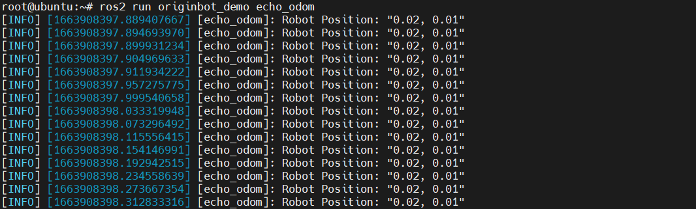
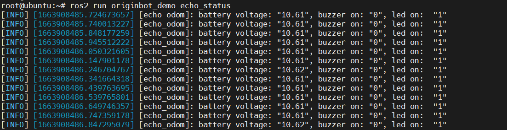
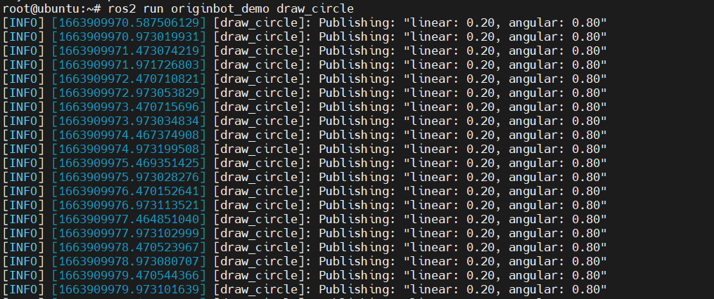

# **基础功能编程**

???+ hint
    操作环境及软硬件配置如下：
    

     - OriginBot机器人（Lite版/标准版/Pro版）
     - PC：Ubuntu (≥22.04) + ROS2 (≥humble)


## **获取里程计消息**

### **运行例程**

启动机器人底盘后，在机器人或者PC端运行如下指令：

```bash
ros2 run originbot_demo echo_odom
```


很快就可以在终端中看到里程计odom话题中的位置坐标：

{.img-fluid tag=1 title="获取里程计消息"}


### **代码实现**

实现该功能的代码文件是originbot_demo/echo_odom.py，详细的实现过程如下：

```python
import rclpy                          # ROS2 Python接口库
from rclpy.node   import Node         # ROS2 节点类
from nav_msgs.msg import Odometry     # ROS2标准定义的里程计消息

"""
创建一个订阅者节点
"""
class SubscriberNode(Node):
    
    def __init__(self, name):
        super().__init__(name)                              # ROS2节点父类初始化
        self.sub = self.create_subscription(\
            Odometry, "odom", self.listener_callback, 10)   # 创建订阅者对象（消息类型、话题名、订阅者回调函数、队列长度）

    def listener_callback(self, msg):                        # 创建回调函数，执行收到话题消息后对数据的处理
        self.get_logger().info('Robot Position: "%0.2f, %0.2f"' \
            % (msg.pose.pose.position.x, msg.pose.pose.position.y)) 

def main(args=None):                       # ROS2节点主入口main函数
    rclpy.init(args=args)                  # ROS2 Python接口初始化
    node = SubscriberNode("echo_odom")     # 创建ROS2节点对象并进行初始化
    rclpy.spin(node)                       # 循环等待ROS2退出
    node.destroy_node()                    # 销毁节点对象
    rclpy.shutdown()                       # 关闭ROS2 Python接口
```


## **获取机器人状态**

### **运行例程**

启动机器人底盘后，在机器人或者PC端运行如下指令：

```bash
ros2 run originbot_demo echo_status
```


很快就可以在终端中看到机器人状态的输出信息：

{.img-fluid tag=1 title="获取机器人状态"}


### **代码实现**

实现该功能的代码文件是originbot_demo/echo_status.py，详细的实现过程如下：

```python
import rclpy                                     # ROS2 Python接口库
from rclpy.node   import Node                    # ROS2 节点类
from originbot_msgs.msg import OriginbotStatus   # OriginBot自定义的状态消息

"""
创建一个订阅者节点
"""
class SubscriberNode(Node):
    
    def __init__(self, name):
        super().__init__(name)                                               # ROS2节点父类初始化
        self.sub = self.create_subscription(\
            OriginbotStatus, "originbot_status", self.listener_callback, 10) # 创建订阅者对象（消息类型、话题名、订阅者回调函数、队列长度）

    def listener_callback(self, msg):                                        # 创建回调函数，执行收到话题消息后对数据的处理
        self.get_logger().info('battery voltage: "%0.2f", buzzer on: "%d", led on:  "%d"' \
            % (msg.battery_voltage, msg.buzzer_on, msg.led_on)) 

def main(args=None):                    # ROS2节点主入口main函数
    rclpy.init(args=args)               # ROS2 Python接口初始化
    node = SubscriberNode("echo_odom")  # 创建ROS2节点对象并进行初始化
    rclpy.spin(node)                    # 循环等待ROS2退出
    node.destroy_node()                 # 销毁节点对象
    rclpy.shutdown()                    # 关闭ROS2 Python接口
```


## **控制蜂鸣器**

### **运行例程**

启动机器人底盘后，在机器人或者PC端运行如下指令：

```bash
ros2 run originbot_demo control_buzzer
```


运行成功后，可以听到机器人控制器板卡上的蜂鸣器开始间隔作响，间隔时间为3s左右。


### **代码实现**

实现该功能的代码文件是originbot_demo/control_buzzer.py，详细的实现过程如下：

```python
import time
import rclpy                                     # ROS2 Python接口库
from rclpy.node   import Node                    # ROS2 节点类
from originbot_msgs.srv import OriginbotBuzzer   # 自定义的服务接口

class serverClient(Node):
    def __init__(self, name):
        super().__init__(name)                                                  # ROS2节点父类初始化
        self.client = self.create_client(OriginbotBuzzer, 'originbot_buzzer')   # 创建服务客户端对象（服务接口类型，服务名）
        while not self.client.wait_for_service(timeout_sec=1.0):                # 循环等待服务器端成功启动
            self.get_logger().info('service not available, waiting again...') 
        self.request = OriginbotBuzzer.Request()                                # 创建服务请求的数据对象
                    
    def send_request(self, buzzer_on):                                          # 创建一个发送服务请求的函数
        self.request.on = buzzer_on
        self.future = self.client.call_async(self.request)                      # 异步方式发送服务请求

def main(args=None):
    rclpy.init(args=args)                      # ROS2 Python接口初始化
    node = serverClient("control_buzzer")      # 创建ROS2节点对象并进行初始化
    
    buzzer_on= True
    while rclpy.ok():                          # ROS2系统正常运行
        node.send_request(buzzer_on)           # 发送服务请求
        rclpy.spin_once(node)                  # 循环执行一次节点
        
        buzzer_on = not buzzer_on
        time.sleep(3)

    node.destroy_node()                        # 销毁节点对象
    rclpy.shutdown()                           # 关闭ROS2 Python接口
```


## **控制LED**

### **运行例程**

启动机器人底盘后，在机器人或者PC端运行如下指令：

```bash
ros2 run originbot_demo control_led
```


运行成功后，可以看到机器人控制器板卡上的LED开始间隔闪烁，间隔时间为3s左右。


### **代码实现**

实现该功能的代码文件是originbot_demo/control_led.py，详细的实现过程如下：


```python
import time
import rclpy                                   # ROS2 Python接口库
from rclpy.node   import Node                  # ROS2 节点类
from originbot_msgs.srv import OriginbotLed    # 自定义的服务接口

class serverClient(Node):
    def __init__(self, name):
        super().__init__(name)                                                 # ROS2节点父类初始化
        self.client = self.create_client(OriginbotLed, 'originbot_led')        # 创建服务客户端对象（服务接口类型，服务名）
        while not self.client.wait_for_service(timeout_sec=1.0):               # 循环等待服务器端成功启动
            self.get_logger().info('service not available, waiting again...') 
        self.request = OriginbotLed.Request()                                  # 创建服务请求的数据对象
                    
    def send_request(self, led_on):                                            # 创建一个发送服务请求的函数
        self.request.on = led_on
        self.future = self.client.call_async(self.request)                     # 异步方式发送服务请求

def main(args=None):
    rclpy.init(args=args)                 # ROS2 Python接口初始化
    node = serverClient("control_led")    # 创建ROS2节点对象并进行初始化
    
    led_on= True
    while rclpy.ok():                     # ROS2系统正常运行
        node.send_request(led_on)         # 发送服务请求
        rclpy.spin_once(node)             # 循环执行一次节点
        
        led_on = not led_on
        time.sleep(3)

    node.destroy_node()                   # 销毁节点对象
    rclpy.shutdown()                      # 关闭ROS2 Python接口
```


## **发布速度指令**

### **运行例程**

启动机器人底盘后，在机器人或者PC端运行如下指令：

```bash
ros2 run originbot_demo draw_circle
```

{.img-fluid tag=1 title="发布速度指令"}


启动成功后，就可以看到机器人开始做圆周运动：


### **代码实现**

实现该功能的代码文件是originbot_demo/draw_circle.py，详细的实现过程如下：

```python
import rclpy                              # ROS2 Python接口库
from rclpy.node import Node               # ROS2 节点类
from geometry_msgs.msg import Twist       # 速度话题的消息

"""
创建一个发布者节点
"""
class PublisherNode(Node):
    
    def __init__(self, name):
        super().__init__(name)                                    # ROS2节点父类初始化
        self.pub   = self.create_publisher(Twist, 'cmd_vel', 10)  # 创建发布者对象（消息类型、话题名、队列长度）
        self.timer = self.create_timer(0.5, self.timer_callback)  # 创建一个定时器（单位为秒的周期，定时执行的回调函数）
        
    def timer_callback(self):               # 创建定时器周期执行的回调函数
        twist = Twist()                     # 创建一个Twist类型的消息对象
        twist.linear.x  = 0.2               # 填充消息对象中的线速度
        twist.angular.z = 0.8               # 填充消息对象中的角速度
        self.pub.publish(twist)              # 发布话题消息
        self.get_logger().info('Publishing: "linear: %0.2f, angular: %0.2f"' % (twist.linear.x, twist.angular.z))  
        
def main(args=None):                      # ROS2节点主入口main函数
    rclpy.init(args=args)                 # ROS2 Python接口初始化
    node = PublisherNode("draw_circle")   # 创建ROS2节点对象并进行初始化
    rclpy.spin(node)                      # 循环等待ROS2退出
    node.destroy_node()                   # 销毁节点对象
    rclpy.shutdown()                      # 关闭ROS2 Python接口
```


[](https://www.guyuehome.com/){:target="_blank"}

