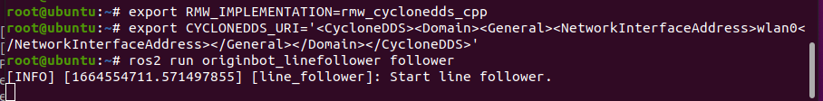
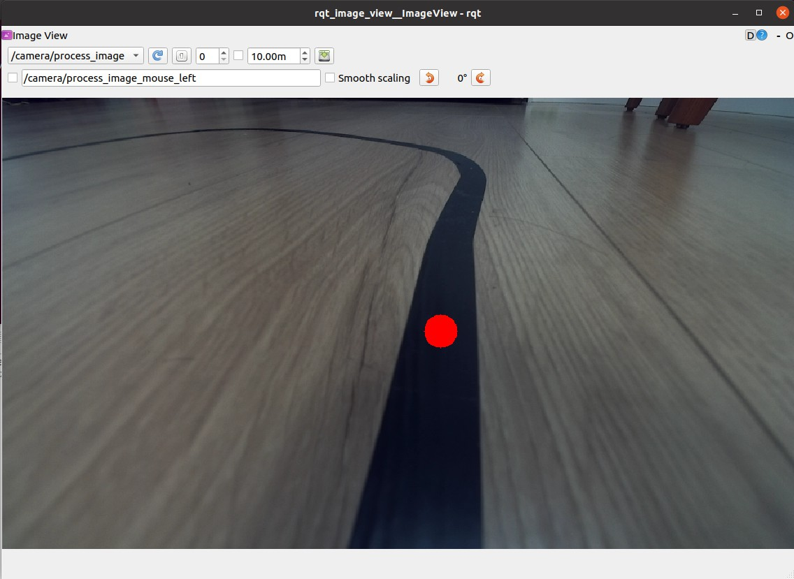

# **视觉巡线（OpenCV）**

???+ hint
    操作环境及软硬件配置如下：

     - OriginBot机器人（Lite版/标准版/Pro 版）
     - PC：Ubuntu (≥22.04) + ROS2 (≥humble)
     - 巡线场景：黑色路径线，背景有明显反差


## **场景说明**

视觉巡线的场景如下，该例程使用黑色引导线作为识别目标，尽量向下调节相机角度，避免外界干扰。

{.img-fluid tag=1}

???+ attation
    视觉巡线受光线和颜色影响较大，强烈建议使用该例程前，先调试一下自己场地环境下引导线的阈值，并对应修改originbot_linefollower/follower.py程序中HSV阈值的上下限，完成修改后注意重新编译再运行如下步骤。{.img-fluid tag=1}


## **启动底盘和相机**

SSH连接OriginBot成功后，在终端中输入如下指令，切换DDS并选择数据通信的网卡，启动机器人底盘和相机：

```bash
export RMW_IMPLEMENTATION=rmw_cyclonedds_cpp
export CYCLONEDDS_URI='<CycloneDDS><Domain><General><NetworkInterfaceAddress>wlan0</NetworkInterfaceAddress></General></Domain></CycloneDDS>'
ros2 launch originbot_bringup originbot.launch.py use_camera:=true
```

{.img-fluid tag=1}

???+ info
    为了保证图像的实时性，这里我们将使用的DDS切换为cyclonedds，避免因为DDS的切片，导致图像延迟。cyclonedds默认会绑定某一网卡进行数据传输，此处我们使用第二句命令指定无线网卡wlan0作为绑定官网卡，大家可以根据实际情况，进行切换。更多信息，也可以参考[DDS的配置](../manual/camera_visualization.md#dds){:target="_blank"}。


## **启动视觉巡线功能**

继续通过SSH连接OriginBot，在终端中输入如下指令，切换DDS并选择数据通信的网卡，然后启动视觉巡线功能：

```bash
export RMW_IMPLEMENTATION=rmw_cyclonedds_cpp
export CYCLONEDDS_URI='<CycloneDDS><Domain><General><NetworkInterfaceAddress>wlan0</NetworkInterfaceAddress></General></Domain></CycloneDDS>'
ros2 run originbot_linefollower follower
```

{.img-fluid tag=1}


启动成功后，稍等片刻，机器人就开始自动巡线运动了。


## **上位机可视化显示**

为了便于看到机器人的动态识别效果，在同一网络下的PC端，切换DDS并选择数据通信的网卡，启动rqt_image_view：

```bash
export RMW_IMPLEMENTATION=rmw_cyclonedds_cpp
export CYCLONEDDS_URI='<CycloneDDS><Domain><General><NetworkInterfaceAddress>wlp2s0</NetworkInterfaceAddress></General></Domain></CycloneDDS>'
ros2 run rqt_image_view rqt_image_view
```

{.img-fluid tag=1}

???+ info
    此处我们使用第二句命令指定无线网卡wlp2s0作为绑定官网卡，该名称和电脑系统相关，可以使用ifconfig查询，大家可以根据实际情况，进行修改。


订阅/camera/process_image话题，即可看到动态识别的图像效果。

{.img-fluid tag=1}


[](https://www.guyuehome.com/){:target="_blank"}
