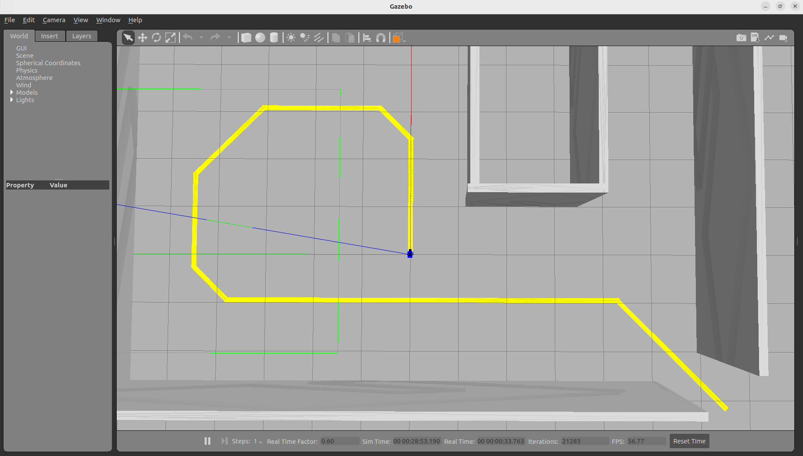
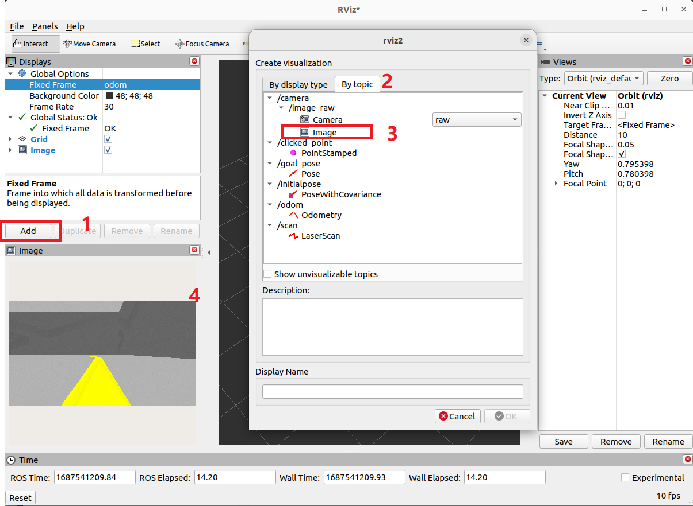
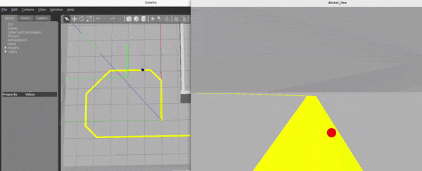
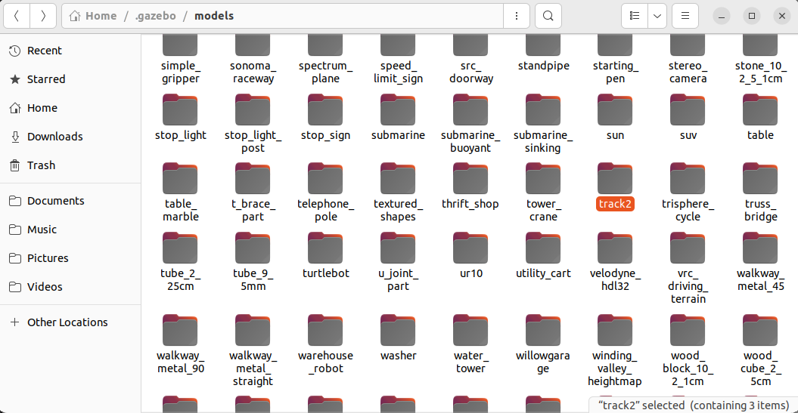
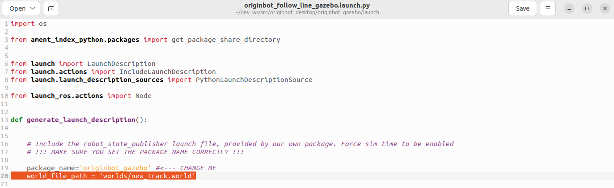
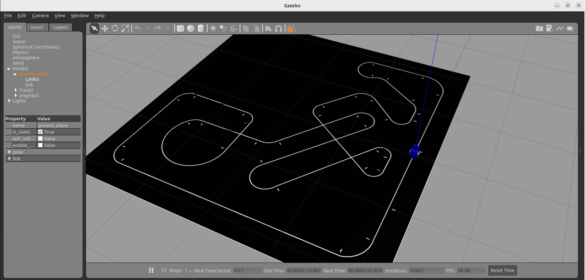

# **视觉巡线（Gazebo）**

???+ hint
    操作环境及软硬件配置如下：

     - PC：Ubuntu (≥22.04) + ROS2 (≥humble)


确保已完成[Gazebo虚拟仿真环境的配置](../application/gazebo_simulation.md){:target="_blank"}，接下来尝试在仿真环境中进行视觉巡线。


## **启动虚拟巡线环境**

在PC端运行如下指令：

```bash
ros2 launch originbot_gazebo originbot_follow_line_gazebo.launch.py
```

Gazebo启动成功后，就可以看到黄色引导线，仿真机器人在引导线的起点处。

{.img-fluid tag=1}


## **查看相机图像数据**

启动Rviz，添加Image显示项，就可以看到实时的图像数据：

```bash
ros2 run rviz2 rviz2
```

{.img-fluid tag=1}


## **启动视觉巡线**

重新打开一个终端，启动视觉巡线功能：

```bash
ros2 run originbot_demo line_follower
```


启动成功后，仿真机器人开始巡线运动，同时弹出一个巡线检测结果的实时显示。





## **更复杂的视觉巡线**

代码仓库中也提供了另外一张更为复杂的巡线地图，欢迎大家自己尝试改写巡线代码。


### **拷贝巡线模型**

将originbot_gazebo功能包中models文件中的“track2”模型文件夹拷贝到~/.gazebo/models文件夹下：

{.img-fluid tag=1}


### **修改巡线地图**

修改originbot_gazebo功能包中launch文件夹下的originbot_follow_line_gazebo.launch.py，将其中的仿真环境文件修改为：

{.img-fluid tag=1}

修改完毕后保存关闭。


### **启动巡线环境**

在工作空间的根目录下重新编译工作空间，确保以上配置生效：

```bash
colcon build
```


在PC端运行如下指令：

```bash
ros2 launch originbot_gazebo originbot_follow_line_gazebo.launch.py
```


启动成功后，就可以看到一个较为复杂的地图啦，大家可以自己动手尝试一下，欢迎把运行成功的效果分享到[古月居社区](https://www.guyuehome.com/)！

{.img-fluid tag=1}


[](https://www.guyuehome.com/){:target="_blank"}

