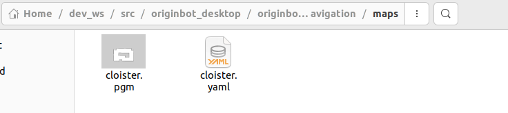
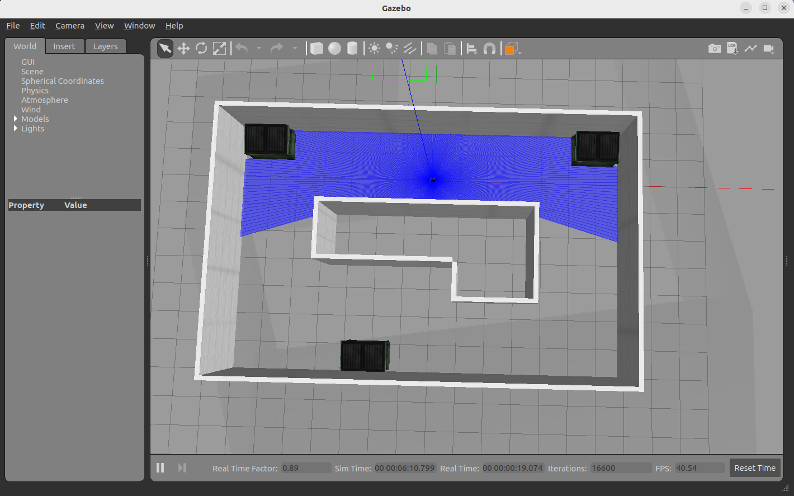
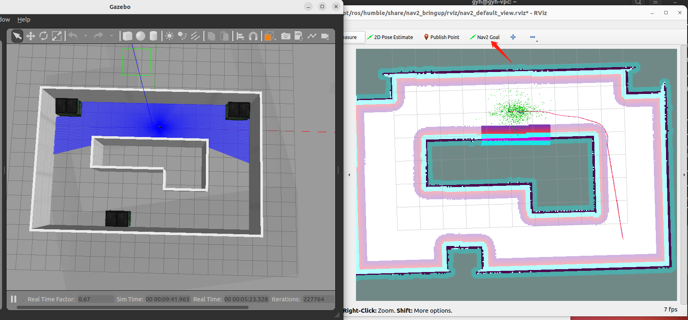

# **自主导航**

???+ hint
    操作环境及软硬件配置如下：

     - PC：Ubuntu (≥22.04) + ROS2 (≥humble)


## **配置地图**

自主导航会在之前SLAM（Gazebo）建立好的地图之上完成，在进行导航前，需要修改成自己环境的地图，修改方法如下：

- 拷贝自己SLAM建立好的地图文件（\*.pgm）和地图配置文件（\*.yaml），放置到originbot_navigation/maps路径下；

{.img-fluid tag=1}

- 修改originbot_navigation/launch/nav_bringup_gazebo.launch.py文件中调用的地图名称，确保和上一步拷贝的地图配置文件名称一致：

{.img-fluid tag=1}

- 修改完成后，终端回到工作空间的根目录下，**重新编译**。

至此，地图配置完成，之后就可以使用自己的地图进行导航啦。


## **启动Gazebo仿真环境**

在PC端打开一个新终端，在终端中输入如下指令，启动Gazebo仿真环境：

```bash
ros2 launch originbot_gazebo originbot_navigation_gazebo.launch.py
```

稍等片刻，启动成功后，即可看到包含机器人模型的仿真环境：

{.img-fluid tag=1}


## **启动导航功能**

在终端中输入如下指令，启动Nav2导航功能包：

```bash
ros2 launch originbot_navigation nav_bringup_gazebo.launch.py
```

{.img-fluid tag=1}

启动成功后，会在终端中看到不断输出的信息，这是因为没有设置机器人初始位姿的缘故，后续设置初始位置后即可解决。

???+ hint
    此处如果找不到Navigation2插件的话，请使用“sudo apt install ros-${ROS_DISTRO}-nav2*”安装。

## **设置初始位置**

在打开的Rviz中配置好显示项目，点击工具栏中的初始状态估计“2D Pose Estimate”按钮，在地图中选择机器人的初始位姿，点击确认后，此时此前终端中的警告也会停止。

{.img-fluid tag=1}


## **单目标点导航**

点击目标位置选择“2D Goal Pose”按钮，在地图上选择导航目标点，即可开始自主导航。

{.img-fluid tag=1}


[](https://www.guyuehome.com/){:target="_blank"}
