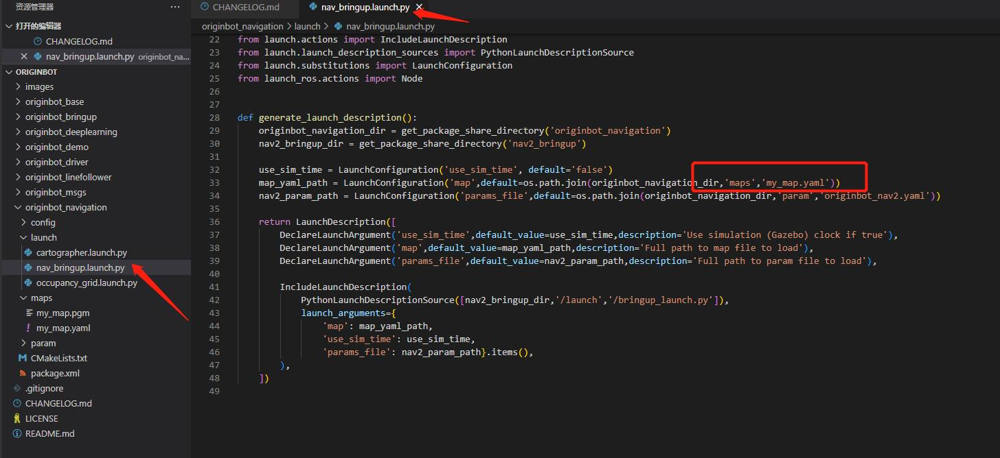
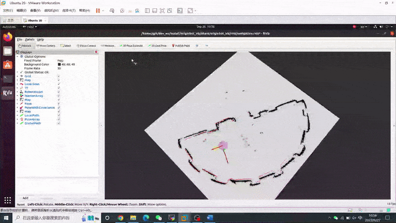
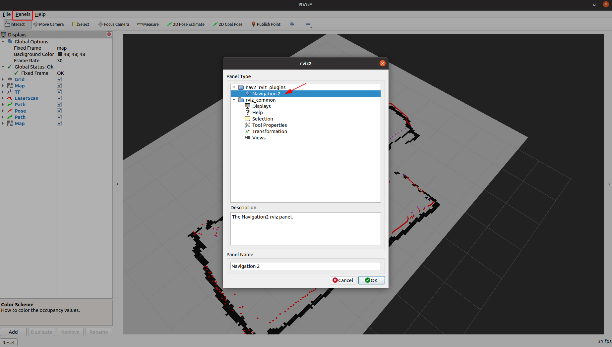
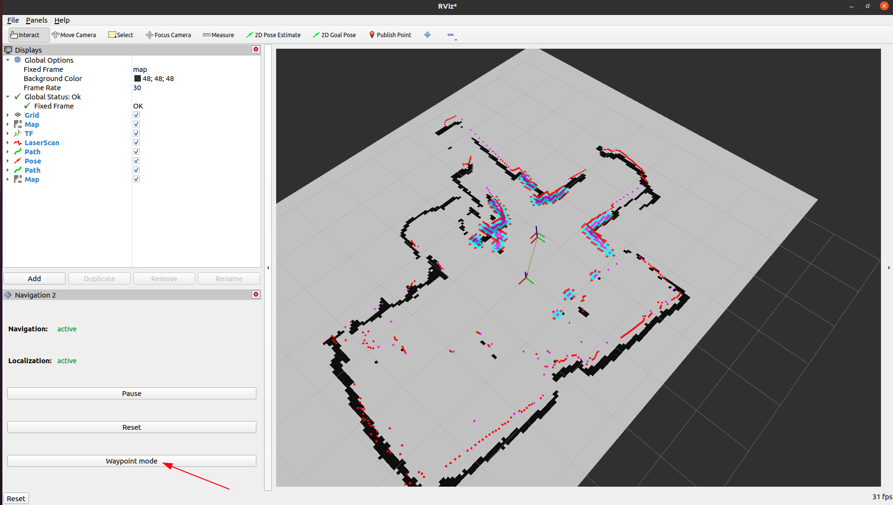
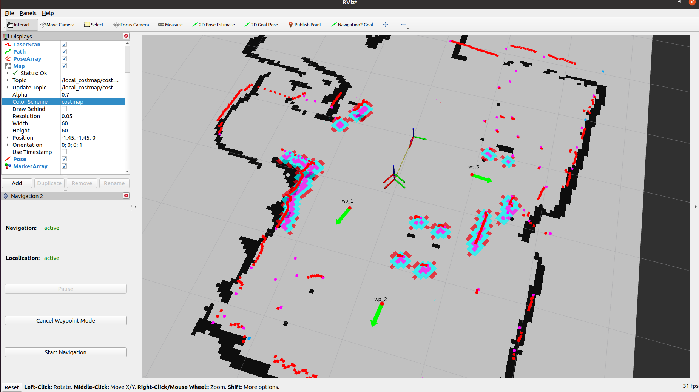

# **自主导航**

???+ hint
    操作环境及软硬件配置如下：

     - OriginBot机器人（标准版/Pro 版）
     - PC：Ubuntu (≥22.04) + ROS2 (≥humble)


<iframe
  src="//player.bilibili.com/player.html?aid=516658213&bvid=BV1eg411a7A9&cid=866157912&page=17&autoplay=0"
  scrolling="no"
  border="0"
  width="800px"
  height="460px"
  frameborder="no"
  framespacing="0"
  allowfullscreen="true"
>
</iframe>


## **配置地图**

自主导航会在之前SLAM建立好的地图之上完成，OriginBot导航功能包中包含一张默认地图，在进行导航前，需要修改成自己环境的地图，修改方法如下：

- 拷贝自己SLAM建立好的地图文件（\*.pgm）和地图配置文件（\*.yaml），放置到originbot_navigation/maps路径下；
- 修改originbot_navigation/launch/nav_bringup.launch文件中调用的地图名称，确保和上一步拷贝的地图配置文件名称一致：

{.img-fluid tag=1 title="配置地图"}

- 修改完成后，终端回到工作空间的根目录下，**重新编译**。
``` bash
# 进入工作空间根目录
cd /userdata/dev_ws/
# 编译参数--packages-select 可指定编译的包
# --symlink-install 参数表示使用软链接方式安装，这样修改地图后不需要重新编译
colcon build --symlink-install --packages-select originbot_navigation
```

至此，地图配置完成，之后就可以使用自己的地图进行导航啦。


## **启动底盘和雷达**

SSH连接OriginBot成功后，在终端中输入如下指令，启动机器人底盘和激光雷达：

=== ":fontawesome-solid-car: v2.x版本镜像"

    ``` bash
    ros2 launch originbot_bringup originbot.launch.py use_lidar:=true use_imu:=true
    ```

=== ":material-car: v1.x版本镜像"

    ``` bash
    ros2 launch originbot_bringup originbot.launch.py use_lidar:=true
    ```


{.img-fluid tag=1 title="启动底盘和雷达"}

???+ hint
	由于底盘启动后会自动记录odom数据，所以每次运行导航功能前，都需要重启一次底盘，否则可能会导致TF树变换出错。


## **上位机可视化显示**

为了便于发布导航的目标点，在同一网络下的PC端，启动上位机可视化软件：

```bash
ros2 launch originbot_viz display_navigation.launch.py
```


???+ hint
    确保在PC端已经完成[originbot_desktop](https://gitee.com/guyuehome/originbot_desktop){:target="_blank"}代码仓库的下载和编译。如果不方便使用originbot_desktop代码仓库，也可以使用“ros2 run rviz2 rviz2”单独启动Rivz2，手动添加map、tf、laserscan等显示插件，也可以达到类似的效果。


## **启动导航功能**

通过SSH连接OriginBot，在终端中输入如下指令，启动Nav2导航功能包：
=== ":fontawesome-solid-car: v2.x版本镜像"

    ``` bash
    ros2 launch originbot_navigation nav_bringup.launch.py
    ```
    {.img-fluid tag=1 title="启动导航功能"}

=== ":material-car: v1.x版本镜像"

    ``` bash
    ros2 launch originbot_navigation nav_bringup.launch.py
    ```
    {.img-fluid tag=1 title="启动导航功能"}

=== ":material-web: NodeHub"
    该功能已上线NodeHub，详细操作请见：[Nav2移动机器人自主导航](https://developer.d-robotics.cc/nodehubdetail/170117036053371397){:target="_blank"}


启动成功后，会在终端中看到不断输出的信息，这是因为没有设置机器人初始位姿的缘故，后续启动Rviz之后会进行设置，暂时可以忽略。

???+ attention
    如果先运行导航，再启动Rviz的话，可能无法在Rviz中看到静态地图，请确保先在PC端启动Rviz之后，再在机器人端启动导航功能。


## **单目标点导航**

在打开的Rviz中配置好显示项目，点击工具栏中的初始状态估计“2D Pose Estimate”按钮，在地图中选择机器人的初始位姿，此时此前终端中的警告也会停止，然后点击目标位置选择“2D Goal Pose”按钮，在地图上选择导航目标点，即可开始自主导航。


{.img-fluid tag=1 title="单目标点导航"}


## **多目标点导航**
点击Rviz菜单栏中的Panels插件选项，从中选择Navigation2插件，点击OK。

{.img-fluid tag=1 title="多目标点导航"}

???+ hint
    此处如果找不到Navigation2插件的话，请使用“sudo apt install ros-${ROS_DISTRO}-nav2*”安装。

在左侧弹出的导航插件窗口中，点击“Waypoint mode”，进入多路点选择模式。
{.img-fluid tag=1 title="多目标点导航"}

使用“Navigation2 goal”功能，选择多个需要导航经过的路点，选择完成后，点击插件中的“Start Navigation”按键，机器人导航运动开始，依次经过刚才选择的路点。
{.img-fluid tag=1 title="多目标点导航"}


## **定点导航**

成功编译功能包之后，可以在 originbot_navigation 中看到 send_goal 功能包，此功能包集成了定点导航的程序。

大家可以使用如下程序进行运行

```
ros2 run send_goal GoalCoordinate
```


[](https://www.guyuehome.com/){:target="_blank"}