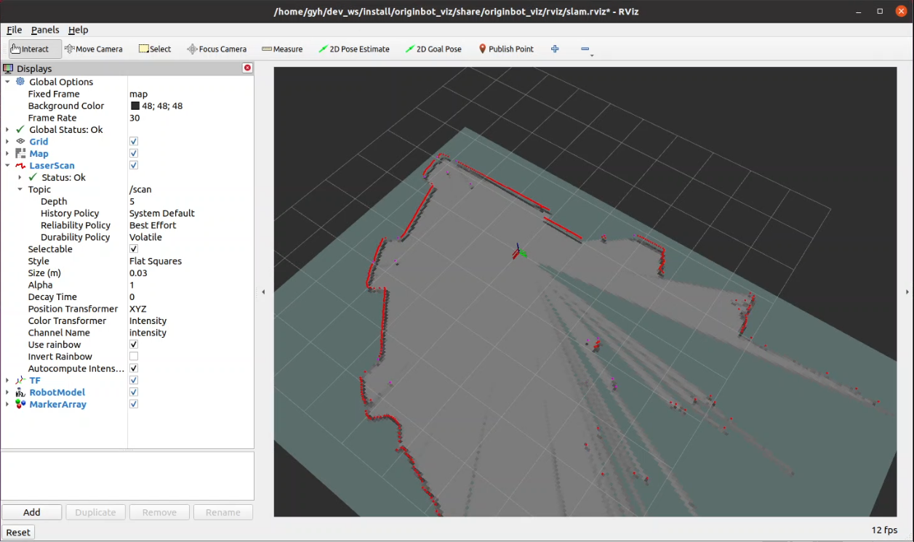

# **地图构建**

???+ hint
    操作环境及软硬件配置如下：

     - OriginBot机器人（标准版/Pro 版）
     - PC：Ubuntu (≥22.04) + ROS2 (≥humble)


<iframe
  src="//player.bilibili.com/player.html?aid=516658213&bvid=BV1eg411a7A9&cid=866152168&page=16&autoplay=0"
  scrolling="no"
  border="0"
  width="800px"
  height="460px"
  frameborder="no"
  framespacing="0"
  allowfullscreen="true"
>
</iframe>

## **启动底盘和雷达**

SSH连接OriginBot成功后，在终端中输入如下指令，启动机器人底盘和激光雷达：

=== ":fontawesome-solid-car: v2.x版本镜像"

    ``` bash
    ros2 launch originbot_bringup originbot.launch.py use_lidar:=true use_imu:=true
    ```

=== ":material-car: v1.x版本镜像"

    ``` bash
    ros2 launch originbot_bringup originbot.launch.py use_lidar:=true
    ```

{.img-fluid tag=1 title="启动底盘和雷达"}

???+ hint
	由于底盘启动后会自动记录odom数据，所以每次运行SLAM功能前，都需要重启一次底盘，否则可能会导致TF树变换出错。


## **启动SLAM**

继续通过SSH连接OriginBot，在终端中输入如下指令，启动cartographer建图算法：

=== ":fontawesome-solid-car: v2.x版本镜像"

    ``` bash
    ros2 launch originbot_navigation cartographer.launch.py
    ```
    {.img-fluid tag=1 title="启动SLAM"}

=== ":material-car: v1.x版本镜像"

    ``` bash
    ros2 launch originbot_navigation cartographer.launch.py
    ```
    {.img-fluid tag=1 title="启动SLAM"}

=== ":material-web: NodeHub"
    该功能已上线NodeHub，详细操作请见：[Cartographer激光雷达SLAM](https://developer.d-robotics.cc/nodehubdetail/170117036053371409){:target="_blank"}

如果程序运行正常，终端中应该显示出类似如下画面

{.img-fluid tag=1 title="正确显示"}


## **上位机可视化显示**

为了便于查看SLAM的完整过程，在同一网络下的PC端，启动上位机可视化软件：

```bash
ros2 launch originbot_viz display_slam.launch.py
```

即可看到此时已经创建出的地图。

{.img-fluid tag=1 title="上位机可视化显示"}

???+ hint
    确保在PC端已经完成[originbot_desktop](https://gitee.com/guyuehome/originbot_desktop){:target="_blank"}代码仓库的下载和编译。如果不方便使用originbot_desktop代码仓库，也可以使用“ros2 run rviz2 rviz2”单独启动Rivz2，手动添加map、tf、laserscan等显示插件，也可以达到类似的效果。


## **键盘控制建图**

为了让机器人建立周边环境的完整信息，我们还需要启动一个键盘控制节点：

```bash
ros2 run teleop_twist_keyboard teleop_twist_keyboard
```

???+ hint
    键盘控制节点在PC端或者OriginBot端运行均可。


现在，我们就可以在键盘控制的终端中，点击键盘的上下左右键，控制机器人探索未知的环境啦，Rviz中会逐渐出现地图的全貌。


{.img-fluid tag=1 title="键盘控制建图"}


## **保存地图**

建图完成后，可以使用如下指令来保存地图：

```bash
ros2 run nav2_map_server map_saver_cli -f my_map --ros-args -p save_map_timeout:=10000.0
```

???+ info
    以上指令会将地图保存到终端的当前路径下，在后续导航使用前，需要拷贝到originbot_navigation功能包中。


[](https://www.guyuehome.com/){:target="_blank"}