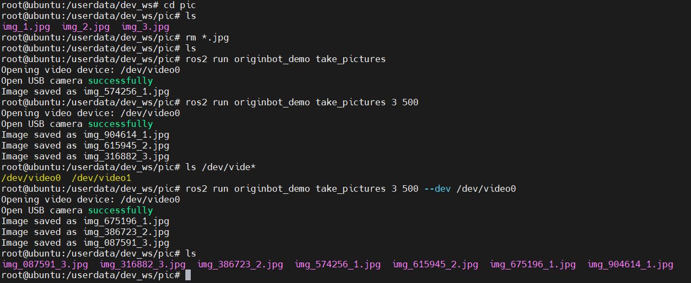
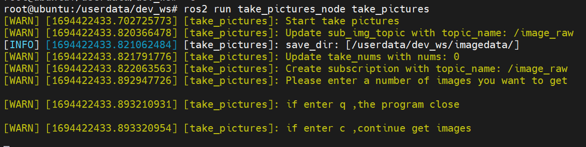
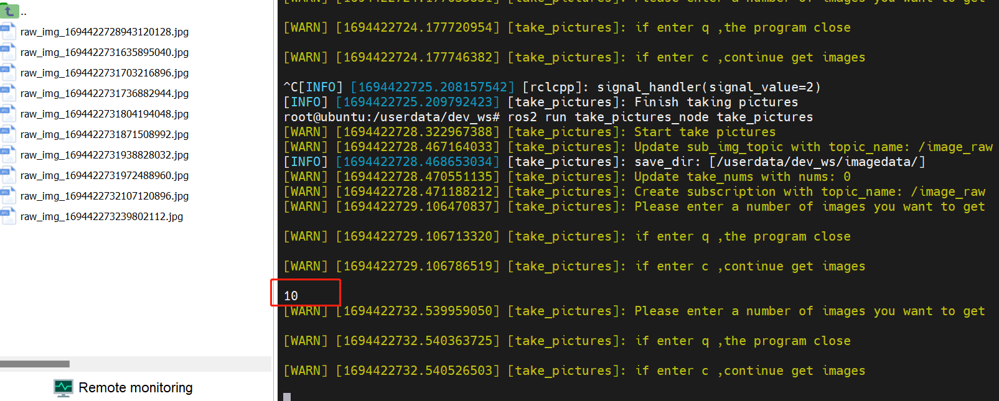
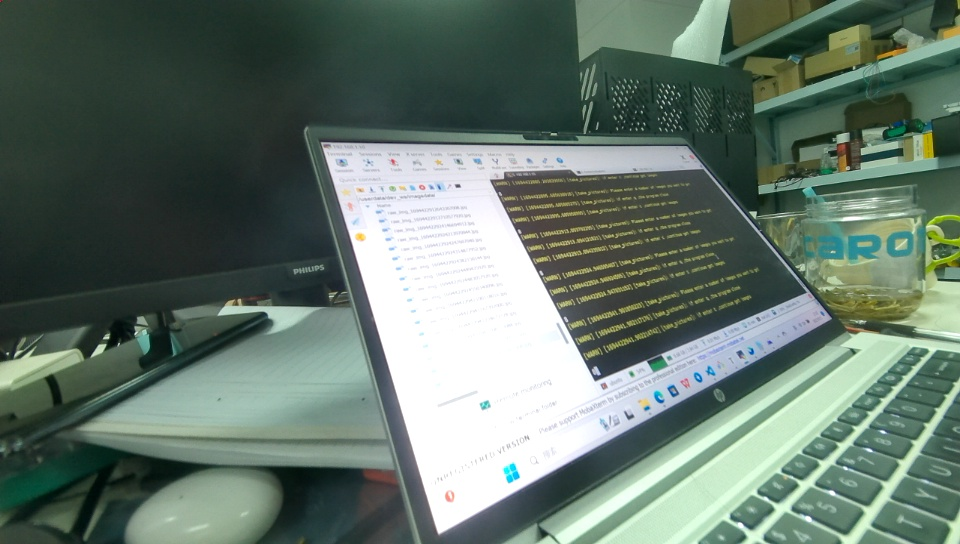

# **图像获取**

???+ hint
    操作环境及软硬件配置如下：
    
     - OriginBot机器人（Lite版/标准版/Pro 版）
     - PC：Ubuntu (≥22.04) + ROS2 (≥humble)

## **功能介绍**

图像获取是视觉开发中必不可少的一个基本功能，使用者可以通过读取每一帧图像来进行数据之间的交互，也可以在读取数据的基础上使用各种传统视觉算法对每一帧图像进行处理。故此功能包的作用是为解决两个问题，其一为帮助用户获取指定帧图像数据，其二为帮助开发者学习 RDK 中各种图像数据的使用。

## **功能运行（Pro版）**

打开视频设备，获取图像数据；可输入获取图像数量和间隔时间(ms)，默认为1张，默认间隔1000ms，视频设备默认为/dev/video0。
``` bash
# 获取图像
ros2 run originbot_demo take_pictures
# 指定获取图像数量和间隔时间(ms)
# 例如：获取3张图像，间隔500ms
ros2 run originbot_demo take_pictures 3 500
# 指定相机设备
ros2 run originbot_demo take_pictures 3 500 --dev /dev/video0
```

## **功能运行（Lite版/标准版）**
 
### **编译功能包**

take_pictures_node 功能包是一个独立的功能包，使用者可以在运行前通过以下指令确保功能的正常运行。

```
cd /userdate/dev_ws
colcon build --packages-select take_pictures_node
cp -r /opt/tros/lib/mono2d_body_detection/config/ .
cp -r /opt/tros/lib/hand_lmk_detection/config/ .
cp -r /opt/tros/lib/hand_gesture_detection/config/ .
```

### **获取图像帧数据**

该功能有两种启动方式，一种为 ros2 run 单独启动节点执行，可以手动指定获取多少张图像，第二种为启动 launch 文件，持续获取图像帧；

#### 方法一：ros2 run

打开两个终端，在第一个终端中执行

```
cd /userdate/dev_ws
ros2 run take_pictures_node take_pictures
```
第二个终端中启动相机节点
```
ros2 launch originbot_bringup camera.launch.py
```

#### 方法二：ros2 launch
通过launch文件启动，由于在launch文件中默认设置了获取多少张，故执行后机会自动获取图片，可以通过打开ip:8000网页看到相机对应的图片。
```
ros2 launch take_pictures_node take_pictures_node.launch.py
```

### **例程说明**
以ros2 run 为例，启动两个终端后，结果如下图所示。

此时，只需往终端中写入你想获取多少张数据帧，程序将会自动保存图像至 /userdata/dev_ws/imagedata/ 中，如没有该路径，路径将会自动创建，如下图所示。

图像效果如下。

通过执行以下命令获取的是rgb数据格式的图片，此外该功能包提供了nv12格式的图片以供选择。
```
#rgb8
ros2 run take_pictures_node take_pictures
```
以下命令为获取nv12格式图片
```
#第一个终端
ros2 launch originbot_bringup camera_internal.launch.py
#第二个终端
ros2 run take_pictures_node take_pictures  --ros-args -p sub_img_topic:=/hbmem_img  --ros-args -p take_nums:=0
```

### **重点模块说明**
在代码实现中，需要关注hbm_img_msgs::msg::HbmMsg1080P与nv12、nv12与rgb转换，以及rgb与opencv格式的处理。

    void TakePicturesNode::saveHbmImage(
        hbm_img_msgs::msg::HbmMsg1080P::SharedPtr image_msg) {
        RCLCPP_INFO(rclcpp::get_logger("take_pictures"),"saveHbmImage start");
    
        auto image_nv12 = Hbmem2Sensor(image_msg);
    
        char *buf_src = new char[image_msg->data_size];
        cv::Mat mat_src = cv::Mat(image_nv12.height * 1.5, image_nv12.width, CV_8UC1, buf_src);
        cv::Mat mat_dst = cv::Mat(image_nv12.height, image_nv12.width, CV_8UC3);
        cv::cvtColor(mat_src, mat_dst, cv::COLOR_YUV2BGR_NV12);
    
        auto image_rgb = NV122RGB(image_nv12,mat_dst);
    
        cv_bridge::CvImagePtr cv_ptr = nullptr;
        cv_ptr = cv_bridge::toCvCopy(image_rgb, sensor_msgs::image_encodings::RGB8);
        // cv::Mat frame_gray;
        // cvtColor( cv_ptr->image, frame_gray, cv::COLOR_BGR2GRAY);
        cv::Mat frame_rgb = cv_ptr->image;
        std::string fName = save_dir_ + "/raw_img_" +
            std::to_string(image_rgb.header.stamp.sec) +
            std::to_string(image_rgb.header.stamp.nanosec) + ".jpg";
        cv::imwrite(fName, frame_rgb);
        }

[](https://www.guyuehome.com/){:target="_blank"}