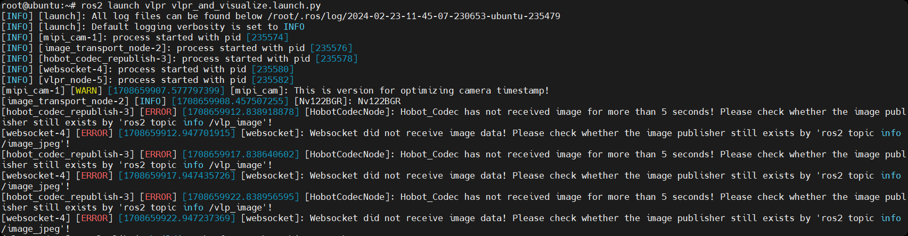
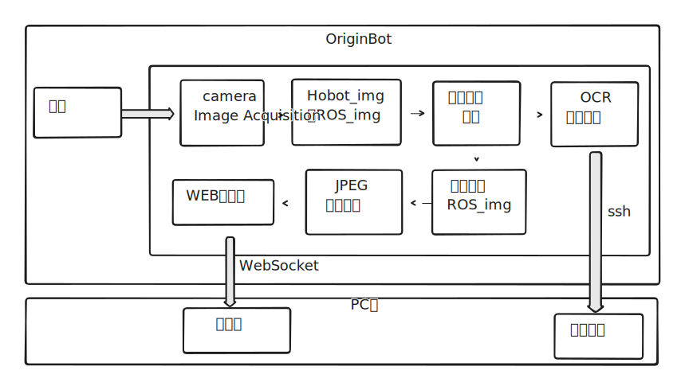

# **车牌识别**

???+ hint
    操作环境及软硬件配置如下：

     - OriginBot机器人（Lite版/标准版）
     - PC：Ubuntu (≥22.04) + ROS2 (≥humble)


## **车牌识别**

SSH连接OriginBot成功后，在终端中输入如下指令，启动车牌识别功能：

```
ros2 launch vlpr vlpr_and_visualize.launch.py
```




启动后web 端会警告无图像数据，需等待车牌识别功能完全启动，当[vlpr_node]显示successfully时启动完成


## **WEB端查看例程效果**

运行成功后，在同一网络的PC端，打开浏览器，输入 http://IP:8000 ，选择“web展示端”，即可查看图像和识别效果，IP为OriginBot的IP地址。


## **原理简介**

车牌识别功能为通过检测车牌轮廓，并识别轮廓内的数字实现，由MIPI图像采集、字符轮廓检测、OCR、图像编解码、WEB展示端组成，流程如下图：

