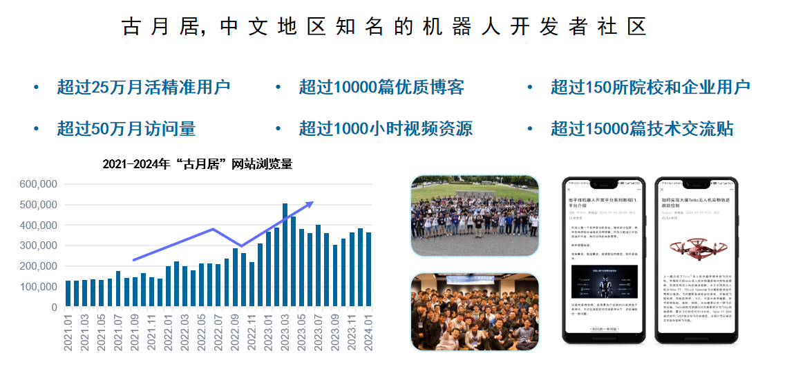

# **About OriginBot** 

OriginBot is an open source kit for intelligent robots and a community-built open source project that aims to allow every participant to enjoy the fun of robot development.

The project was jointly initiated by Guyuehome and D-Robotics, and more companies, organizations and developers are welcome to join.

Contact:brand@guyuehome.com

## **Introduction to Guyuehome**

Guyuehome is a well-known ROS robot community in the Chinese-speaking world（[www.guyuehome.com](http://www.guyuehome.com/){:target="_blank"}） dedicated to providing a high-quality communication and learning platform for robot learners. With more than 1.2 million online users, it strives to build a community ecosystem that integrates talent, content, and schools and enterprises. Since its establishment in 2011, it has accumulated more than 10 million words of high-quality content and more than 1,000 hours of video courses. It has published best-selling books such as "ROS Robot Development Practice" and established cooperation with many universities and enterprises. Through the innovative model of AI robot + community ecology, it enables future-oriented talent training.

