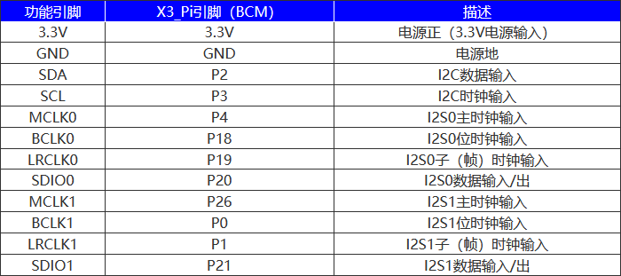
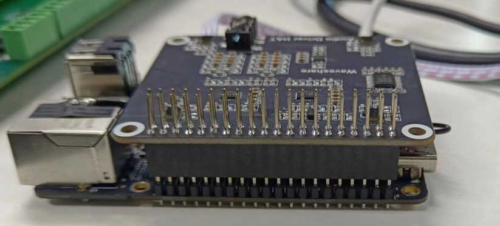
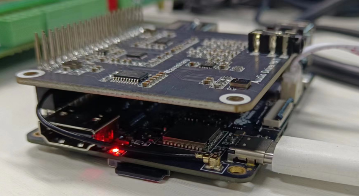
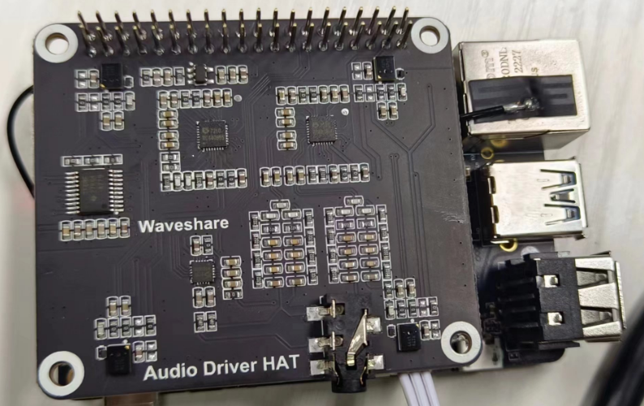
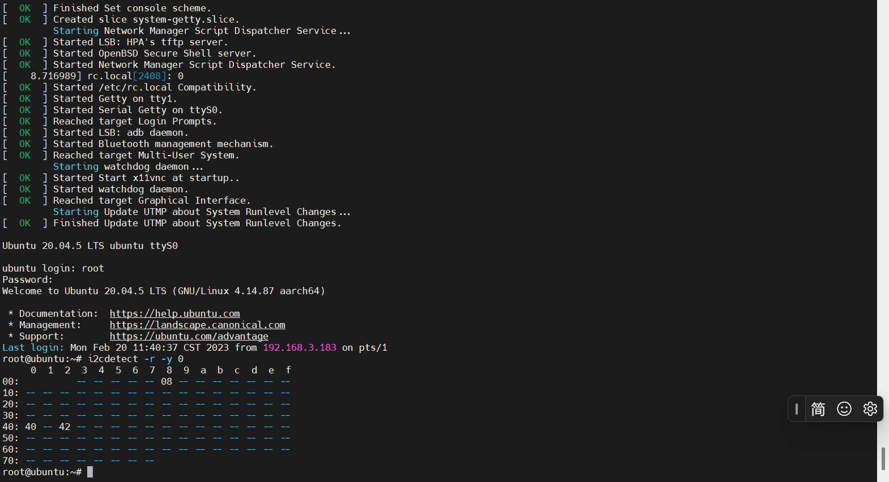
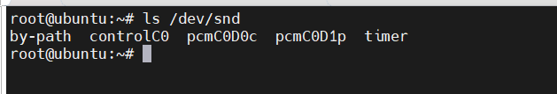
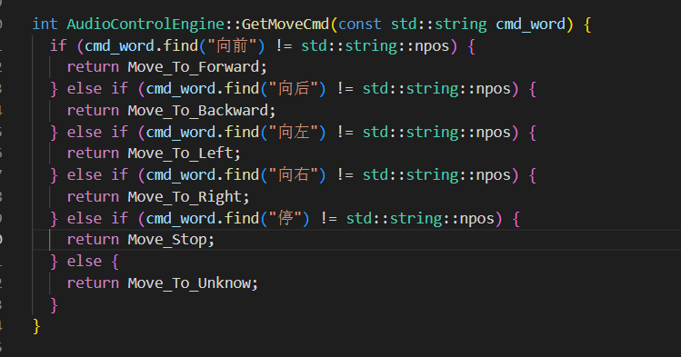

# **Voice Control**

???+ hint
    The operating environment and software and hardware configurations are as follows:

     - OriginBot Pro
     - PC：Ubuntu (≥22.04) + ROS2 (≥humble)
     - Microphone expansion board


## **Function introduction**

With the increasing development of electronic products, voice recognition technology has widely appeared in different scenarios, such as smart homes, voice assistants, telephone customer service, and robot tour guides. And with the continuous development of technology, the voice recognition of robots is becoming more and more accurate and reliable, which further promotes the application of robots in various fields.

The voice control function developed this time needs to be used in conjunction with the intelligent voice module of the Horizon Robotics development platform. Thanks to the BPU of 10Tops computing power on X5, it can realize low-latency algorithm inference capabilities, as well as far-field (3~5 meters) noise reduction, echo cancellation, and high-accuracy asr recognition functions realized by the voice algorithm module, and users can independently configure voice command words or directly define the behavior of the robot according to speech recognition.

## **Function runs**

### **Configure the environment**

After SSH connection to OriginBot, configure the intelligent voice module:

```
# Copy the configuration files needed to run the example from the TogetheROS installation path.
cp -r /opt/tros/lib/hobot_audio/config/ .

# Load the audio driver only once after the device starts.
bash config/audio.sh
```

### **Start the robot chassis**

Enter the following commands in the terminal to start the robot chassis:

```
ros2 launch originbot_bringup originbot.launch.py
```

### **Start voice control**

The following are the instructions for the password control function:

``` bash
ros2 launch audio_control audio_control.launch.py
```


## **Presentation effect**


## **Description of the intelligent voice module**

The intelligent voice module is an audio module designed based on RDK, using ES7210 high-performance four-channel coding chip and ES8156 high-performance stereo audio decoding chip, which is controlled through the I2C interface and transmitted audio through the I2S interface. The standard 3.5mm headphone jack is installed on board to play music through external headphones. There is a high-quality MEMS silicon microphone in each of the left and right corners of the board for stereo recording.

**Where to buy**

You can check the RDK User Manual [Audio Adapter Board | RDK User Manual (horizon.cc)](https://developer.horizon.cc/documents_rdk/hardware_development/rdk_x3/audio_board)
has how to use and a link to purchase

**Product Features**

- Supply voltage：3.3V
- Audio coding chip：ES7210
- Audio decoding chip：ES8156
- Control interface：I2C
- Audio interface：I2S
- ADC signal-to-noise ratio：102dB
- DAC signal-to-noise ratio：110dB

**Interface**



**Installation**







**Detect the hardware runtime environment method**

```
i2cdetect -r -y 0
```



Among them,`08` is the device address of `ES8156`，`40`and`42` are the device address of  `ES7210`.

**Load the driver audio codec and the rdk audio framework driver**

```
sudo modprobe es7210
sudo modprobe es8156
sudo modprobe hobot-i2s-dma
sudo modprobe hobot-cpudai
sudo modprobe hobot-snd-7210 snd_card=5
```

**Check whether the load is successful**

```
ls /dev/snd
```



After successfully loading, run the `ls  /dev/snd`  command to see that the audio control node, the recording and playback node of pcm, has been generated.

**Recording test methods**

```
#Capture the recording of the 4-channel microphone for 5 seconds:
sudo tinycap ./4chn_test.wav -D 0 -d 0 -c 4 -b 16 -r 48000 -p 512 -n 4 -t 5
#Capture the recording of the 2-channel microphone for 5 seconds:
sudo tinycap ./2chn_test.wav -D 0 -d 0 -c 2 -b 16 -r 48000 -p 512 -n 4 -t 5
```

**Play**

```
#Play 2-channel audio (4-channel recording is not supported) :
sudo tinyplay ./2chn_test.wav -D 0 -d 1
```

You can use a speaker or a 3.5mm earbud to access the jack of the U4 to listen to the effect, or you can pull the audio file from the system to the computer for playback.

## **Voice control is advanced**

Is it possible to redefine the functionality of voice control? The answer is, it must be!

You can modify the definition and configuration of command words in the intelligent speech recognition node, and at the same time modify the control policy for custom command words in the voice control node, or directly add a voice control APP.

In the Intelligent Speech Recognition Node, the configuration files of the device wake word and command word are in the /opt/tros/lib/hobot_audio/config/hrsc/cmd_word.json file (of course, if the user copies this config folder to another path, the actual configuration path shall prevail), and the default configuration is as follows:

```
{
    "cmd_word": [
    "Hello",
    "Move on",
    "Back up",
    "Turn left",
    "Turn right",
    "Stop moving"
    ]
}
```

The first word is the wake word. So how do you do that with the commands after that?



This function is defined in audio_control\src\audio_control_engine.cpp, you only need to modify the keywords here and add the corresponding function operation to DIY by yourself.


[](https://www.guyuehome.com/){:target="_blank"}
