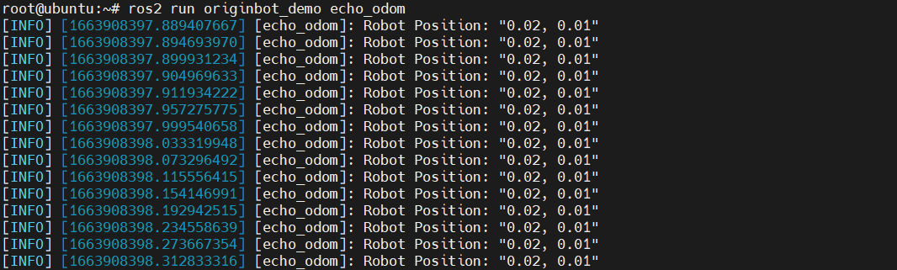
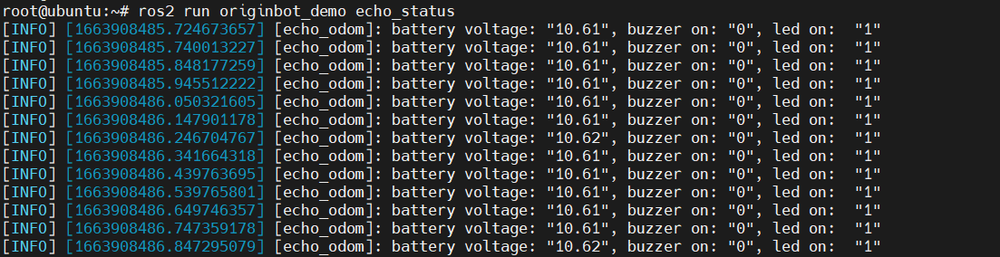
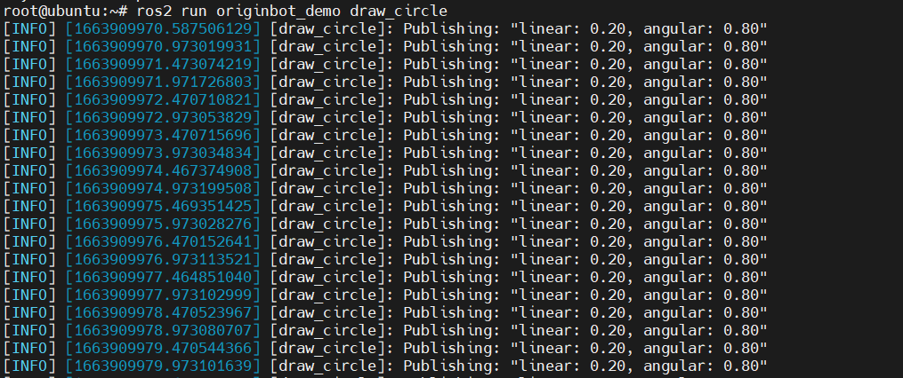

# **Basic functional programming**

???+ hint
    The operating environment and software and hardware configurations are as follows:
    

     - OriginBot Pro
     - PC：Ubuntu (≥22.04) + ROS2 (≥humble)


## **Get odometer messages**

### **Run the routine**

After starting the robot chassis, run the following commands on the robot or PC:

```bash
ros2 run originbot_demo echo_odom
```


Soon the location coordinates in the odometer odom topic will be visible in the terminal:

{.img-fluid tag=1 title="Get odometer messages"}


### **Code implementation**

The code file that implements this function is originbot_demo/echo_odom.py, and the detailed implementation process is as follows:

```python
import rclpy                          # ROS2 Python interface library
from rclpy.node   import Node         # ROS2 Node class
from nav_msgs.msg import Odometry     # The odometer message defined by the ROS2 standard

"""
Create a subscriber node
"""
class SubscriberNode(Node):
    
    def __init__(self, name):
        super().__init__(name)                              # The ROS2 node parent class is initialized
        self.sub = self.create_subscription(\
            Odometry, "odom", self.listener_callback, 10)   # Create subscriber objects (message type, topic name, subscriber callback function, queue length)

    def listener_callback(self, msg):                        # Create a callback function that performs the processing of the data after receiving the topic message
        self.get_logger().info('Robot Position: "%0.2f, %0.2f"' \
            % (msg.pose.pose.position.x, msg.pose.pose.position.y)) 

def main(args=None):                       # ROS2 node main entry main function
    rclpy.init(args=args)                  # ROS2 The Python interface is initialized
    node = SubscriberNode("echo_odom")     # Create and initialize the ROS2 node object
    rclpy.spin(node)                       # Loop waiting for ROS2 to exit
    node.destroy_node()                    # Destroy node object
    rclpy.shutdown()                       # Close the ROS2 Python interface
```


## **Get the status of your bot**

### **Run the routine**

After starting the robot chassis, run the following commands on the robot or PC:

```bash
ros2 run originbot_demo echo_status
```


Soon you will be able to see the output information of the robot status in the terminal:

{.img-fluid tag=1 title="Get the status of your bot"}


### **Code implementation**

The code file that implements this function is originbot_demo/echo_status.py, and the detailed implementation process is as follows:

```python
import rclpy                                     # ROS2 Python interface library
from rclpy.node   import Node                    # ROS2 Node class
from originbot_msgs.msg import OriginbotStatus   # OriginBot Custom status messages

"""
Create a subscriber node
"""
class SubscriberNode(Node):
    
    def __init__(self, name):
        super().__init__(name)                                               # The ROS2 node parent class is initialized
        self.sub = self.create_subscription(\
            OriginbotStatus, "originbot_status", self.listener_callback, 10) # Create subscriber objects (message type, topic name, subscriber callback function, queue length)

    def listener_callback(self, msg):                                        # Create a callback function that performs the processing of the data after receiving the topic message
        self.get_logger().info('battery voltage: "%0.2f", buzzer on: "%d", led on:  "%d"' \
            % (msg.battery_voltage, msg.buzzer_on, msg.led_on)) 

def main(args=None):                    # ROS2 node main entry main function
    rclpy.init(args=args)               # ROS2 The Python interface is initialized
    node = SubscriberNode("echo_odom")  # Create and initialize the ROS2 node object
    rclpy.spin(node)                    # Loop waiting for ROS2 to exit
    node.destroy_node()                 # Destroy node object
    rclpy.shutdown()                    # Close the ROS2 Python interface
```


## **Control the buzzer**

### **Run the routine**

After starting the robot chassis, run the following commands on the robot or PC:

```bash
ros2 run originbot_demo control_buzzer
```


After successful operation, you can hear the buzzer on the robot controller board start to sound at intervals, and the interval time is about 3s.


### **Code implementation**

The code file that implements this function is originbot_demo/control_buzzer.py, and the detailed implementation process is as follows:

```python
import time
import rclpy                                     # ROS2 Python interface library
from rclpy.node   import Node                    # ROS2 Node class
from originbot_msgs.srv import OriginbotBuzzer   # Custom service interface

class serverClient(Node):
    def __init__(self, name):
        super().__init__(name)                                                  # The ROS2 node parent class is initialized
        self.client = self.create_client(OriginbotBuzzer, 'originbot_buzzer')   # Create a service client object (service interface type, service name)
        while not self.client.wait_for_service(timeout_sec=1.0):                # Loop waiting for the server side to start successfully
            self.get_logger().info('service not available, waiting again...') 
        self.request = OriginbotBuzzer.Request()                                # Create the data object for the service request
                    
    def send_request(self, buzzer_on):                                          # Create a function that sends a service request
        self.request.on = buzzer_on
        self.future = self.client.call_async(self.request)                      # Service requests are sent in asynchronous mode

def main(args=None):
    rclpy.init(args=args)                      # ROS2 The Python interface is initialized
    node = serverClient("control_buzzer")      # Create and initialize the ROS2 node object
    
    buzzer_on= True
    while rclpy.ok():                          # ROS2 The system is running properly
Send service request
        node.send_request(buzzer_on)           # Send service request
        rclpy.spin_once(node)                  # Loop through the node once
        
        buzzer_on = not buzzer_on
        time.sleep(3)

    node.destroy_node()                        # Destroy node object
    rclpy.shutdown()                           # Close the ROS2 Python interface
```


## **Control LED**

### **Run the routine**

After starting the robot chassis, run the following commands on the robot or PC:

```bash
ros2 run originbot_demo control_led
```


After successful operation, you can see that the LED on the robot controller board starts to flash at intervals, and the interval time is about 3s.


### **Code implementation**

The code file that implements this function is originbot_demo/control_led.py, and the detailed implementation process is as follows:


```python
import time
import rclpy                                   # ROS2 Python interface library
from rclpy.node   import Node                  # ROS2 Node class
from originbot_msgs.srv import OriginbotLed    # Custom service interface

class serverClient(Node):
    def __init__(self, name):
        super().__init__(name)                                                 # The ROS2 node parent class is initialized
        self.client = self.create_client(OriginbotLed, 'originbot_led')        # Create a service client object (service interface type, service name)
        while not self.client.wait_for_service(timeout_sec=1.0):               # Loop waiting for the server side to start successfully
            self.get_logger().info('service not available, waiting again...') 
        self.request = OriginbotLed.Request()                                  # Create the data object for the service request
                    
    def send_request(self, led_on):                                            # Create a function that sends a service request
        self.request.on = led_on
        self.future = self.client.call_async(self.request)                     # Service requests are sent in asynchronous mode

def main(args=None):
    rclpy.init(args=args)                 # ROS2 The Python interface is initialized
    node = serverClient("control_led")    # Create and initialize the ROS2 node object
    
    led_on= True
    while rclpy.ok():                     # ROS2 The system is running properly
        node.send_request(led_on)         # Send service request
        rclpy.spin_once(node)             # Loop through the node once
        
        led_on = not led_on
        time.sleep(3)

    node.destroy_node()                   # Destroy node object
    rclpy.shutdown()                      # Close the ROS2 Python interface
```


## **Publish speed commands**

### **Run the routine**

After starting the robot chassis, run the following commands on the robot or PC:

```bash
ros2 run originbot_demo draw_circle
```

{.img-fluid tag=1 title="Publish speed commands"}


After successful startup, you can see that the robot starts to make a circular motion:


### **Code implementation**

The code file that implements this function is originbot_demo/draw_circle.py, and the detailed implementation process is as follows:

```python
import rclpy                              # ROS2 Python interface library
from rclpy.node import Node               # ROS2 Node class
from geometry_msgs.msg import Twist       # News on speed topic

"""
Create a subscriber node
"""
class PublisherNode(Node):
    
    def __init__(self, name):
        super().__init__(name)                                    # The ROS2 node parent class is initialized
        self.pub   = self.create_publisher(Twist, 'cmd_vel', 10)  # Create a publisher object (message type, topic name, queue length)
        self.timer = self.create_timer(0.5, self.timer_callback)  # Create a timer (period in seconds, timed callback function)
        
    def timer_callback(self):               # Create a callback function for timer periodic execution
        twist = Twist()                     # Create a message object of type Twist
        twist.linear.x  = 0.2               # Fill the line speed in the message object
        twist.angular.z = 0.8               # Fill the angular velocity in the message object
        self.pub.publish(twist)              # Publish topic news
        self.get_logger().info('Publishing: "linear: %0.2f, angular: %0.2f"' % (twist.linear.x, twist.angular.z))  
        
def main(args=None):                      # ROS2 node main entry main function
    rclpy.init(args=args)                 # ROS2 The Python interface is initialized
    node = PublisherNode("draw_circle")   # Create and initialize the ROS2 node object
    rclpy.spin(node)                      # Loop waiting for ROS2 to exit
    node.destroy_node()                   # Destroy node object
    rclpy.shutdown()                      # Close the ROS2 Python interface
```


[](https://www.guyuehome.com/){:target="_blank"}

