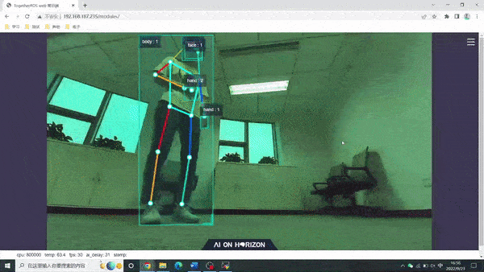

# **Human Body Tracking**

???+ hint
    The operating environment and software and hardware configurations are as follows:
    

     - OriginBot Pro
     - PC：Ubuntu (≥22.04) + ROS2 (≥humble)


## **Start the robot chassis**

After the SSH connection to OriginBot is successful, enter the following command in the terminal to start the robot chassis:

```bash
ros2 launch originbot_bringup originbot.launch.py
```

{.img-fluid tag=1 title="Start the robot chassis"}


## **Activate the human body following function**

``` bash
cd /userdata/dev_ws

# Start the launch file
ros2 launch body_tracking body_tracking_without_gesture.launch.py
```

{.img-fluid tag=1 title="Activate the human body following function"}

???+ Attention
    When starting the application function, please pay attention to the configuration file under the current running path, otherwise the application function cannot find the configuration file and will fail to run.


## **The human body follows the effect**

After successful startup, standing in front of the OriginBot camera, you need to let the robot recognize the whole body, move the body slowly, and you can see that the robot has begun to follow the movement of the human body.


## **Visualized display of the upper computer**

Open the browser and access the IP address of the robot to see the real-time effect of visual recognition.





## **Introduction to the principle**

The human body following function is to control the robot to follow the movement of the human body, which is composed of MIPI image acquisition, human body detection and tracking, human body following strategy, image encoding and decoding, and WEB display, and the process is as follows:

{.img-fluid tag=1 title="Introduction to the principle"}

For a detailed explanation of the principle, please see:

[https://developer.d-robotics.cc/rdk_doc/Robot_development/apps/car_tracking](https://developer.d-robotics.cc/rdk_doc/Robot_development/apps/car_tracking){:target="_blank"}


The source code for human detection and tracking can be found at:

[https://github.com/D-Robotics/body_tracking](https://github.com/D-Robotics/body_tracking){:target="_blank"}


[](https://www.guyuehome.com/){:target="_blank"}

