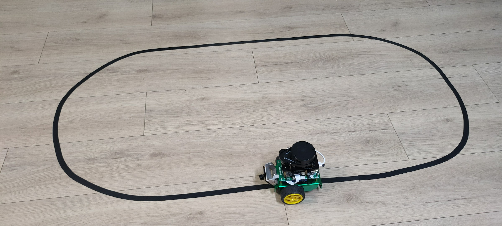
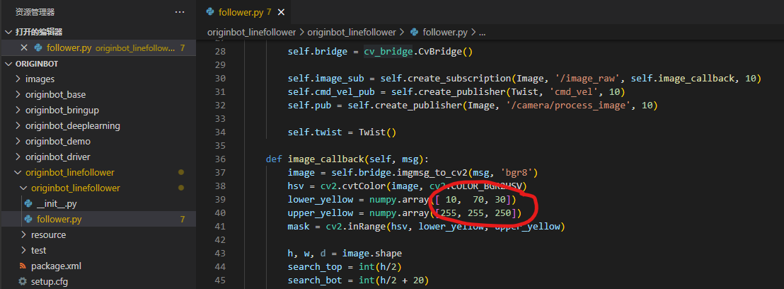
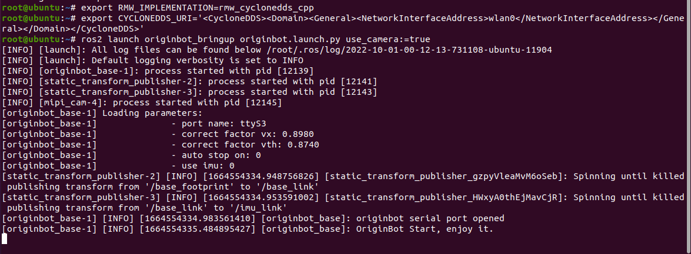
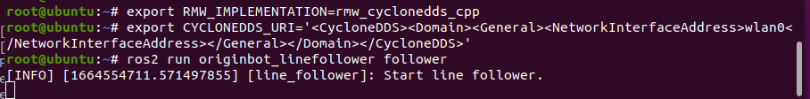
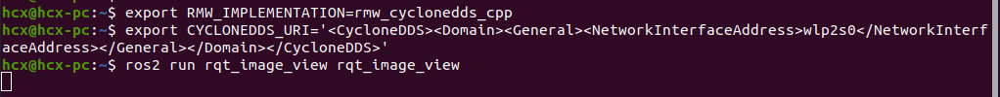
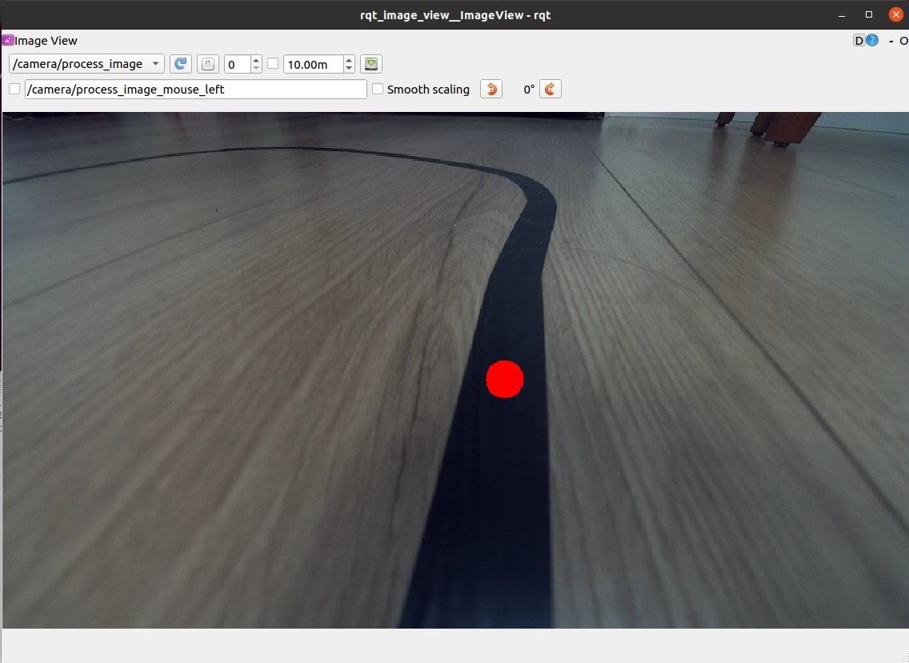

# **Visual Line Following（OpenCV）**

???+ hint
    The operating environment and software and hardware configurations are as follows:

     - OriginBot Pro
     - PC：Ubuntu (≥22.04) + ROS2 (≥humble)
     - Line patrol scene: black path line, the background has obvious contrast


## **Scenario description**

The scene of visual line patrol is as follows, this routine uses the black guide line as the recognition target, and adjusts the camera angle down as much as possible to avoid external interference.

{.img-fluid tag=1}

???+ attation
    Visual lines are greatly affected by light and color, it is strongly recommended to debug the threshold of the guide line in your own site environment before using this routine, and modify the upper and lower limits of the HSV threshold in the originbot_linefollower/follower.py program, and pay attention to recompilation after the modification is completed, and then run the following steps.{.img-fluid tag=1}


## **Start the chassis and camera**

After the SSH connection to OriginBot is successful, enter the following command in the terminal, switch DDS, select the NIC for data communication, and start the robot chassis and camera:

```bash
export RMW_IMPLEMENTATION=rmw_cyclonedds_cpp
export CYCLONEDDS_URI='<CycloneDDS><Domain><General><NetworkInterfaceAddress>wlan0</NetworkInterfaceAddress></General></Domain></CycloneDDS>'
ros2 launch originbot_bringup originbot.launch.py use_camera:=true
```

{.img-fluid tag=1}

???+ info
    In order to ensure the real-time performance of the image, we will switch the DDS used here to cyclonedds to avoid the image delay caused by DDS slicing. Cyclonedds will bind a network card for data transmission by default, here we use the second command to specify the wireless network card wlan0 as the bound official website card, you can switch according to the actual situation. For more information, see [DDS Configuration](../manual/camera_visualization.md#installing-dds){:target="_blank"}.


## **Enable the visual line patrol function**

Connect to OriginBot via SSH, enter the following command in the terminal, switch DDS, select the NIC for data communication, and then start the visual line patrol function:

```bash
export RMW_IMPLEMENTATION=rmw_cyclonedds_cpp
export CYCLONEDDS_URI='<CycloneDDS><Domain><General><NetworkInterfaceAddress>wlan0</NetworkInterfaceAddress></General></Domain></CycloneDDS>'
ros2 run originbot_linefollower follower
```

{.img-fluid tag=1}


After the start is successful, wait for a while, and the robot will start to automatically patrol the line.


## **Visualized display of the upper computer**

In order to easily see the dynamic recognition effect of the robot, switch DDS and select the network card for data communication on the PC side under the same network, and start the rqt_image_view:

```bash
export RMW_IMPLEMENTATION=rmw_cyclonedds_cpp
export CYCLONEDDS_URI='<CycloneDDS><Domain><General><NetworkInterfaceAddress>wlp2s0</NetworkInterfaceAddress></General></Domain></CycloneDDS>'
ros2 run rqt_image_view rqt_image_view
```

{.img-fluid tag=1}

???+ info
    Here we use the second command to specify the wireless network card wlp2s0 as the binding official website card, the name is related to the computer system, you can use ifconfig query, you can modify it according to the actual situation.


Subscribe to /camera/process_image topic to see the image effect of dynamic recognition.

{.img-fluid tag=1}


[](https://www.guyuehome.com/){:target="_blank"}
