# **Visual Line Following (AI Deep Learning)**

???+ hint
    The operating environment and software and hardware configurations are as follows:

     - OriginBot Pro
     - PC：Ubuntu (≥22.04) + ROS2 (≥humble) + pytorch + docker
     - Line following scene: black path line, with obvious contrast with the background


## **Apply goals**

In the [visual line patrol（OpenCV）](../application/cv_line_follower.md){:target="_blank"}, we can already let the car follow the black path line movement, to achieve the most basic visual line patrol task, but you may have found that the image recognition based on OpenCV is greatly affected by the light, after changing the site, the threshold needs to be readjusted, is it possible to let the robot autonomously adapt to the changes in the environment? That is, let the robot learn on its own.

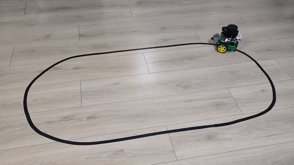

No problem, everyone must have heard of deep learning, using this method, we can achieve a data-driven visual line patrol effect, what kind of site needs to be adapted, just need to collect some picture data, and then we will try it.


## **Run method**

### **Scenario description**

In the application code of OriginBot, we have trained a set of line patrol models for you, using the following scenarios:

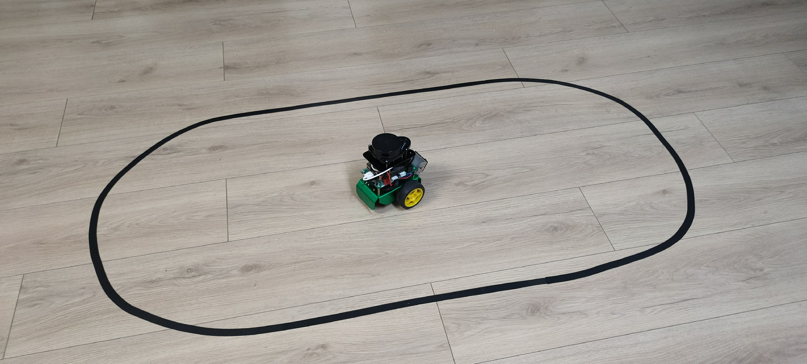{.img-fluid tag=1}


If you have a similar environment around you, you can skip the machine learning steps mentioned above for the time being and go directly to the deployment process, let's first try how effective the visual line patrol is using deep learning.


### **Start the visual line patrol**

First, place the OriginBot in the scene where you are patrolling the line, and adjust the camera angle down as much as possible to avoid external interference.

{.img-fluid tag=1}


Next, start the line patrol function, and note the parameters that need to be followed by the model path and name after the command:

```bash

cd /userdata/dev_ws/src/originbot/originbot_deeplearning/line_follower_perception/
ros2 run line_follower_perception line_follower_perception --ros-args -p model_path:=model/resnet18_224x224_nv12.bin -p model_name:=resnet18_224x224_nv12
```
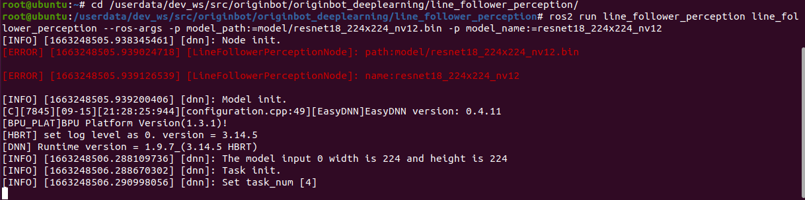{.img-fluid tag=1}


### **Start the robot**

After SSH is connected to OriginBot, enter the following command in the terminal to start the robot chassis and camera:

``` bash
ros2 launch line_follower_perception usb_cam_web.launch.py
ros2 launch originbot_bringup originbot.launch.py
```

After the camera is successfully started, you can see the dynamically recognized path line position in the line patrol terminal:

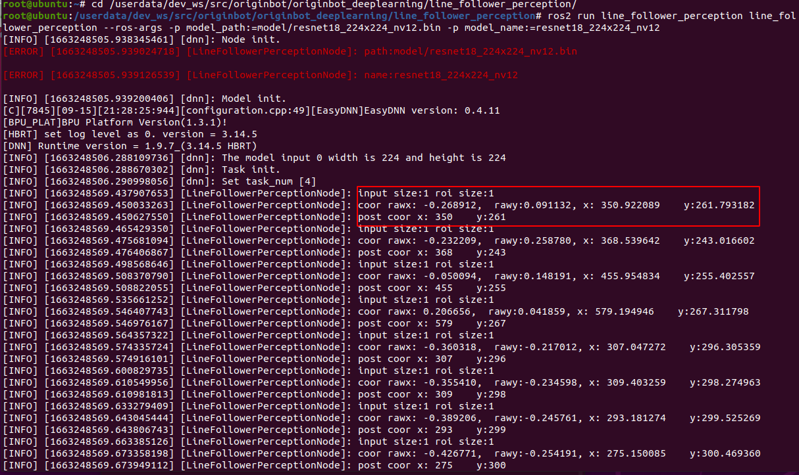{.img-fluid tag=1}


After running for a while, you can see that the robot has started to patrol the line.


Deep learning is based on data, the robot can only learn from the scene that it has seen in the data. If it has not seen the scene, the recognition effect is not very good. So if we use the patrol color and the surrounding environment are different, we still need to collect as much data as possible so that the robot can learn. The complete deep learning process can refer to the following.


## **Introduction to the principle**

The perception of the position of the guide line in the line-tracking task is actually the perception of the characteristics of the guide line. The photoelectric sensor detects the position of the line by using the difference in reflected light. Different colors of surfaces have different reflectivity. For example, white has a high reflectivity and black absorbs light, so the received signal strength is different. The traditional image processing method is to extract features based on the pixel values of the image, while deep learning automatically learns the image features through the neural network and returns the position of the features in the image.

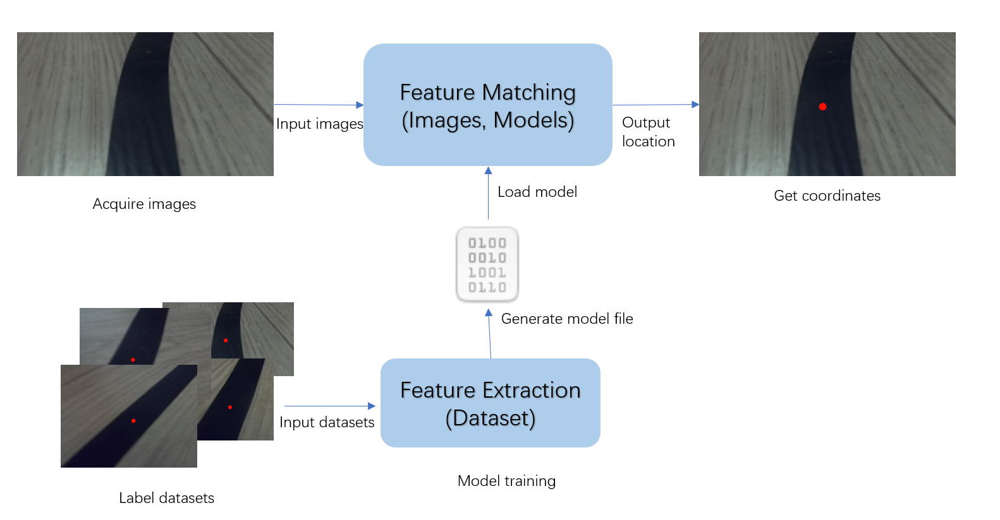{.img-fluid tag=1}

deeplearning in the line-tracking task is actually a powerful feature matcher. It can extract guide line features from the image and return the position of the features in the image. As long as a certain number of labeled data are prepared, a deep learning model can be trained to achieve guide line position perception, and there is no need to manually adjust the threshold.

### **Deep learning process**

Compared with traditional image processing, deep learning can enable machine vision to adapt to more changes, thereby improving the accuracy of complex environments. Before we begin, let's briefly introduce the basic process of deep learning.

The core purpose of machine learning is to help us solve problems, which can be broken down into six main steps:

- **Problem definition**：What is the problem we are trying to solve? For example, in the case of visual line patrol here, it is necessary to identify the position of the line in the image.
- **Data preparation**：Start preparing your data for the problem you want to solve. For example, you need to prepare photos of various line patrol scenes for machine learning.
- **Model selection/development**：A model is a set of processes for processing data, which is often referred to as CNN convolutional neural networks, GAN generative adversarial networks, RNN recurrent neural networks, and so on.
- **Model training and tuning**：Putting data into the model and training the optimal parameters can be understood as the process of machine learning.
- **Model evaluation test**：Just like a quiz, we take some data and give it to the trained model to see how it works.
- **Deployment**：After everything is ready, you can put the trained model on the robot, that is, officially transfer the knowledge to a certain robot, and it can solve the problem raised earlier.


### **Visual line inspection process**

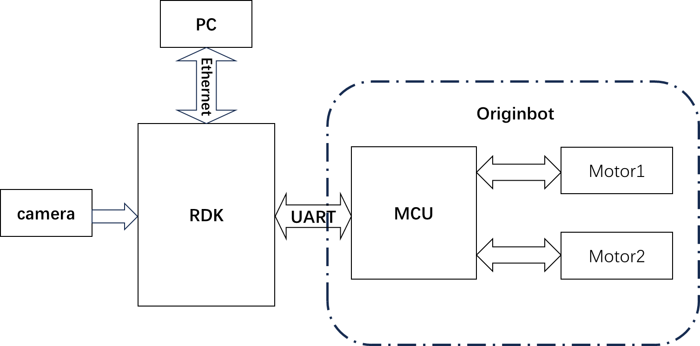{.img-fluid tag=1}

The OriginBot has two active wheels, one passive wheel, and the two active wheels are used to rotate the robot through differential speed. The MCU module is mainly used for motor control of the robot and communicates with the main control RDK X5 through UART. The main controller is selected to be the earthmelon RDK X5, which has 10T computing power and can easily handle complex CNN inference tasks.

The whole system is shown in the figure above. The RDK X5 obtains the data of the environment in front of the car through the camera, and the image data is inferred by the trained CNN model to obtain the coordinate value of the guide line, and then the motion mode of the car is calculated according to a certain control strategy, and the motion control command is issued to the car through UART to realize the closed-loop control of the whole system.

The PC is used for data annotation and training.

### **Data labeling and training**

ResNet18 is a 18-layer deep residual convolutional neural network, one of the most classic networks in the deep learning field, and has excellent performance in image classification tasks. It solves the problem of gradient disappearance through residual connections, allowing deeper neural networks to be successfully trained. On the D-Robotics RDK, ResNet18 inference performance reaches 232FPS, ensuring the real-time processing of data.

ResNet18 inputs a resolution of 224x224, so the image size passed in for training needs to be transformed to 224x224

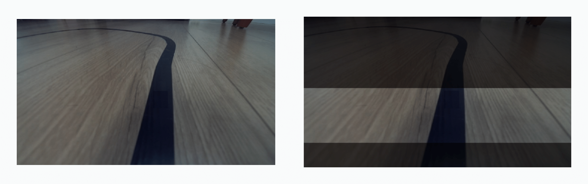

In the line-tracking scenario, the part that is more concerned about is the lower part of the image, so the part that is not needed can be cut off synchronously during annotation, and the line height can be cut off to 224.

For the width, you can use scaling. The image size captured by the USB camera is 640x480, and the width will be scaled to 224 during training. This step usually does not modify the original dataset file, but scales it when reading.

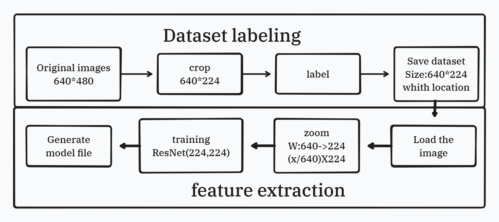

Summarizing the process, the USB camera captures a series of 640x480 images with guiding lines; the annotation program reads an image, crops part of the area to get a 640x224 image, and completes the annotation by clicking the position of the guiding line with the mouse; the obtained dataset is passed to ResNet18 before scaling the annotated coordinates and images to 224x224 to start training, and the model file is generated.

### **Deployment on the board and use**

The floating-point model *.pth file trained by pytorch will have very low efficiency if run directly on the D-Robotics RDK. In order to improve the operational efficiency and exert the 10T computing power of the BPU, the operation of convert the floating-point model to the fixed-point model is required here. The trained model is first converted.onnx(**Open Neural Network Exchange**) - an open format used to represent deep learning models, allowing models between different frameworks to be converted and used mutually. Generate fixed-point models that can run on the D-Robotics RDK BPU *.bin file.

Load the model file on the board, and capture images in real time, crop and scale them, and then input them into the ResNet network to get the position of the guiding line in the image.

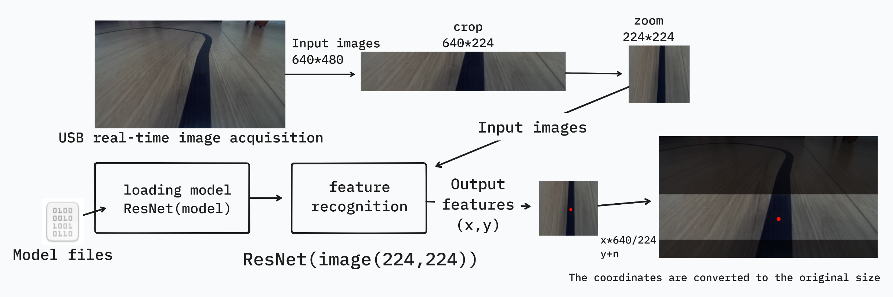

However, the obtained coordinates at this time are based on 224x224, so the coordinates need to be restored to 640x480. The horizontal coordinate is x*(640/224), and the vertical coordinate is y+ the cropped height. After that, control can be achieved based on the position of the guide line. If the guide line is on the left, the car will turn left accordingly; if it is on the right, the car will turn right accordingly.


## **AI deep learning**

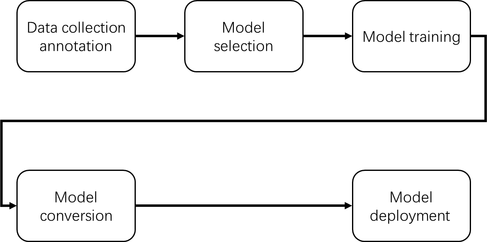{.img-fluid tag=1}

The next deep learning operation is mainly divided into the above steps, before the operation, you also need to complete the configuration of the PC environment, let's experience deep learning together.


### **PC environment configuration**


The basic environment on the PC side is Ubuntu+ROS+pytorch+docker, please complete the configuration of Ubuntu, ROS, and OriginBot function packages according to  [Desktop environment configuration](../guide/pc_config.md){:target="_blank"}.


#### **Install pytorch**

The training framework is pytorch, and you can directly use the following command to install it on the Ubuntu system on the PC side:

``` bash
# create a virtual environment
python3 -m venv ~/.pytorch_venv
source ~/.pytorch_venv/bin/activate
# install pytorch
pip3 install torch torchvision torchaudio --extra-index-url https://download.pytorch.org/whl/cpu
# install opencv
pip3 install opencv-python
```

???+ hint
    To keep the system environment clean, a virtual environment is created for pytorch, and the environment is activated using the command `source ~/.pytorch_venv/bin/activate`, and the activation is canceled using the command `deactivate`.
    In order to ensure universality, the CPU version of pytorch is installed here. If there is a GPU on the hardware, the GPU version of pytorch can also be selected, which will be faster in training speed.


#### **Install docker**

Docker is required for subsequent model conversion to save time for environment configuration, and you need to install it first and download the image used for model conversion.


The installation of Docker in the Ubuntu environment can be completed by referring to the following website or online information:

[Ubuntu Docker installation](https://www.runoob.com/docker/ubuntu-docker-install.html){:target="_blank"}


After the installation is complete, you can use the following command to download the toolchain and docker image for subsequent model conversions:

- OE Package (1.28GB)     
horizon_x5_open_explorer_v1.2.6-py310_20240724.tar.gz
```bash
wget -c ftp://x5ftp@vrftp.horizon.ai/OpenExplorer/v1.2.6_release/horizon_x5_open_explorer_v1.2.6-py310_20240724.tar.gz --ftp-password=x5ftp@123$%
```

- CPU Docker File (1.65GB)       
docker_openexplorer_ubuntu_20_x5_cpu_v1.2.8.tar.gz
```bash
wget -c ftp://x5ftp@vrftp.horizon.ai/OpenExplorer/v1.2.8_release/docker_openexplorer_ubuntu_20_x5_cpu_v1.2.8.tar.gz --ftp-password=x5ftp@123$%
```

???+ hint
    The above docker images are large in size, please ensure that the network is smooth and wait patiently.


#### **Introduction to related feature packs**

Throughout the deep learning process, we will use three directly related feature packages/folders:

- **10_model_convert**：Used to store floating-point model to fixed-point model related code and configuration, and all the contents of this folder need to be run in the AI toolchain docker;

- **line_follower_model**：Used to store model training-related content, such as data labeling, model training, and generating onnx models, all the contents of this folder are run on the PC;

- **line_follower_perception**：Used to store the code of the line following program, which can be compiled on the board or generated by cross-compiling the package running on RDK.


Code repository: [https://github.com/D-Robotics/line_follower.git](https://github.com/D-Robotics/line_follower.git), you can get the code using the following command:

``` bash
mkdir -p ~/line_follower_ws/src
cd ~/line_follower_ws/src/
git clone https://github.com/yzhcat/line_follower.git -b feature-x5-usb_cam
```

Once the environment is ready, we can get started.


### **Data collection and annotation**

Data is the foundation of deep learning, we first need to complete the collection and annotation of data, this process is mainly completed on the PC side, you need to subscribe to the real-time images of the OriginBot robot side, the main process is as follows:

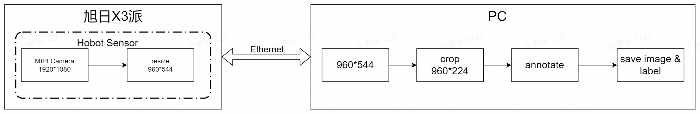{.img-fluid tag=1}

（1）Start the OriginBot camera, collect images of the patrol scene, and publish the image topic image_raw;

（2）The PC side subscribes to the image topics published by OriginBot and obtains image data;

（3）The PC side crops the image, and manually completes the annotation of the path line in each image;

（4）Save the annotation result and the corresponding image.


#### **Start the OriginBot camera**

After connecting to OriginBot via SSH, enter the following command in the terminal to start the camera of OriginBot:

```bash
ros2 launch hobot_usb_cam hobot_usb_cam_websocket.launch.py
```

Use the browser to enter [http://IP:8000](http://ip:8000/) to view the image (IP is the device IP address).

> The static IP address of the network cable is 192.168.127.10
> Other connection methods can use the 'ifconfig' or 'ip addr' command to view the ip

???+ hint
    Data collection process can manually set the posture of the robot, and the robot chassis is not started, only the camera is started.


#### **Start the data collection and annotation program**

=== "Real-time"

    On the PC side, use the following command to start the data acquisition and annotation program in the line_follower_model package:

    ```bash
    cd ~/line_follower_ws/
    colcon build --symlink-install --packages-select line_follower_model
    source install/setup.bash
    ros2 run line_follower_model annotation
    ```
    ???+ hint
        - The program subscribes to the sensor_msgs/Image type image topic /image
        - If you are prompted that cv-bridge is not found, you can try the following command to install
        sudo apt install ros-$ROS_DISTRO-cv-bridge

=== "annotation after collection"
    Use MobaXterm SSH to connect to OriginBot successfully, enter the following command in the terminal to save the image
    ``` bash
    # install image_view
    sudo apt install ros-humble-image-view
    # create a folder to save the image
    mkdir input_images && cd input_images
    # run image_view
    ros2 run image_view image_view
    ```

    > image_view using the right mouse button to save the image, the saved path is in the current directory, you can use the `pwd` command to view the current directory

    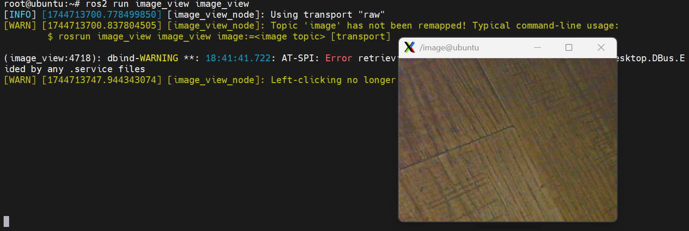

    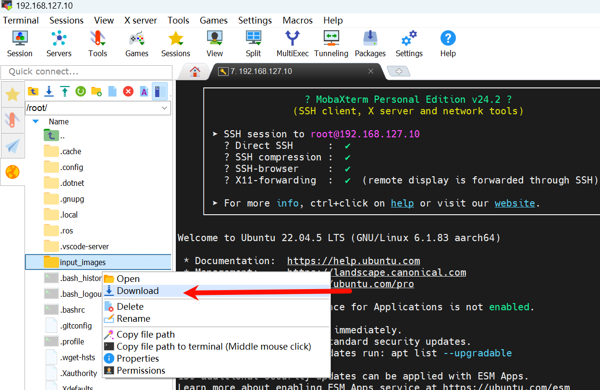

    Export the collected images to the PC side, and then copy them to the `~/line_follower_ws` directory.
    The image data folder is named input_images, and the line_follower_model package data collection annotation program is started using the following command:
    
    ```bash
    cd ~/line_follower_ws/
    source install/setup.bash
    ros2 run line_follower_model pic_annotation
    ```
    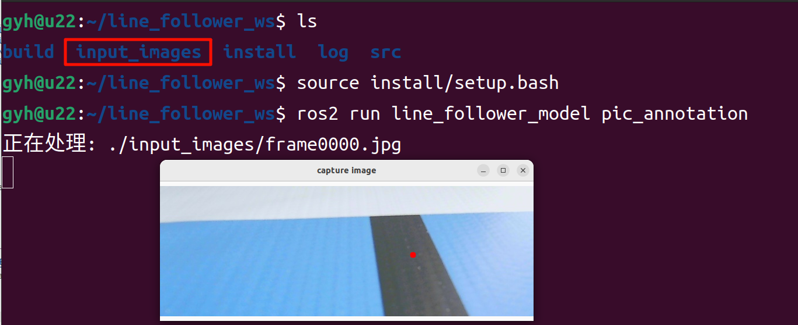
    ???+ hint
        - The annotation script does not depend on the ROS environment, you can put the annotation script and image data in the same directory and start it directly through `python3 pic_annotation_member.py`
        - The annotation script is located in `~/line_follower_ws/src/line_follower/line_follower_model/line_follower_model/`


#### **Data collection and annotation**

After successful startup, press the enter key on the keyboard, the program will subscribe to the latest image topic, crop and display it through a visual window, and the data collection is successful:

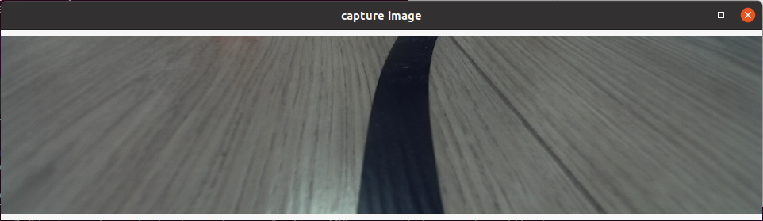{.img-fluid tag=1}


Click the center of the path line in the vertical direction of the picture with the left mouse button to complete the annotation of the image data of the frame:

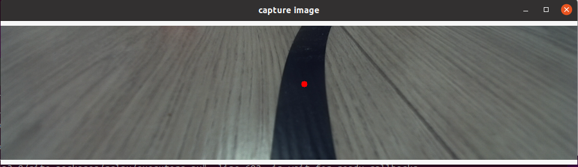{.img-fluid tag=1}


Press the Enter key to automatically save the image to the image_dataset folder under the current path, and save the markup result. The image is named as follows:

> xy_[x coordinates]_[y coordinates]_[uuid].jpg

The uuid is the unique identifier of the image to avoid the same file name.

???+ hint
    If the click is inaccurate, you can click the left mouse button several times until you are satisfied. If you do not click the annotation, the image will be skipped after press enter and will not be put into the dataset.


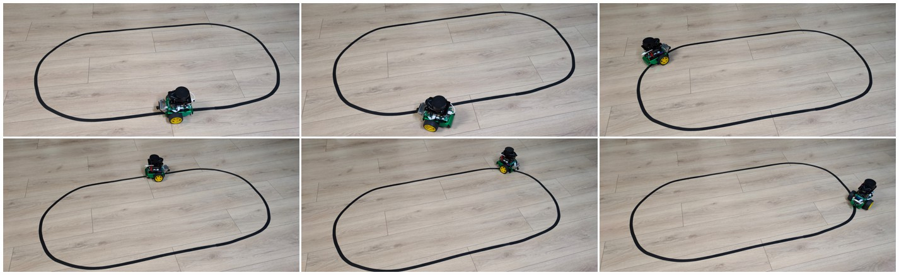{.img-fluid tag=1}

Continuously adjust the position of the robot in the scene, consider various possible image effects, complete the above data collection and annotation process in cycles, and collect a sufficient amount of data, at least 100 pieces are recommended for subsequent model training. When the environment or site changes, the corresponding images can also be collected and trained together to improve the adaptability of the model.

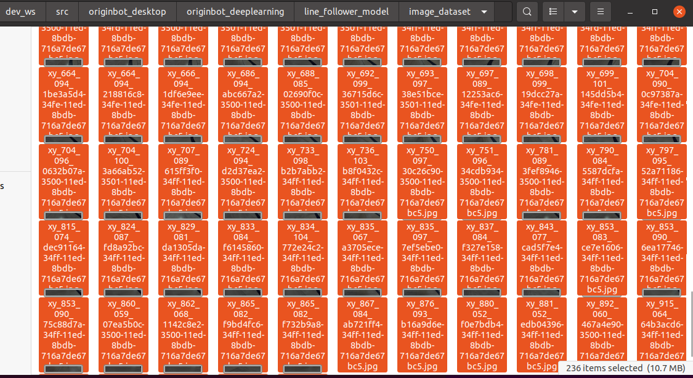{.img-fluid tag=1}


### **Model training**

#### **Model selection**

Convolutional Neural Network（Convolutional Neural Network, CNN） is a deep neural network model that is widely used in the fields of image and natural language processing. In 1998, Lecun et al. proposed a gradient-based backpropagation algorithm for document recognition. In this neural network, the convolutional layer plays a crucial role.With the continuous enhancement of computing power, some large CNN networks began to show great advantages in the image field. In 2012, Krizhevsky et al. proposed the AlexNet network structure, and won the championship in the ImageNet image classification competition by 11%. Subsequently, different scholars proposed a series of network structures and continuously refreshed the results of ImageNet, among which the more classic networks include: VGG(Visual Geometry Group), GoogLeNet and ResNet. The convolutional neural network consists of an input layer, a convolutional layer, a pooling layer, a fully connected layer, and an output layer, and its structure is as follows:

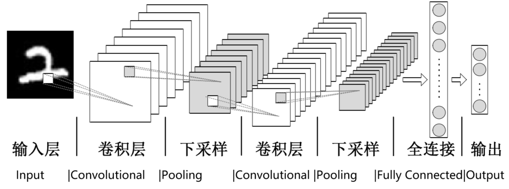{.img-fluid tag=1}


Considering the maturity of the model and the hardware requirements of the CPU/GPU for training the model, the ResNet network is selected as the backbone. The Residual Neural Network (ResNet) was proposed by Kaiming He, Xiangyu Zhang, Shaoqing Ren, Jian Sun and others from Microsoft Research, and won the championship in the 2015 ILSVRC (ImageNet Large Scale Visual Recognition Challenge). ResNet cleverly uses shortcut connections to solve the problem of model degradation in deep networks, and is one of the most widely used CNN feature extraction networks. The structure of ResNet18 is as follows:

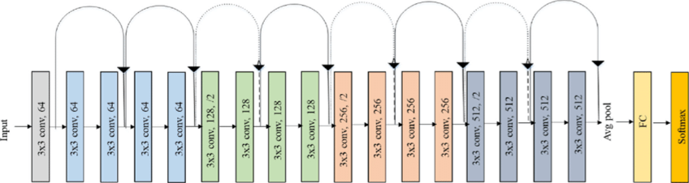{.img-fluid tag=1}

The ResNet18 inference performance is up to 232 FPS on the RDK X3 and the ResNet50 inference performance is also over 100 FPS.The high frame rate ensures real-time data processing and is a necessary condition for subsequent speed increases and more complex applications. Here, the ResNet18 network structure is used first, and the deeper ResNet50 network structure is considered when the bottleneck is encountered later. In order to satisfy the output guide line coordinate value x,y, you need to modify the ResNet18 network FC output to 2, that is, directly output the x,y coordinate value of the guide line. The ResNet18 input resolution is 224x224.


#### **Model training**

The above-mentioned models can be directly reused from the definitions in PyTorch, and the sharding of the dataset and the training of the model are all encapsulated in the code of the line_follower_model feature package.

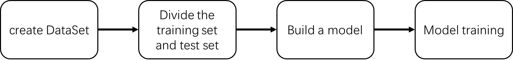{.img-fluid tag=1}


Directly activate the pytorch environment on the PC and run the following command to start training:

activate pytorch environment
```bash
source ~/.pytorch_venv/bin/activate
export PYTHONPATH=$PYTHONPATH:$(python -c "import sys; print(':'.join(sys.path))")
```

run training script
```bash
cd ~/line_follower_ws/
source install/setup.bash
ros2 run line_follower_model training
```

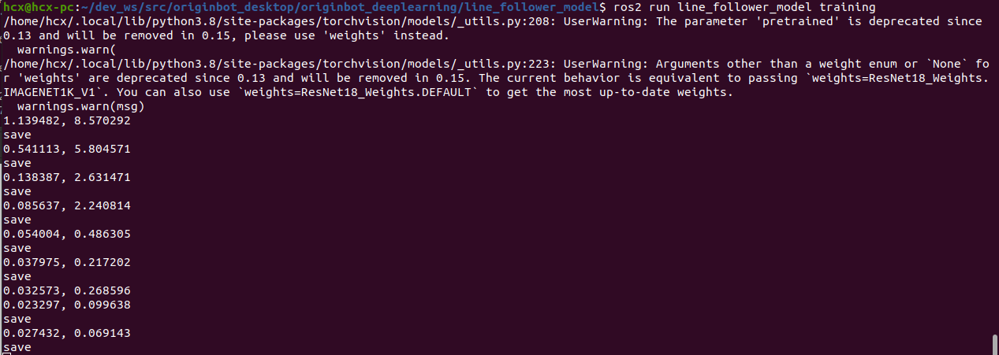{.img-fluid tag=1}

The model training process takes a long time, about 30 minutes, please be patient.

After training is complete, the .pth model file will be generated.

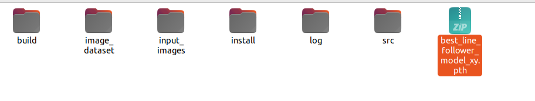

???+ hint
    - The training script does not depend on the ros environment, you can put the training script and image data in the same directory, activate the pytorch environment and start it directly through python `python3 training_member_function.py`
    - The training script is in `~/line_follower_ws/src/line_follower/line_follower_model/line_follower_model/`


### **Model conversion**

The floating-point model trained by pytorch would be inefficient if run directly on RDK X3. In order to improve the operation efficiency and give full play to the 5T computing power of the BPU, the floating-point model conversion operation needs to be performed here.

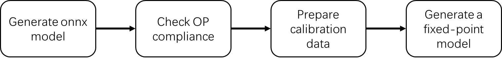{.img-fluid tag=1}


#### **Generate an onnx model**

On the PC side, use generate_onnx to convert the previously trained model into an onnx model by using the following command:

activate pytorch environment
```bash
source ~/.pytorch_venv/bin/activate
export PYTHONPATH=$PYTHONPATH:$(python -c "import sys; print(':'.join(sys.path))")
```

run generate_onnx script
```bash
cd ~/line_follower_ws/
source install/setup.bash
ros2 run line_follower_model generate_onnx
```

running the above command will generate the best_line_follower_model_xy.onnx model in the current directory.

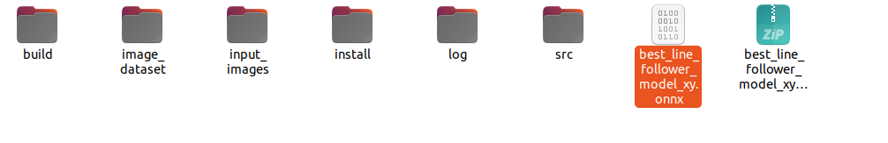

???+ hint
    - The training script does not depend on the ros environment, you can put the training script and image data in the same directory, activate the pytorch environment and start it directly through python `python3 generate_onnx_member_function.py`
    - The training script is in `~/line_follower_ws/src/line_follower/line_follower_model/line_follower_model/`

#### **Start the AI toolchain docker**
Load the offline image into the local environment.
```bash
sudo docker load -i docker_openexplorer_xxx.tar.gz
sudo docker image ls
```
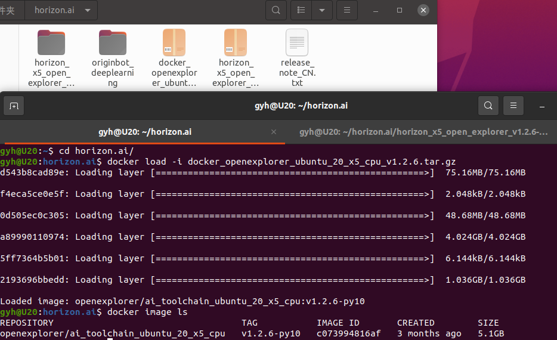

extract OE package horizon_x5_open_explorer_v1.2.8-py310_20240926.tar.gz

```bash
tar -xzvf horizon_x5_open_explorer_v1.2.6-py310_20240724.tar.gz
cd horizon_x5_open_explorer_v1.2.6-py310_20240724/
```

Modify run_docker.sh. At the beginning, find version=v1.2.6 and replace it with version=v1.2.6-py10

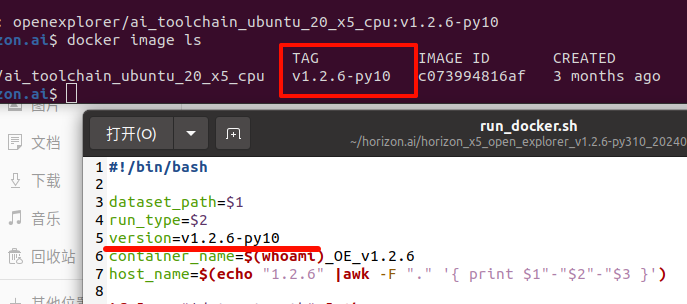

Configure the 10_model_convert folder
Open the /10_model_convert folder, and put the image data image_dataset and the converted best_line_follower_model_xy.onnx model file into the 10_model_convert/mapper folder


copy 10_model_convert folder to samples/ai_toolchain/horizon_model_convert_sample/03_classification/ directory.
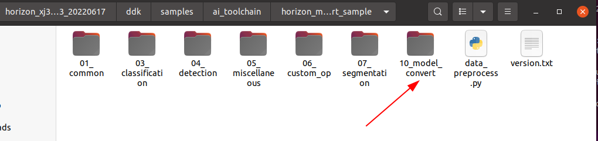{.img-fluid tag=1}

Then go back to the root directory of the OE package and load the AI toolchain docker image:

Run Docker

```bash
sudo bash run_docker.sh ./data/ cpu
```

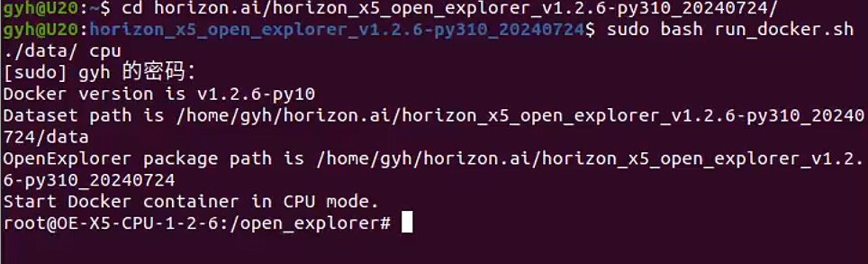{.img-fluid tag=1}


enter the 10_model_convert folder

```bash
cd samples/ai_toolchain/horizon_model_convert_sample/03_classification/10_model_convert/mapper
```

???+ hint
    If you encounter the error Unable to find image 'openexplorer/ai_toolchain_ubuntu_20_x5_cpu:v1.2.6' locally, check whether the TAG of ai_toolchain_ubuntu_20_x5_cpu is v1.2.6-py10 through the `docker image ls` command. If not, replace version=v1.2.6 in the beginning of run_docker.sh with version=v1.2.6-py10.


#### **Calibration data is generated**
The calibration data generated in this step is mainly used for calibration during model compilation, and can use part of the training model data, as long as the standard is correct, the number is about 100, and we have copied the dataset in the previous step.

In the Docker image started, complete the following operations:

```bash
bash 02_preprocess.sh
```
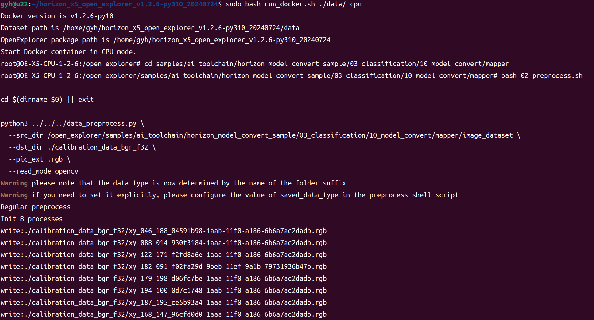{.img-fluid tag=1}


#### **The model is compiled to generate a fixed-point model**

This step generates a fixed-point model file for subsequent deployment on the robot:

```bash
bash 03_build.sh
```

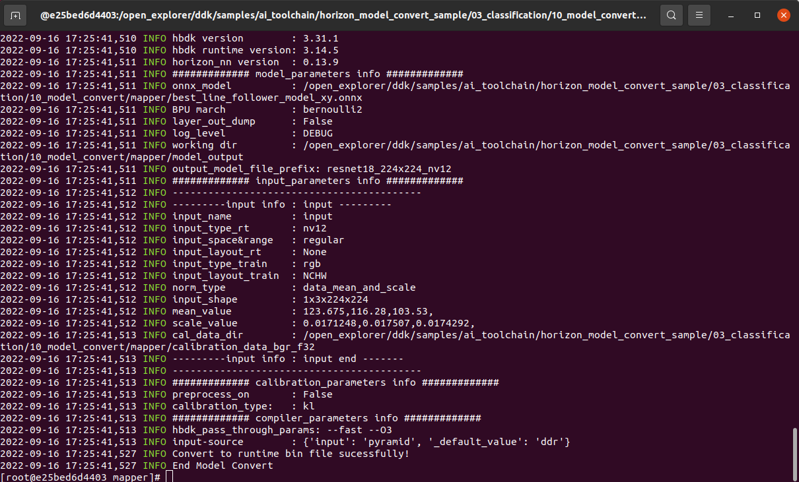{.img-fluid tag=1}

After the compilation is successful, the final model file will be generated in the 10_model_output path.
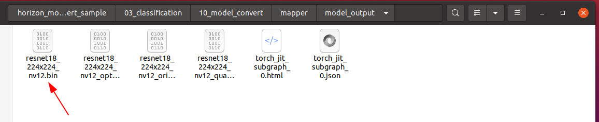{.img-fluid tag=1}


We can right-click to copy the model file and put it in the line_follower_model feature pack for later deployment.
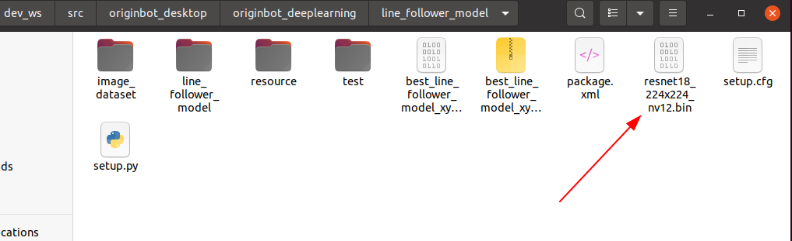{.img-fluid tag=1}


### **Model deployment**

The fixed-point model that can run on the RDK X3BPU has been obtained through the previous model transformation. How to deploy it on the RDK X3 to achieve the complete set of functions of image acquisition, model inference, and motion control? This is based on the Hobot DNN in TogetheROS. Hobot DNN is a board-end algorithm inference framework in the TogetheROS software stack, which uses BPU processors to implement AI inference functions on Horizon RDK X3, providing a simpler and easy-to-use model integrated development interface for robot application development, including model management, input processing and result analysis based on model description, and model output memory allocation management.


#### **Model deployment**

Copy the generated fixed-point model resnet18_224x224_nv12.bin to the model folder in the line_follower_perception feature package of OriginBot, replace the original model, and recompile the workspace.


After the compilation is complete, you can run the following command to deploy the model, where the parameters model_path and model_name specify the path and name of the model:

```bash
cd /userdata/dev_ws/src/originbot/originbot_deeplearning/line_follower_perception/
ros2 run line_follower_perception line_follower_perception --ros-args -p model_path:=model/resnet18_224x224_nv12.bin -p model_name:=resnet18_224x224_nv12
```
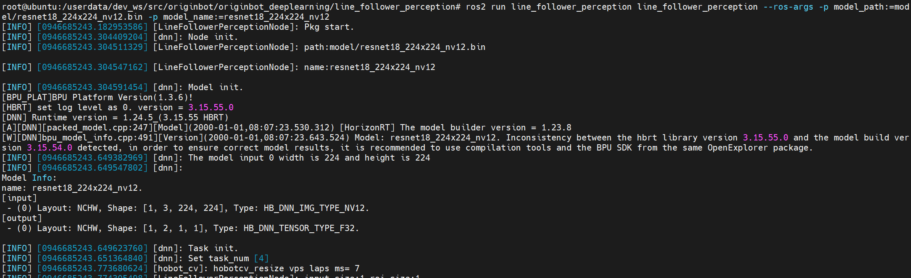{.img-fluid tag=1}


#### **Start the camera**

First, place the OriginBot in the scene where the line is patrolling.

Use the following command to start the camera driver

```bash
ros2 launch line_follower_perception usb_cam_web.launch.py
```

After the camera is successfully started, you can see the dynamically recognized path line position in the line patrol terminal:

{.img-fluid tag=1}


#### **Start the bot**

Finally, start the OriginBot chassis again, and the robot can autonomously find the line!

```bash
ros2 launch originbot_bringup originbot.launch.py
```


???+ reference
    - [Line Following](https://developer.d-robotics.cc/rdk_doc/en/Application_case/line_follower)
    - [D-robotics X5 OpenExplorer](https://developer.d-robotics.cc/forumDetail/251934919646096384)(view after login)


[](https://www.guyuehome.com/){:target="_blank"}