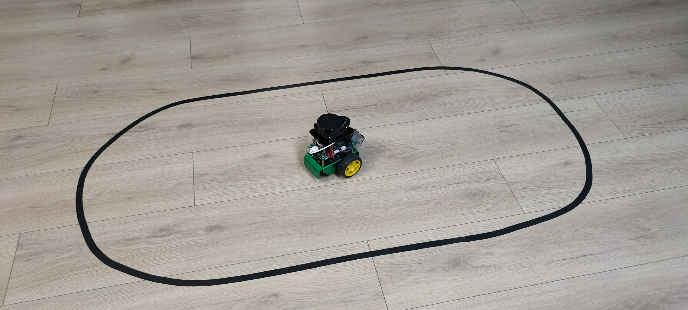
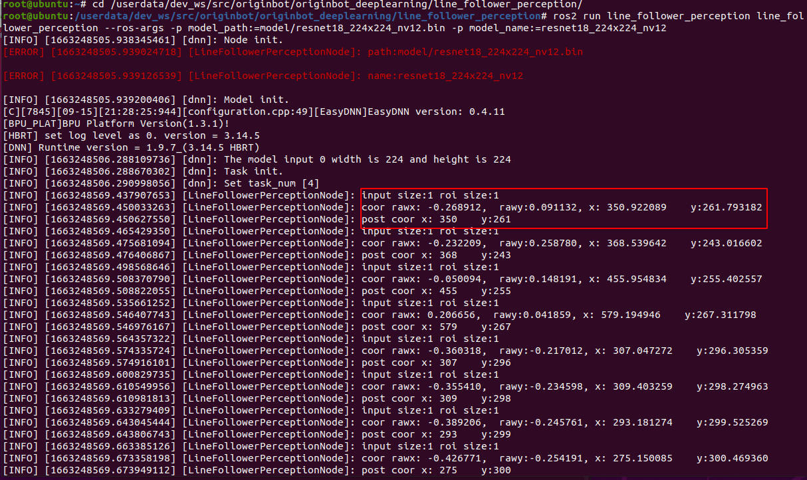
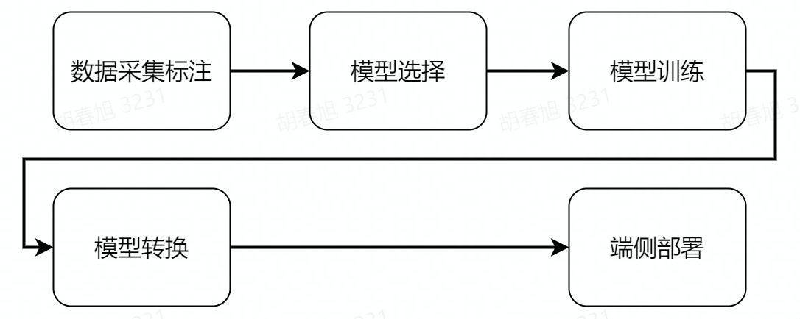
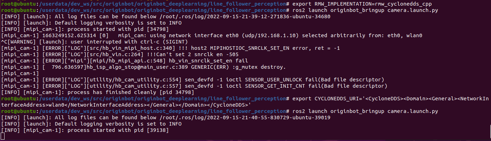
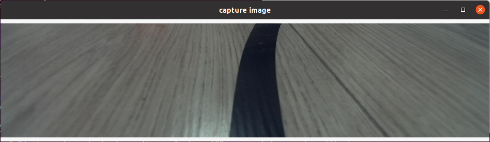
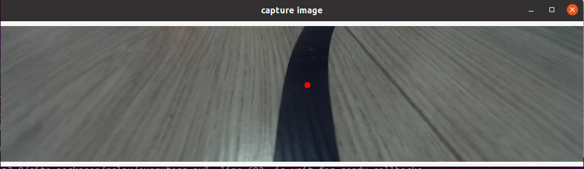
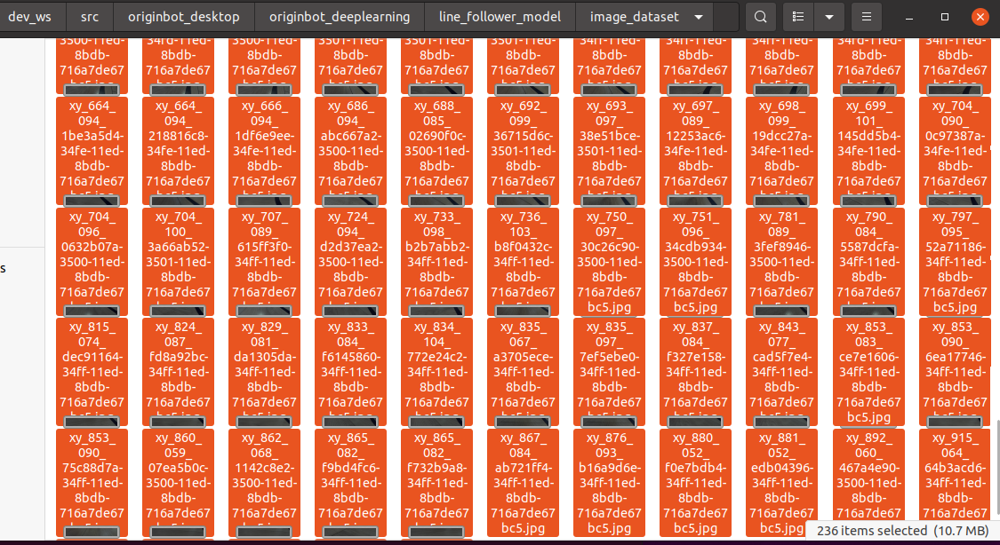
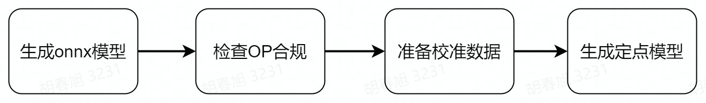
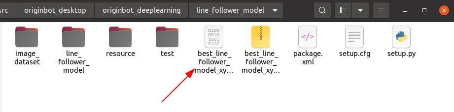
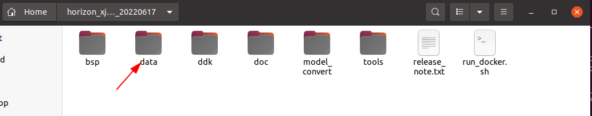

# **Visual Line Following (AI Deep Learning) X3**

???+ hint
    The operating environment and software and hardware configurations are as follows:

     - OriginBot Pro
     - PC：Ubuntu (≥22.04) + ROS2 (≥humble) + pytorch + docker
     - Line patrol scene: black path line, the background has obvious contrast


## **Apply goals**

In the [visual line patrol（OpenCV）](../application/cv_line_follower.md){:target="_blank"}, we can already let the car follow the black path line movement, to achieve the most basic visual line patrol task, but you may have found that the image recognition based on OpenCV is greatly affected by the light, after changing the site, the threshold needs to be readjusted, is it possible to let the robot autonomously adapt to the changes in the environment? That is, let the robot learn on its own.


No problem, everyone must have heard of deep learning, using this method, we can achieve a data-driven visual line patrol effect, what kind of site needs to be adapted, just need to collect some picture data, and then we will try it.


## **Introduction to the principle**

### **Deep learning process**

Compared with traditional image processing, deep learning can enable machine vision to adapt to more changes, thereby improving the accuracy of complex environments. Before we begin, let's briefly introduce the basic process of deep learning.

{.img-fluid tag=1}

The core purpose of machine learning is to help us solve problems, which can be broken down into six main steps:

- **Problem definition**：What is the problem we are trying to solve? For example, in the case of visual line patrol here, it is necessary to identify the position of the line in the image.
- **Data preparation**：Start preparing your data for the problem you want to solve. For example, you need to prepare photos of various line patrol scenes for machine learning.
- **Model selection/development**：A model is a set of processes for processing data, which is often referred to as CNN convolutional neural networks, GAN generative adversarial networks, RNN recurrent neural networks, and so on.
- **Model training and tuning**：Putting data into the model and training the optimal parameters can be understood as the process of machine learning.
- **Model evaluation test**：Just like a quiz, we take some data and give it to the trained model to see how it works.
- **Deployment**：After everything is ready, you can put the trained model on the robot, that is, officially transfer the knowledge to a certain robot, and it can solve the problem raised earlier.


### **Visual line inspection process**

{.img-fluid tag=1}

The OriginBot has two drive wheels, a driven wheel, which is rotated and controlled by the differential speed of the two drive wheels. Among them, the MCU module is mainly used for motor motion control of the OriginBot, and communicates with the main control RDK X3 through the serial port. The main controller is Horizon RDK X3, which has 5T computing power and can easily handle complex CNN inference work.

The whole system is shown in the figure above, RDK X3 obtains the environmental data in front of the OriginBot through the camera, and the image data is inferred through the trained CNN model to obtain the coordinate value of the guide line, and then calculates the movement mode of the OriginBot according to a certain control strategy, and issues motion control instructions to the OriginBot through UART to realize the closed-loop control of the whole system.

The PC is used for data annotation and training, and in order to improve efficiency, RDK X3 is used to send the image to the PC via Ethernet for annotation.


## **Run method**

### **Scenario description**

In the application code of OriginBot, we have trained a set of line patrol models for you, using the following scenarios:

{.img-fluid tag=1}


If you have a similar environment around you, you can skip the machine learning steps mentioned above for the time being and go directly to the deployment process, let's first try how effective the visual line patrol is using deep learning.


### **Start the visual line patrol**

First, place the OriginBot in the scene where you are patrolling the line, and adjust the camera angle down as much as possible to avoid external interference.

{.img-fluid tag=1}


Next, start the line patrol function, and note the parameters that need to be followed by the model path and name after the command:

```bash
cd /userdata/dev_ws/src/originbot/originbot_deeplearning/line_follower_perception/
ros2 run line_follower_perception line_follower_perception --ros-args -p model_path:=model/resnet18_224x224_nv12.bin -p model_name:=resnet18_224x224_nv12
```
{.img-fluid tag=1}


### **Start the robot**

After SSH is connected to OriginBot, enter the following command in the terminal to start the robot chassis and camera:

```bash
ros2 launch originbot_bringup camera_internal.launch.py
ros2 launch originbot_bringup originbot.launch.py
```

After the camera is successfully started, you can see the dynamically recognized path line position in the line patrol terminal:

{.img-fluid tag=1}


After running for a while, you can see that the robot has started to patrol the line.


Deep learning is based on data, the robot can only learn from the scene that it has seen in the data. If it has not seen the scene, the recognition effect is not very good. So if we use the patrol color and the surrounding environment are different, we still need to collect as much data as possible so that the robot can learn. The complete deep learning process can refer to the following.


## **AI deep learning**

{.img-fluid tag=1}

The next deep learning operation is mainly divided into the above steps, before the operation, you also need to complete the configuration of the PC environment, let's experience deep learning together.


### **PC environment configuration**

The basic environment on the PC side is Ubuntu+ROS+pytorch+docker, please complete the configuration of Ubuntu, ROS, and OriginBot function packages according to  [Desktop environment configuration](../guide/pc_config.md){:target="_blank"}.


#### **Install pytorch**

The training framework is pytorch, and you can directly use the following command to install it on the Ubuntu system on the PC side:

```
pip3 install torch torchvision torchaudio --extra-index-url https://download.pytorch.org/whl/cpu
```


???+ hint
    In order to ensure universality, the CPU version of pytorch is installed here, and if you have a GPU on the hardware, you can also choose the GPU version of pytorch, which is faster for training.


#### **Install Docker**

Docker is required for subsequent model conversion to save time for environment configuration, and you need to install it first and download the image used for model conversion.


The installation of Docker in the Ubuntu environment can be completed by referring to the following website or online information:

[Ubuntu Docker installation](https://www.runoob.com/docker/ubuntu-docker-install.html){:target="_blank"}


After the installation is complete, you can use the following command to download the toolchain and docker image for subsequent model conversions:

- Download AI Toolchain OE Package（6.1GB）

```bash
wget -c ftp://vrftp.horizon.ai/Open_Explorer_gcc_9.3.0/2.3.3/horizon_xj3_open_explorer_v2.3.3_20220727.tar.gz
```

- Download AI toolchain docker（14.8GB）

```bash
wget -c ftp://vrftp.horizon.ai/Open_Explorer_gcc_9.3.0/2.3.3/x3pi_toolchain/ai_toolchain_2.3.3.tar.gz
```

???+ hint
    The above docker images are large in size, please ensure that the network is smooth and wait patiently.


#### **Introduction to related feature packs**

Throughout the deep learning process, we will use three directly related feature packages/folders:

- **10_model_convert**：Used to store floating-point model to fixed-point model related code and configuration, and all the contents of this folder need to be run in the AI toolchain docker;

- **line_follower_model**：Used to store model training-related content, such as data labeling, model training, and generating onnx models, all the contents of this folder are run on the PC;

- **line_follower_perception**：Used to store the code running on RDK X3, which can be compiled on the board or generated by cross-compiling the package running on RDK X3.


Among them, the two packages 10_model_convert and line_follower_model are placed in the [originbot_desktop code repository](https://github.com/yzhcat/originbot_desktop){:target="_blank"}，and line_follower_perception are placed in the [originbot code repository](https://github.com/yzhcat/originbot){:target="_blank"}.


Once the environment is ready, we can get started.


### **Data collection and annotation**

Data is the foundation of deep learning, we first need to complete the collection and annotation of data, this process is mainly completed on the PC side, you need to subscribe to the real-time images of the OriginBot robot side, the main process is as follows:

{.img-fluid tag=1}

（1）Start the OriginBot camera, collect images of the patrol scene, and publish the image topic image_raw;

（2）The PC side subscribes to the image topics published by OriginBot and obtains image data;

（3）The PC side crops the image, and manually completes the annotation of the path line in each image;

（4）Save the annotation result and the corresponding image.


#### **Start the OriginBot camera**

After connecting to OriginBot via SSH, enter the following command in the terminal to start the camera of OriginBot:

```bash
export RMW_IMPLEMENTATION=rmw_cyclonedds_cpp
ros2 launch originbot_bringup camera.launch.py
```

{.img-fluid tag=1}


???+ hint
    During the data acquisition process, the posture of the robot can be artificially placed. The camera can be started separately without starting the robot chassis.


#### **Start the data collection and annotation program**

On the PC side, use the following command to start the data acquisition and annotation program in the line_follower_model package:

```bash
export RMW_IMPLEMENTATION=rmw_cyclonedds_cpp
cd ~/dev_ws/src/originbot_desktop/originbot_deeplearning/line_follower_model
ros2 run line_follower_model annotation
```
{.img-fluid tag=1}


In order to ensure the smooth communication, the above use cyclonedds, after configuration, cyclonedds will automatically bind a network card, if the communication network card is wrong, you can use the following command to replace:​
​    

     export CYCLONEDDS_URI='<CycloneDDS><Domain><General><NetworkInterfaceAddress>wlan0</NetworkInterfaceAddress></General></Domain></CycloneDDS>'


#### **Data collection and annotation**

After successful startup, press the enter key on the keyboard, the program will subscribe to the latest image topic, crop and display it through a visual window, and the data collection is successful:

{.img-fluid tag=1}


Click the center of the path line in the vertical direction of the picture with the left mouse button to complete the annotation of the image data of the frame:

{.img-fluid tag=1}


Press the Enter key to automatically save the image to the image_dataset folder under the current path, and save the markup result. The image is named as follows:

> xy_[x coordinates]_[y coordinates]_[uuid].jpg

The uuid is the unique identifier of the image to avoid the same file name.

???+ hint
    If the click is inaccurate, you can click the left mouse button several times until you are satisfied. If you do not click the annotation, the image will be skipped after press enter and will not be put into the dataset.


{.img-fluid tag=1}

Continuously adjust the position of the robot in the scene, consider various possible image effects, complete the above data collection and annotation process in cycles, and collect a sufficient amount of data, at least 100 pieces are recommended for subsequent model training. When the environment or site changes, the corresponding images can also be collected and trained together to improve the adaptability of the model.

{.img-fluid tag=1}


### **Model training**

#### **Model selection**

Convolutional Neural Network（Convolutional Neural Network, CNN） is a deep neural network model that is widely used in the fields of image and natural language processing. In 1998, Lecun et al. proposed a gradient-based backpropagation algorithm for document recognition. In this neural network, the convolutional layer plays a crucial role.With the continuous enhancement of computing power, some large CNN networks began to show great advantages in the image field. In 2012, Krizhevsky et al. proposed the AlexNet network structure, and won the championship in the ImageNet image classification competition by 11%. Subsequently, different scholars proposed a series of network structures and continuously refreshed the results of ImageNet, among which the more classic networks include: VGG(Visual Geometry Group), GoogLeNet and ResNet. The convolutional neural network consists of an input layer, a convolutional layer, a pooling layer, a fully connected layer, and an output layer, and its structure is as follows:

{.img-fluid tag=1}


Considering the maturity of the model and the hardware requirements of the CPU/GPU for training the model, the ResNet network is selected as the backbone. The Residual Neural Network (ResNet) was proposed by Kaiming He, Xiangyu Zhang, Shaoqing Ren, Jian Sun and others from Microsoft Research, and won the championship in the 2015 ILSVRC (ImageNet Large Scale Visual Recognition Challenge). ResNet cleverly uses shortcut connections to solve the problem of model degradation in deep networks, and is one of the most widely used CNN feature extraction networks. The structure of ResNet18 is as follows:

{.img-fluid tag=1}

The ResNet18 inference performance is up to 232 FPS on the RDK X3 and the ResNet50 inference performance is also over 100 FPS.The high frame rate ensures real-time data processing and is a necessary condition for subsequent speed increases and more complex applications. Here, the ResNet18 network structure is used first, and the deeper ResNet50 network structure is considered when the bottleneck is encountered later. In order to satisfy the output guide line coordinate value x,y, you need to modify the ResNet18 network FC output to 2, that is, directly output the x,y coordinate value of the guide line. The ResNet18 input resolution is 224x224.


#### **Model training**

The above-mentioned models can be directly reused from the definitions in PyTorch, and the sharding of the dataset and the training of the model are all encapsulated in the code of the line_follower_model feature package.

{.img-fluid tag=1}


Directly on the PC, run the following command to start training:

```bash
cd ~/dev_ws/src/originbot_desktop/originbot_deeplearning/line_follower_model
ros2 run line_follower_model training
```

{.img-fluid tag=1}


The model training process will take a while, which is expected to take about 30 minutes, so please be patient.


After the training is complete, a model file is generated.
{.img-fluid tag=1}


### **Model conversion**

The floating-point model trained by pytorch would be inefficient if run directly on RDK X3. In order to improve the operation efficiency and give full play to the 5T computing power of the BPU, the floating-point model conversion operation needs to be performed here.

{.img-fluid tag=1}


#### **Generate an onnx model**

On the PC side, use generate_onnx to convert the previously trained model into an onnx model by using the following command:

```bash
cd ~/dev_ws/src/originbot_desktop/originbot_deeplearning/line_follower_model
ros2 run line_follower_model generate_onnx
```
{.img-fluid tag=1}


After running, the generated best_line_follower_model_xy.onnx model will be obtained in the current directory.
{.img-fluid tag=1}


#### **Start the AI toolchain docker**
Decompress the docker image and OE package of the AI toolchain that you downloaded before, and copy the data files from the decompressed docker image to the data folder in the OE package.
{.img-fluid tag=1}
{.img-fluid tag=1}

Copy the 10_model_convert package from the originbot_desktop repository to the ddk/samples/ai_toolchain/horizon_model_convert_sample/03_classification/ directory of the OE development package.
{.img-fluid tag=1}


Then copy the annotated dataset folder and the generated onnx model under the line_follower_model function package to the above 10_model_convert package:
{.img-fluid tag=1}


Then go back to the root directory of the OE package and load the docker image of the AI toolchain:

```bash

sh run_docker.sh /data/
```
{.img-fluid tag=1}


#### **Calibration data is generated**

The calibration data generated in this step is mainly used for the next step of model compilation and calibration, and part of the data of the training model can be used, there are no special requirements, as long as the standard is correct, the number is about 100, and we have copied the dataset in the previous step.

In the Docker image that is started, perform the following operations:

```bash
cd ddk/samples/ai_toolchain/horizon_model_convert_sample/03_classification/10_model_convert/mapper
sh 02_preprocess.sh
```
{.img-fluid tag=1}


#### **The model is compiled to generate a fixed-point model**

This step generates a fixed-point model file for subsequent deployment on the robot:

```bash
cd ddk/samples/ai_toolchain/horizon_model_convert_sample/03_classification/10_model_convert/mapper
sh 03_build.sh
```

{.img-fluid tag=1}

After the compilation is successful, the final model file will be generated in the 10_model_output path.
{.img-fluid tag=1}


We can right-click to copy the model file and put it in the line_follower_model feature pack for later deployment.
{.img-fluid tag=1}


### **Model deployment**

The fixed-point model that can run on the RDK X3BPU has been obtained through the previous model transformation. How to deploy it on the RDK X3 to achieve the complete set of functions of image acquisition, model inference, and motion control? This is based on the Hobot DNN in TogetheROS. Hobot DNN is a board-end algorithm inference framework in the TogetheROS software stack, which uses BPU processors to implement AI inference functions on Horizon RDK X3, providing a simpler and easy-to-use model integrated development interface for robot application development, including model management, input processing and result analysis based on model description, and model output memory allocation management.


#### **Model deployment**

Copy the generated fixed-point model resnet18_224x224_nv12.bin to the model folder in the line_follower_perception feature package of OriginBot, replace the original model, and recompile the workspace.


After the compilation is complete, you can run the following command to deploy the model, where the parameters model_path and model_name specify the path and name of the model:

```bash
cd /userdata/dev_ws/src/originbot/originbot_deeplearning/line_follower_perception/
ros2 run line_follower_perception line_follower_perception --ros-args -p model_path:=model/resnet18_224x224_nv12.bin -p model_name:=resnet18_224x224_nv12
```
{.img-fluid tag=1}


#### **Start the camera**

First, place the OriginBot in the scene where the line is patrolling.


Use the following command to start the camera driver in zero-copy mode to accelerate the internal image processing efficiency:

```bash
ros2 launch originbot_bringup camera_internal.launch.py
```


After the camera is successfully started, you can see the dynamically recognized path line position in the line patrol terminal:

{.img-fluid tag=1}


#### **Start the bot**

Finally, start the OriginBot chassis again, and the robot can autonomously find the line!

```bash
ros2 launch originbot_bringup originbot.launch.py
```


[](https://www.guyuehome.com/){:target="_blank"}