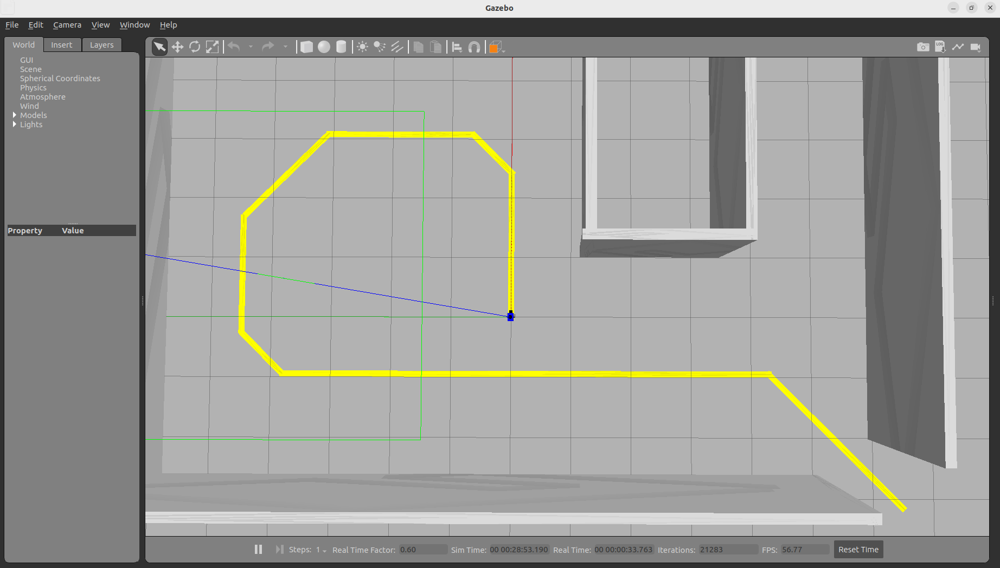
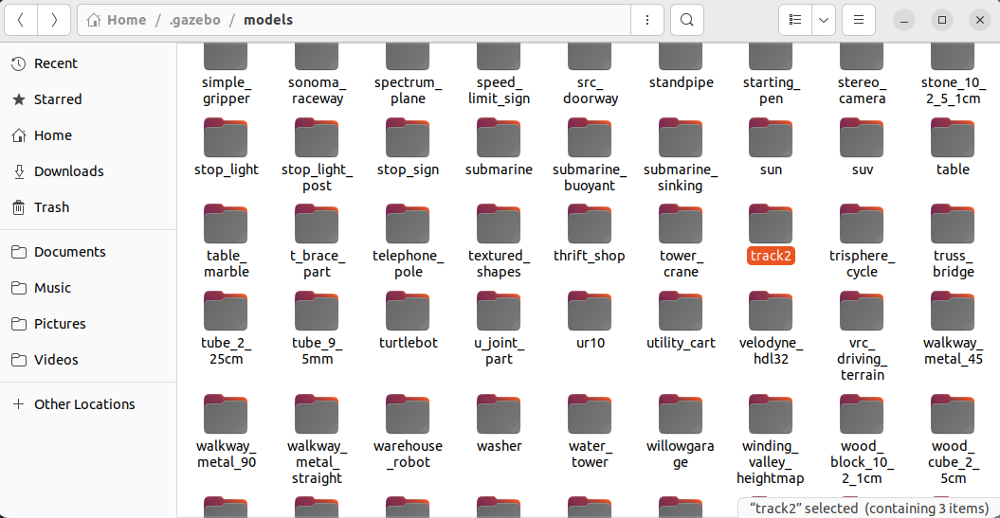
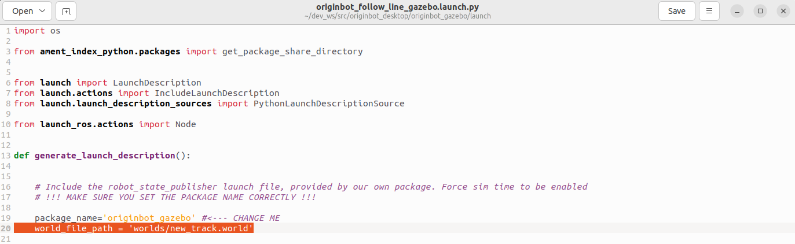

# **Visual Line Following (Gazebo)**

???+ hint
    The operating environment and software and hardware configurations are as follows:

     - PC：Ubuntu (≥22.04) + ROS2 (≥humble)


Make sure that [the configuration of the Gazebo virtual simulation environment](../application/gazebo_simulation.md){:target="_blank"}is complete. Next, try to perform visual line patrol in the simulation environment.

## **Start the virtual line patrol environment**

Run the following command on the PC:

```bash
ros2 launch originbot_gazebo originbot_follow_line_gazebo.launch.py
```

After Gazebo is successfully started, you can see the yellow guide line and the simulated robot is at the starting point of the guide line.

{.img-fluid tag=1}


## **Viewing Camera Image Data**

Start Rviz, add the Image display item, and you can see the real-time image data:

```bash
ros2 run rviz2 rviz2
```

{.img-fluid tag=1}


## **Start the visual line patrol**

Reopen a terminal and start the visual line patrol function:

```bash
ros2 run originbot_demo line_follower
```


After successful startup, the simulated robot starts to patrol the line, and at the same time, a real-time display of the patrol line detection result pops up.


## **More complex visual line inspection**

Another more complex line patrol map is also provided in the code repository. You are welcome to try to rewrite the line patrol code yourself.


### **Copy the line patrol model**

Copy the "track2" model folder in the models file in the originbot_gazebo function package to the ~/.gazebo/models folder:

{.img-fluid tag=1}


### **Modify the patrol map**

Modify originbot_follow_line_gazebo.launch.py ​​in the launch folder of the originbot_gazebo function package and modify the simulation environment file to:

{.img-fluid tag=1}

Save and close after modification.


### **Start the line patrol environment**

Recompile the workspace in the root directory of the workspace to ensure that the above configuration takes effect:

```bash
colcon build
```


Run the following command on the PC：

```bash
ros2 launch originbot_gazebo originbot_follow_line_gazebo.launch.py
```


After successful startup, you can see a more complex map. You can try it yourself. You are welcome to share the successful results to the [Guyuehome community](https://www.guyuehome.com/)！

{.img-fluid tag=1}


[](https://www.guyuehome.com/){:target="_blank"}

