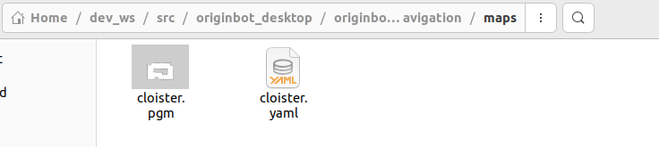
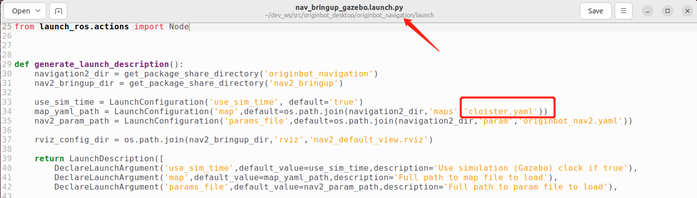
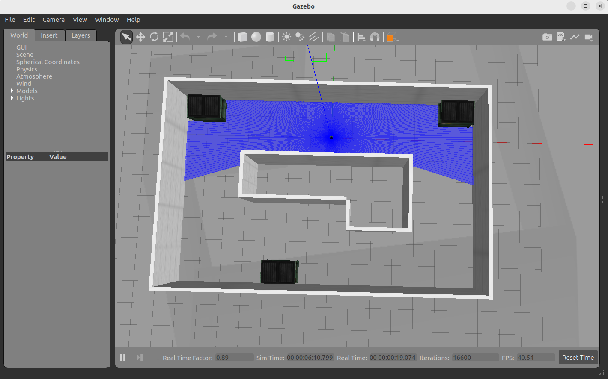
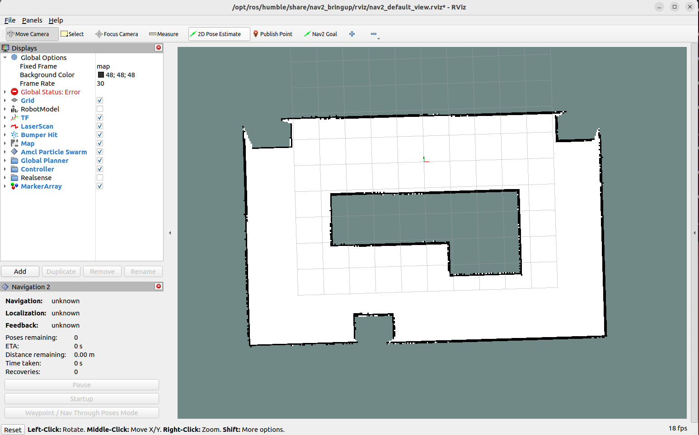
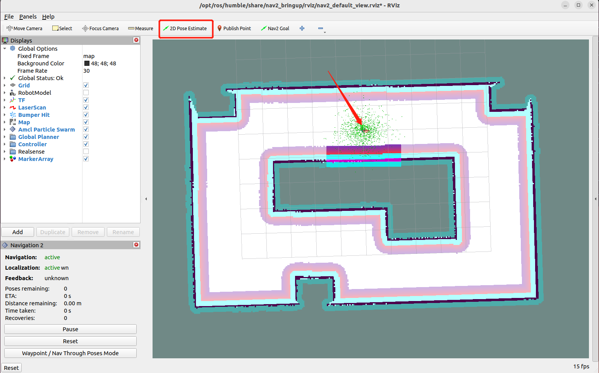
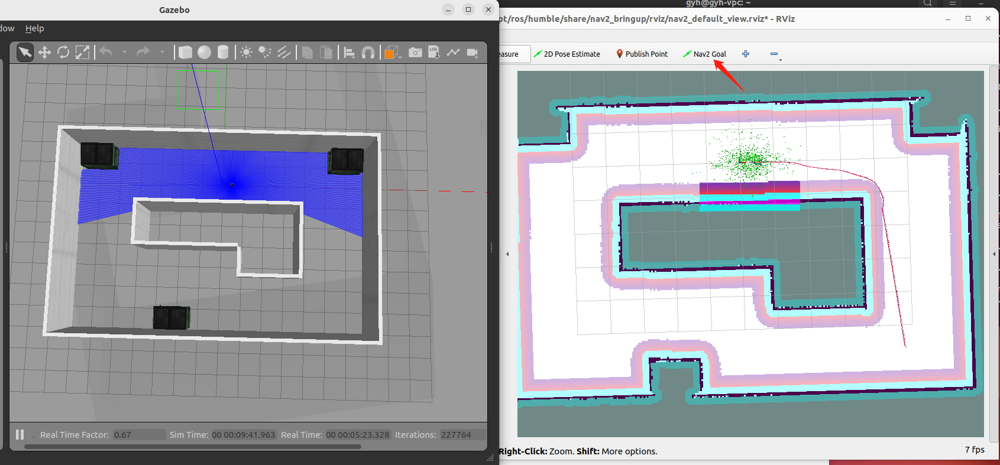

# **Autonomous navigation**

???+ hint
    The operating environment and software and hardware configurations are as follows:

     - PC：Ubuntu (≥22.04) + ROS2 (≥humble)


## **Configure the map**

Autonomous navigation will be completed on the map previously created by SLAM (Gazebo). Before navigation, you need to modify the map to your own environment. The modification method is as follows:

- Copy the map file（\*.pgm） and map configuration file（\*.yaml）created by your SLAM and place them in the originbot_navigation/maps directory.

{.img-fluid tag=1}

- Modify the map name called in the originbot_navigation/launch/nav_bringup_gazebo.launch.py ​​file to ensure that it is consistent with the map configuration file name copied in the previous step:

{.img-fluid tag=1}

- After the modification is complete, the terminal returns to the root directory of the workspace and  **recompiles** it.

At this point, the map is configured, and you can use your own map to navigate.


## **Start the Gazebo simulation environment**

Open a new terminal on the PC and enter the following command in the terminal to start the Gazebo simulation environment:

```bash
ros2 launch originbot_gazebo originbot_navigation_gazebo.launch.py
```

After a short wait, you will see the simulation environment containing the robot model after successful startup:

{.img-fluid tag=1}


## **Start the navigation feature**

Enter the following command in the terminal to start the Nav2 navigation function package:

```bash
ros2 launch originbot_navigation nav_bringup_gazebo.launch.py
```

{.img-fluid tag=1}

After successful startup, you will see continuous output of information in the terminal. This is because the initial position of the robot is not set. This can be solved by setting the initial position later.

???+ hint
     If you cannot find the Navigation2 plugin here, please use "sudo apt install ros-${ROS_DISTRO}-nav2*" to install it.

## **Set the initial position**

Configure the display project in the opened Rviz, click the "2D Pose Estimate" button in the toolbar, select the initial pose of the robot in the map, and click OK. The warning in the terminal will stop.


{.img-fluid tag=1}


## **Single-target point navigation**

Click the target location and select the "2D Goal Pose" button, and then select the navigation target point on the map to start autonomous navigation.

{.img-fluid tag=1}


[](https://www.guyuehome.com/){:target="_blank"}
