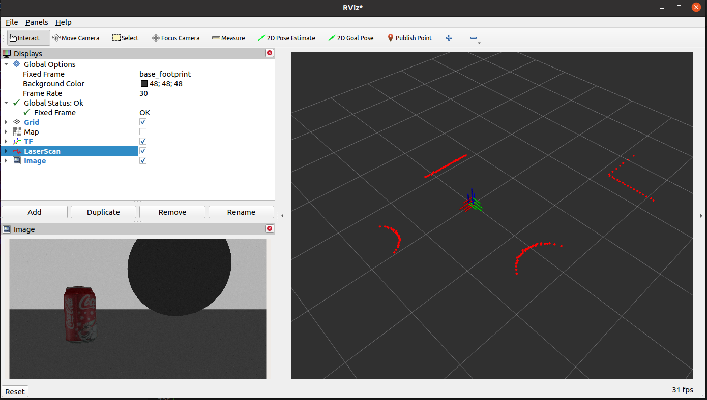

# **Gazebo Virtual Simulation**

???+ hint
    The operating environment and software and hardware configurations are as follows:
    

     - PC：Ubuntu (≥22.04) + ROS2 (≥humble)


## **Development environment configuration**

Install Ubuntu+ROS2 system on PC, and download and compile the originbot_desktop code repository.


For detailed operation methods, please see: [Download/Compile the PC Function Pack](../guide/pc_config.md#3-pc){:target="_blank"}


## **3D model visualization**

Run the following command on the PC:

```
ros2 launch originbot_description display.launch.py
```


You can load the 3D model of the robot, and start the visualization interface of the Rviz2 host computer to display the 3D model of the robot:

{.img-fluid tag=1}


## **3D simulation environment**

### **Install dependencies**

Before running the simulation environment, now confirm that the following feature packs are installed on the PC:

```bash
sudo apt install ros-${ROS_DISTRO}-gazebo-ros
sudo apt install ros-${ROS_DISTRO}-gazebo-ros2-control
sudo apt install ros-${ROS_DISTRO}-gazebo-plugins
sudo apt install ros-${ROS_DISTRO}-ros2-control
sudo apt install ros-${ROS_DISTRO}-ros2-controllers
```


### **Start the simulation**

Start the terminal, run the following command, and wait for the Gazebo simulation software to start:

```bash
ros2 launch originbot_gazebo originbot_gazebo.launch.py
```

{.img-fluid tag=1}

???+ hint
    1. In order to ensure the smooth loading of the model, please download and place the offline model file library under ~/.gazebo/models, otherwise Gazebo may not start. [Click to download the offline model](https://github.com/osrf/gazebo_models){:target="_blank"}
    2. If you can't display the robot model using the virtual machine, you need to turn off "Accelerate 3D graphics" in the virtual machine settings, add "export SVGA_VGPU10=0" to the .bashrc on Ubuntu system, and use the CPU to render Gazebo.


### **View simulation data**

Whether the data in the current simulation environment has been successfully simulated, we can confirm through the topic list:

```bash
ros2 topic list
```

{.img-fluid tag=1}

It can be seen that in the current simulation environment, speed control, odometer, camera images, lidar data, etc. have been successfully simulated.


### **Control robot movement**

Start a new terminal and run the keyboard control node to control the robot motion in the simulation environment through the keyboard:

```bash
ros2 run teleop_twist_keyboard teleop_twist_keyboard
```


### **View sensor visualization data**

先Start by putting some obstacles in the simulation environment:

{.img-fluid tag=1}


Then launch Rviz:

```bash
ros2 run rviz2 rviz2
```


Configure the display items of Image and LaserScan in Rviz, subscribe to the corresponding topic, and you can see the visualization effect:

{.img-fluid tag=1}


[](https://www.guyuehome.com/){:target="_blank"}

