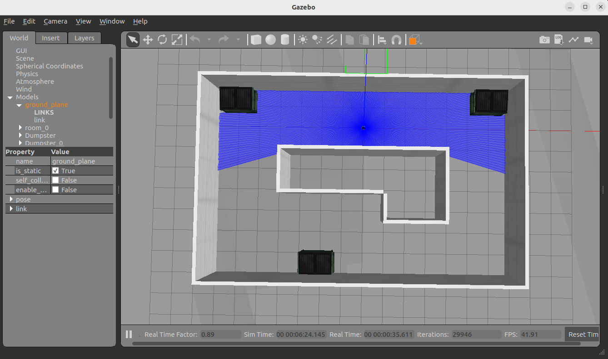
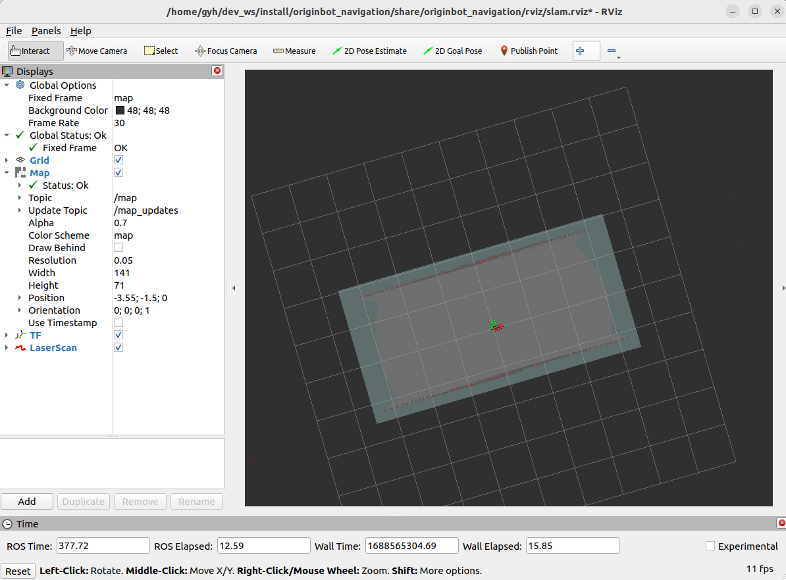
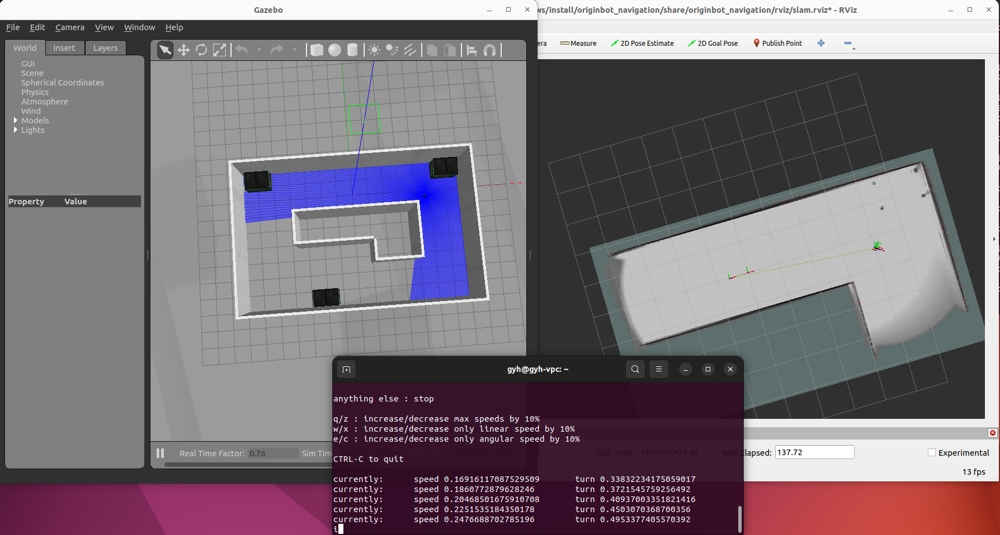
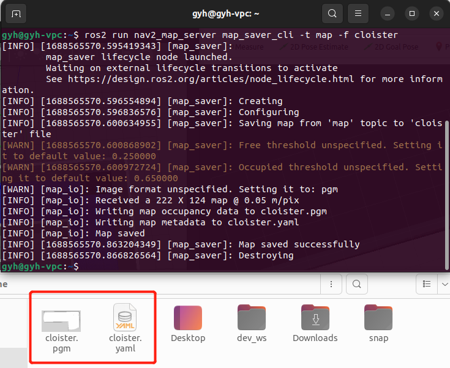

# **SLAM Map Building (Gazebo)**

???+ hint
    The operating environment and software and hardware configurations are as follows:
    

     - PC：Ubuntu (≥22.04) + ROS2 (≥humble)


## **Start the Gazebo simulation environment**

Open a new terminal on the PC and enter the following command in the terminal to start the Gazebo simulation environment:

```bash
ros2 launch originbot_gazebo originbot_navigation_gazebo.launch.py
```

After a short wait, you will see the simulation environment containing the robot model after successful startup:

{.img-fluid tag=1}


## **Start SLAM and visualization**

Open a new terminal on the PC and enter the following command in the terminal to start the cartographer mapping algorithm:

```bash
ros2 launch originbot_navigation cartographer_gazebo.launch.py
```

{.img-fluid tag=1}

???+ hint
    Make sure that the [originbot_desktop](https://github.com/guyuehome/originbot_desktop){:target="_blank"}  code repository has been downloaded and compiled on the PC. If it is inconvenient to use the originbot_desktop code repository, you can also use "ros2 run rviz2 rviz2" to start Rivz2 separately, and manually add display plug-ins such as map, tf, laserscan, etc. to achieve similar results.


## **Keyboard control mapping**

In order for the robot to establish complete information about the surrounding environment, we also need to start a keyboard control node:

```bash
ros2 run teleop_twist_keyboard teleop_twist_keyboard
```


Now, we can click the up, down, left, and right keys on the keyboard in the keyboard-controlled terminal to control the robot to explore the unknown environment. The full picture of the map will gradually appear in Rviz.

{.img-fluid tag=1}


## **Save the map**

After the map is built, you can use the following command to save the map:

```bash
ros2 run nav2_map_server map_saver_cli -t map -f cloister
```

{.img-fluid tag=1}

???+ info
    The above command will save the map to the current path of the terminal. Before using it for subsequent navigation, it needs to be copied to the originbot_navigation function package.


[](https://www.guyuehome.com/){:target="_blank"}

