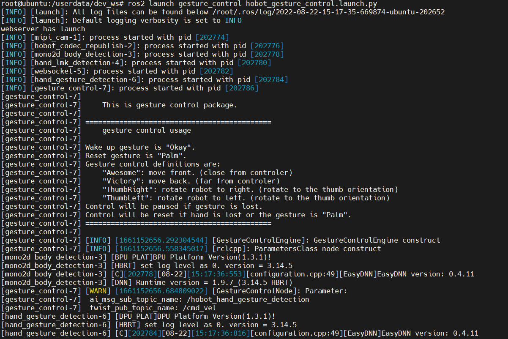

# **Gesture control**

???+ hint
    The operating environment and software and hardware configurations are as follows:
    

     - OriginBot Pro
     - PC：Ubuntu (≥22.04) + ROS2 (≥humble)


## **Start the robot chassis**

After the SSH connection to OriginBot is successful, enter the following command in the terminal to start the robot chassis:

```bash
ros2 launch originbot_bringup originbot.launch.py
```

{.img-fluid tag=1 title="Start the robot chassis"}


## **Enable the gesture control function**

``` bash
cd /userdata/dev_ws
export CAM_TYPE=usb
# Start the launch file
ros2 launch gesture_control gesture_control.launch.py
```

{.img-fluid tag=1 title="Enable the gesture control function"}

???+ Attention
    When starting an application function, please make sure that the configuration file is in the current running path. Otherwise, the application function will not be able to find the configuration file and will fail to run.


## **Gestures control bot effects**

After the startup is successful, stand in front of the OriginBot camera and use the following gestures to control the robot's movement.


|Control Gesture	|Function	|Gesture Action Example|
|-|-|-|
|666 Gesture/Awesome|	Move forward|	|
|yeah/Victory|	Move backward|	|
|Thumb Right|	Turn right|	|
|Thumb Left|	Turn left	||


## **Visualized display of the upper computer**

Open the browser and access the robot's IP address to see the real-time effect of visual recognition.
{.img-fluid tag=1 title="Visualized display of the upper computer"}


## **Introduction to the principle**

The gesture control function is to control the movement of the robot car through gestures, including left and right rotation and front and back translation. It consists of MIPI image acquisition, human body detection and tracking, human hand key point detection, gesture recognition, gesture control strategy, image encoding and decoding, and WEB display terminal. The process is as follows:

{.img-fluid tag=1 title="Introduction to the principle"}

For a detailed explanation of the principle, please see:

[https://developer.d-robotics.cc/rdk_doc/Robot_development/apps/car_gesture_control](https://developer.d-robotics.cc/rdk_doc/Robot_development/apps/car_gesture_control){:target="_blank"}

[](https://www.guyuehome.com/){:target="_blank"}

