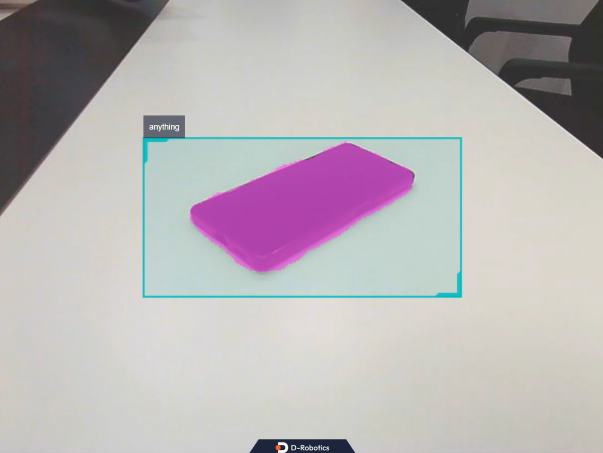

# **Segment Everything**

???+ hint
    The operating environment and software and hardware configurations are as follows:

     - OriginBot Robot (Pro Edition)
    
     - PC: Ubuntu (≥22.04) + ROS2 (≥humble)

The `mono_mobilesam` package is an example of using Mobile SAM for quantized deployment. The image data comes from local image playback and subscribed image messages. SAM relies on detection box inputs for segmentation and segments the targets within the detection boxes without requiring target category information—only the boxes need to be provided. Finally, the algorithm information is published through topics and rendered visually on a web page.

Application scenarios: obstacle segmentation, water area segmentation, etc., combined with detection boxes.

## **Run Example**
```bash
# Enter the workspace
cd /userdata/dev_ws

# Copy the configuration files required for the example from the tros installation path.
cp -r /opt/tros/${TROS_DISTRO}/lib/mono_mobilesam/config/ .

# Configure the USB camera
export CAM_TYPE=usb

# Launch the launch file
ros2 launch mono_mobilesam sam.launch.py 
```

### **View Example Results on the Web**

After running successfully, open a browser on a PC in the same network, enter `http://IP:8000`, and select "Web Display". You can then view the images and algorithm results. Replace `IP` with the IP address of the OriginBot.



[](https://www.guyuehome.com/){:target="_blank"}