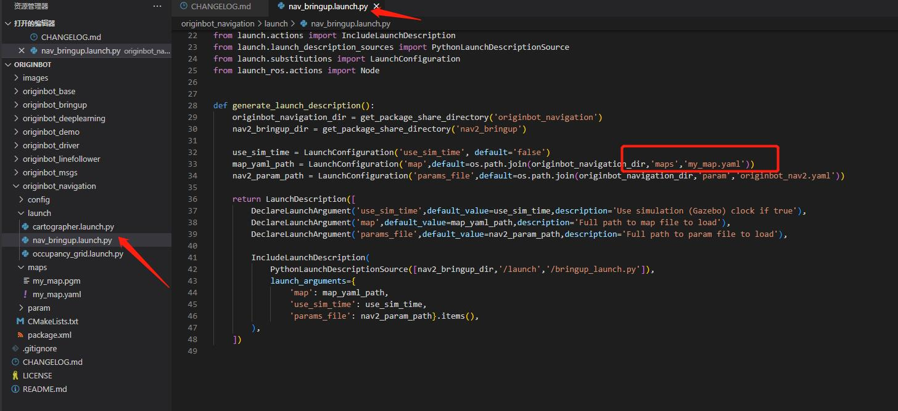
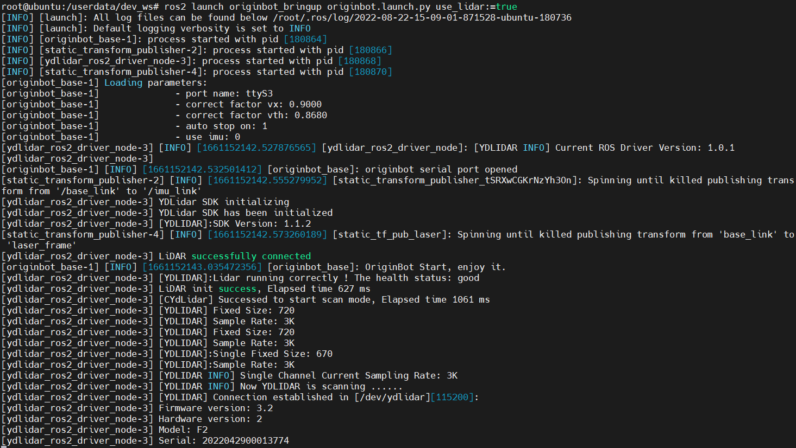
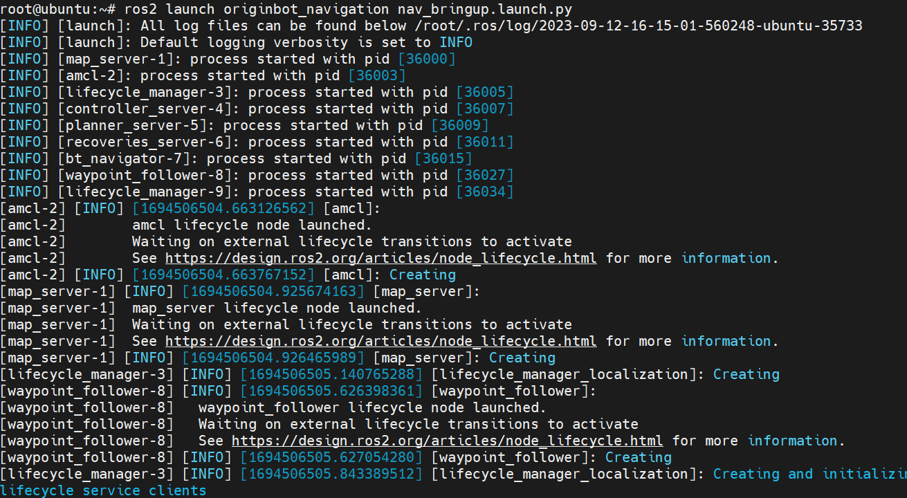
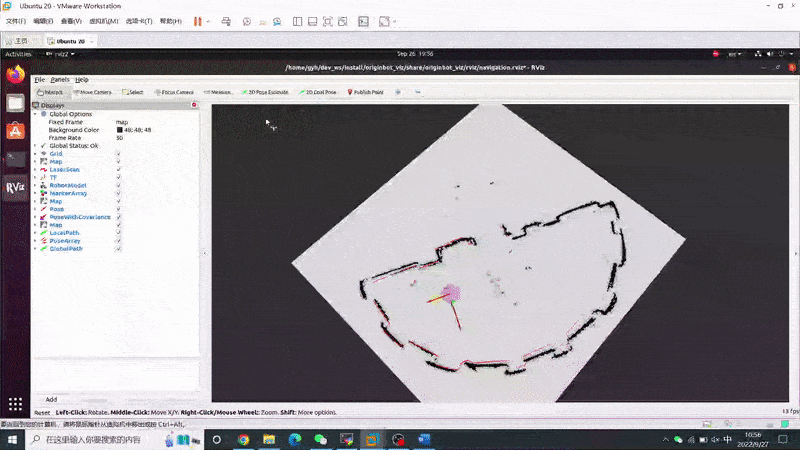
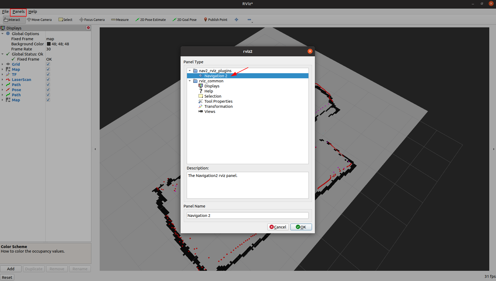
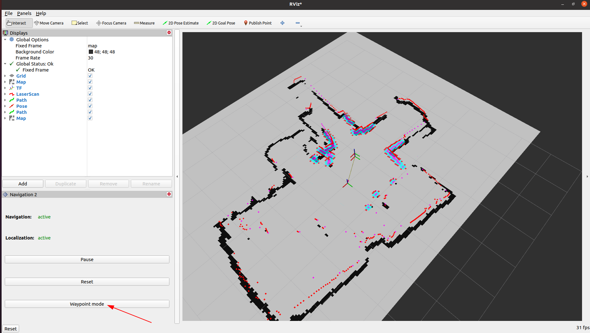
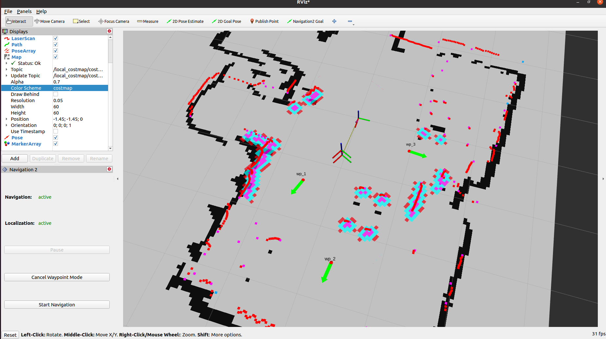
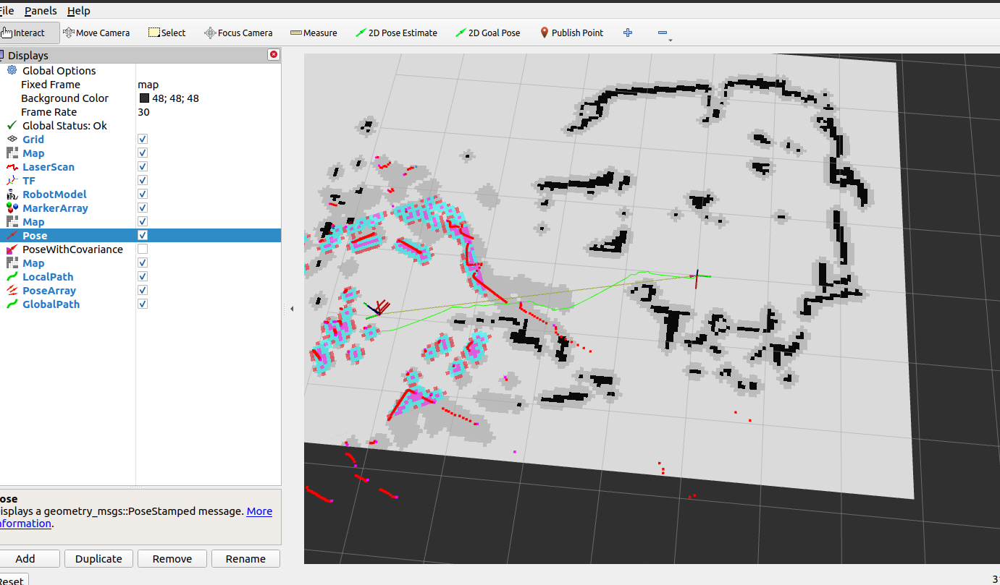

# **Autonomous navigation**

???+ hint
    The operating environment and software and hardware configurations are as follows:

     - OriginBot Pro
     - PC：Ubuntu (≥22.04) + ROS2 (≥humble)


<iframe
  src="//player.bilibili.com/player.html?aid=516658213&bvid=BV1eg411a7A9&cid=866157912&page=17&autoplay=0"
  scrolling="no"
  border="0"
  width="800px"
  height="460px"
  frameborder="no"
  framespacing="0"
  allowfullscreen="true"
>
</iframe>


## **Configure the map**

Autonomous navigation will be completed on the map established by the previous SLAM, and the OriginBot navigation package contains a default map, which needs to be modified to the map of your own environment before navigation, and the modification method is as follows:

- Copy the map file（\*.pgm）and map configuration file（\*.yaml）created by your SLAM and place them in the originbot_navigation/maps directory;
- Change the name of the map called in the originbot_navigation/launch/nav_bringup.launch file to ensure that it is the same as the name of the map configuration file copied in the previous step:

{.img-fluid tag=1 title="Configure the map"}

- After the modification is complete, the terminal returns to the root directory of the workspace and **recompiles** it.

```bash
# Go to the root directory of the workspace
cd /userdata/dev_ws/
#colcon build--packages-select  You can specify the compiled package
# --symlink-install The parameter indicates that the installation is done using a soft link, so that the map does not need to be recompiled after modification
colcon build --symlink-install --packages-select originbot_navigation
```
At this point, the map is configured, and you can use your own map to navigate.


## **Start the chassis and lidar**

After SSH is connected to OriginBot, enter the following command in the terminal to start the robot chassis and lidar:

``` bash
ros2 launch originbot_bringup originbot.launch.py use_lidar:=true use_imu:=true
```


{.img-fluid tag=1 title="Start the chassis and lidar"}

???+ hint
	Since the chassis will automatically record odom data after startup, you need to restart the chassis each time before running the navigation function, otherwise the TF tree transformation may fail.


## **Visualized display of the upper computer**

In order to facilitate the release of navigation target points, start the upper computer visualization software on the PC under the same network:

```bash
ros2 launch originbot_viz display_navigation.launch.py
```


???+ hint
    Make sure that the [originbot_desktop](https://github.com/yzhcat/originbot_desktop){:target="_blank"} code repository has been downloaded and compiled on the PC. If it is inconvenient to use the originbot_desktop code repository, you can also use "ros2 run rviz2 rviz2" to start Rivz2 separately, and manually add display plug-ins such as map, tf, laserscan, etc. to achieve similar results.


## **Start the navigation feature**

Connect to OriginBot via SSH and enter the following command in the terminal to start the Nav2 navigation package:


``` bash
ros2 launch originbot_navigation nav_bringup.launch.py
```
{.img-fluid tag=1 title="Start the navigation feature"}


After successful startup, you will see continuous output of information in the terminal. This is because the initial position of the robot is not set. It will be set after starting Rviz later. You can ignore it for now.

???+ attention
    If you run navigation first and then start Rviz, you may not be able to see the static map in Rviz. Please make sure to start Rviz on the PC first and then start the navigation function on the robot.


## **Single-target point navigation**

Configure the display project in the opened Rviz, click the "2D Pose Estimate" button in the toolbar, select the initial pose of the robot in the map, and the warning in the terminal will stop. Then click the target position and select the "2D Goal Pose" button. Select the navigation target point on the map to start autonomous navigation.


{.img-fluid tag=1 title="Single-target point navigation"}


## **Multi-target point navigation**
Click on the Panels option in the Rviz menu bar, select the Navigation2 plugin from it, and click OK.

{.img-fluid tag=1 title="Multi-target point navigation"}

???+ hint
    If you can't find the Navigation2 plugin here, please use “sudo apt install ros-${ROS_DISTRO}-nav2*” to install it.

In the navigation plug-in window that pops up on the left, click "Waypoint mode" to enter the multi-way point selection mode.
{.img-fluid tag=1 title="Multi-target point navigation"}

Use the "Navigation2 goal" function to select multiple waypoints that need to be navigated, and after the selection is completed, click the "Start Navigation" button in the plug-in, and the robot navigation movement will start, passing through the selected waypoints in turn.
{.img-fluid tag=1 title="Multi-target point navigation"}


## **Fixed-point navigation**

After the feature pack has been successfully compiled, you can see the send_goal feature pack in the originbot_navigation, which integrates the fixed-point navigation program.

You can use the following programs to run it:

```
ros2 run send_goal GoalCoordinate
```



[](https://www.guyuehome.com/){:target="_blank"}