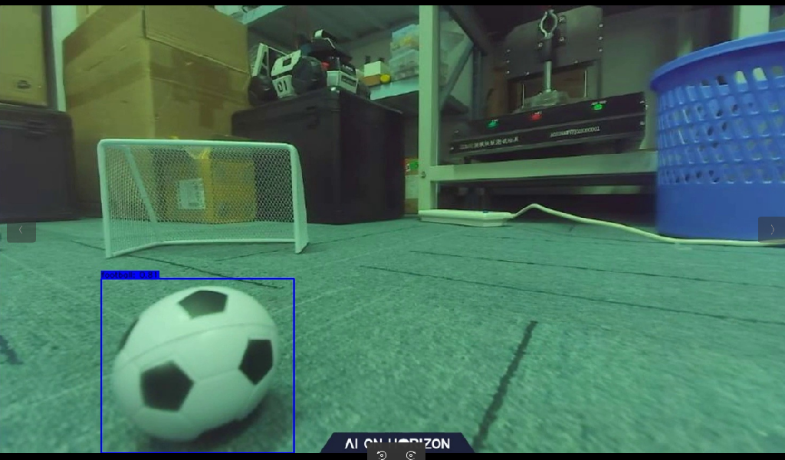
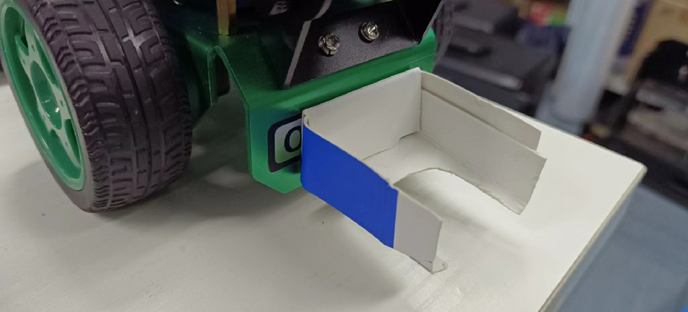
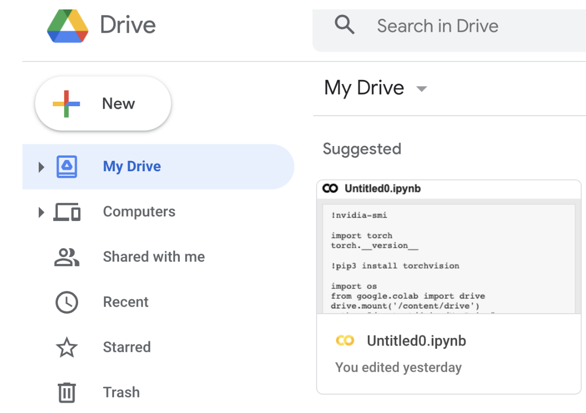
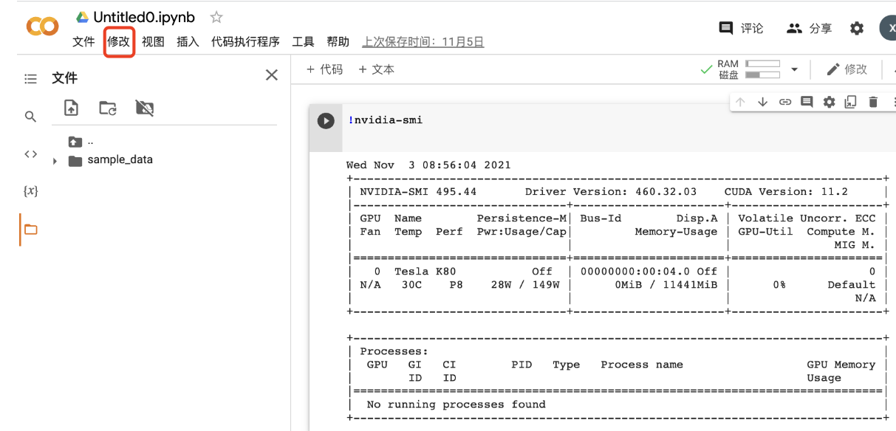
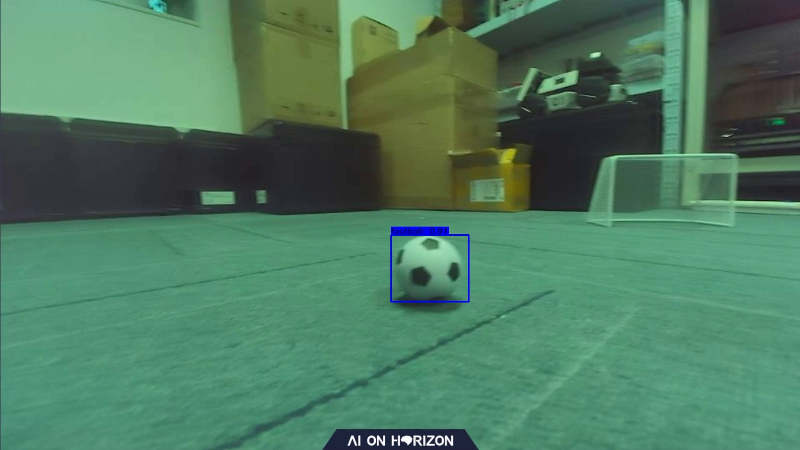

# **Playing Football**

???+ hint
	The operating environment and software and hardware configurations are as follows:

     - OriginBot Pro
     - PC：Ubuntu (≥22.04) + ROS2 (≥humble)


## **Application Description**

In the football field of the World Cup, everyone saw the various scenes of the players galloping on the football field. I wonder if you will also fantasize that one day robots can really go to the football field for a thrilling competition? Let's take OriginBot as an example and develop a new feature for playing football!

First of all, there are two necessary elements, one is football and the other is goal. The OriginBot can realize the football project, and the football can be identified by the goal, and the OriginBot can be dribbled to the goal. Here we have summarized the three elements of this project, identifying the football, the cart dribbling, and the cart shooting.


## **Hardware configuration**

### **Scenario description**

In the application code of OriginBot, we have trained a set of models for you to recognize footballs. The size of [football](https://detail.tmall.com/item.htm?app=chrome&bxsign=scdvWbq-VPcbgEMWU8q8H2Xd2OPhfI7etyomDDJ9EoY7TouDT_px7NiaPKFlkIjQLJrzgVn5FZYdoiKaGLnJbC-CDRvAn2fkVJ8nKQrwkbDgW0rIgxHZJx4kyriZQK_HFuw&cpp=1&id=653536038144&price=13.9-45.9&shareUniqueId=18620108203&share_crt_v=1&shareurl=true&short_name=h.UgMIhFv&sourceType=item,item&sp_abtk=gray_ShareGlobalNavigation_1_code_simpleAndroid&sp_tk=TVN5R2RZWVRsSHk=&spm=a2159r.13376460.0.0&suid=24dfb5fb-b23b-4269-b9c2-06ef25d8ca5e&tbSocialPopKey=shareItem&tk=MSyGdYYTlHy&un=78f593f474668cb68bcc5a13b9bc225d&un_site=0&ut_sk=1.YbWZ+L47U8IDAJfaQBYzv5sf_21646297_1667803454429.Copy.1)is 4 cm in diameter. The effect is as follows.



If you have a similar environment around you, you can directly deploy the link and test the object recognition and tracking effect of deep learning.


### **Hardware description**

In order to achieve a better kicking effect, we pulled the camera to the lowest position. At the same time, we added a tool to help the OriginBot car dribble better.  [click this link](https://drive.google.com/file/d/13gIK_GtsCaIEkNZ_tc7dPa0-4CKxYX-8){:target="_blank"} to download the 3D model of the gripper. If possible, you can print the gripper by 3D printing. The installation is as follows:


Of course, if it's not convenient to 3D print, you can also make one out of things around you. Here we use a cardboard version, as shown in the image below:




## **Run method**

### **Activate the soccer ball recognition and dribbling function**

  Start by placing OriginBot in a similar scene. Next, launch the feature.

```
cd /userdata/dev_ws
source install/setup.bash
ros2 run play_football play_football
```


### **Start the robot**

After SSH is connected to OriginBot, enter the following command in the terminal to start the robot chassis and camera:

```
ros2 launch originbot_bringup camera_internal.launch.py
ros2 launch originbot_bringup originbot.launch.py
```

Once it's running, you'll see the bot start tracking the ball.


### **Shoot at goal**

There is some preparation to be done before shooting, and here we don't identify the goal, so how do we go about it? Navigation！ So we need to build a map first and clarify the location of the goal on the map.

 Start the navigation node, set the starting point (the current position of the OriginBot) and the end point (goal position) and start the dribbling node at the same time, and the OriginBot can go to the goal position.

```
ros2 launch originbot_navigation nav_bringup.launch.py
```


## **Effect display**

Shoot at goal：


Dribble：


## **YoLov5 trains a football recognition model**

### Model selection

Here we choose the commonly used YOLOv5 algorithm. Here we briefly explain how it works. 

In official terms, YOLOv5 implements a method called single-stage object detection, which can complete the task of object detection, recognition and localization in a forward propagation process, so how exactly does it achieve it?

- First, YOLOv5 uses an algorithm called Adaptive Non-Maximum Suppression (A-NMS), which can improve detection accuracy by dynamically adjusting the threshold of non-maximum suppression.

- YOLOv5 then uses a model called a Deep Divisible Convolutional Neural Network (DCNN) to extract image features, and uses multiple convolutional kernels of different sizes for feature extraction in order to capture multi-scale targets.

- Finally, YOLOv5 uses a method called multi-scale prediction, which can detect targets of different sizes individually and improve the detection accuracy by comparing the prediction results at different scales.

Only by knowing these can we better write code and do algorithm analysis.

### **Prepare the model training environment**

  There are two options for you to choose from.

- Train the model on the PC

​      You can follow the normal steps for PC training.

- Train models in the cloud

​      For the convenience of the model training here, we chose the cloud training model to avoid the training time taking too long due to the graphics card. For the cloud server, we chose Google's Colab.

```
https://drive.google.com/
```

Select the My Drive folder, click New to create a new folder, and name it play_football.



Then right-click and select Google Colaboratory.

Click Modify to change the notebook runtime to GPU.



In addition, you can try to use some commands to check the corresponding parameters.

```
#View the graphics card parameters
!nvidia-smi

#View the pytorch
import torch
torch.__version__
```

Attach google drive to your Cloud PC.

```
import os
from google.colab import drive
drive.mount('/content/drive')
 
path = "/content/drive/My Drive"
 
os.chdir(path)
os.listdir(path)
```

Download the Yolov5 algorithm package

```
git clone https://github.com/ultralytics/yolov5 
cd yolov5
git reset --hard 5e970d4 
```

Next, you can follow the normal process of training Yolov5.

**Additional Additions：**

（1）In terms of environment use, colab downloads the latest pytorch version by default, but the version used in version 2.0 cannot be too high, and it is recommended that you use this version.

```
!pip install torch==1.9.0+cu111 torchvision==0.10.0+cu111 torchaudio==0.9.0 -f https://download.pytorch.org/whl/torch_stable.html
```

（2）Regardless of whether you use the cloud or the PC side, in terms of network architecture, in order to match the use of RDK, you need to change the network architecture (yolo.py) to the following:

```
  def forward(self, x):
      # x = x.copy()  # for profiling
      z = []  # inference output
      self.training |= self.export
      for i in range(self.nl):
          x[i] = self.m[i](x[i])  # conv
          bs, _, ny, nx = x[i].shape  # x(bs,255,20,20) to x(bs,3,20,20,85)
          #  x[i] = x[i].view(bs, self.na, self.no, ny, nx).permute(0, 1, 3, 4, 2).contiguous()
          x[i] = x[i].permute(0, 2, 3, 1).contiguous()
```

（3）To export the model, you need to change the ONNX opset to 10 or 11, and the default input name parameter of torch.onnx.export part can be changed from 'images' to 'data';p arser.add_argument to 672x672.


### **AI toolchain conversion**

Here you can see the [Visual Line Patrol](../application/deeplearning_line_follower.md#ai_1){:target="_blank"} section, using version 2.2.3a of the toolchain. Next, I would like to introduce you to some core points.

- First of all, you need to configure the environment of the AI tool chain, which can be found in the Horizon Resource Center.

- After configuring the environment, you can see that there are some conversion tools related to YOLOV5 in this directory.

  ```
  horizon_xj3_open_explorer_v2.2.3a_20220701/ddk/samples/ai_toolchain/horizon_model_convert_sample/04_detection/03_yolov5s/mapper
  ```

  In this directory, you can execute the following commands in the same order as the visual patrol.

  ```
  ./01_check.sh
  ./02_preprocess.sh
  ./03_build.sh
  #After completing these three steps, you can see that a.bin file is generated under the model_output directory, so how do you verify that this file is valid?
  ./04_inference.sh
  ```

  

  At this time, you will find that there is an error, here you need to make a change to the executable file, First go to 04_inference.sh to change the image path, and then you need to change the content of the postprocess.py, change as follows:
  
  ```python
   def get_yolov5s_config():
        yolov5s_config = EasyDict()
        yolov5s_config.ANCHORS = np.array([
            10, 13, 16, 30, 33, 23, 30, 61, 62, 45, 59, 119, 116, 90, 156, 198,
            373, 326
        ]).reshape((3, 3, 2))
        yolov5s_config.STRIDES = np.array([8, 16, 32])
        yolov5s_config.NUM_CLASSES = 1
        yolov5s_config.CLASSES = ["football"]
        yolov5s_config.INPUT_SHAPE = (672, 672)
        return yolov5s_config
  
  
    def postprocess(model_output,
                    model_hw_shape,
                    origin_image=None,
                    origin_img_shape=None,
                    score_threshold=0.7,
                    nms_threshold=0.45,
                    dump_image=True):
        t1 = cv2.getTickCount()
        yolov5s_config = get_yolov5s_config()
        classes = yolov5s_config.CLASSES
        num_classes = yolov5s_config.NUM_CLASSES
        anchors = yolov5s_config.ANCHORS
        num_anchors = anchors.shape[0]
        strides = yolov5s_config.STRIDES
        input_shape = yolov5s_config.INPUT_SHAPE
  
    if origin_image is not None:
        org_height, org_width = origin_image.shape[1:3]
    else:
        org_height, org_width = origin_img_shape
    process_height, process_width = model_hw_shape
  
    model_output[0] = model_output[0].reshape([1, 84, 84, 3,
                                               6]).transpose([0, 3, 1, 2, 4])
    model_output[1] = model_output[1].reshape([1, 42, 42, 3,
                                               6]).transpose([0, 3, 1, 2, 4])
    model_output[2] = model_output[2].reshape([1, 21, 21, 3,
                                               6]).transpose([0, 3, 1, 2, 4])
  
    pred_sbbox, pred_mbbox, pred_lbbox = model_output[0], model_output[
        1], model_output[2]
  
    pred_sbbox = yolov5s_decoder(pred_sbbox, num_anchors, num_classes,
                                 anchors[0], strides[0])
    pred_mbbox = yolov5s_decoder(pred_mbbox, num_anchors, num_classes,
                                 anchors[1], strides[1])
    pred_lbbox = yolov5s_decoder(pred_lbbox, num_anchors, num_classes,
                                 anchors[2], strides[2])
    pred_bbox = np.concatenate([
        np.reshape(pred_sbbox, (-1, 5 + num_classes)),
        np.reshape(pred_mbbox, (-1, 5 + num_classes)),
        np.reshape(pred_lbbox, (-1, 5 + num_classes))
    ],
                               axis=0)
    print(process_height, process_width)
    bboxes = postprocess_boxes(pred_bbox, (org_height, org_width),
                               input_shape=(process_height, process_width),
                               score_threshold=score_threshold)
    nms_bboxes = nms(bboxes, nms_threshold)
    if dump_image and origin_image is not None:
        logging.info(f"detected item num: {len(nms_bboxes)}")
        draw_bboxs(origin_image[0], nms_bboxes)
    t2 = cv2.getTickCount()
    print('post consumption {0} ms'.format((t2-t1)*1000/cv2.getTickFrequency()))
    return nms_bboxes
  ```
  
  


  A demo image will be generated to verify the effectiveness of our model.

 


### **Board-side deployment**

Copy the generated fixed-point model play_football.bin to the config folder under the playfootball_node feature package of the OriginBot side, replace the original model, and recompile the workspace.


### **Control mode**

In the dribble example, we use a similar approach to patrolling, tracking the ball and following the dribble, as follows:

```bash
ros2 run play_football play_football
ros2 launch originbot_bringup camera_internal.launch.py
ros2 launch originbot_bringup originbot.launch.py
```


In the process of shooting, navigation is used to make the machine run towards the target point.

It is worth mentioning that different machines may have different differences, and you need to do some fine-tuning on the motion control parameters.


```c++
// Machine motion control
  auto message = geometry_msgs::msg::Twist();

  if(exist_result == 1){
      message.angular.z = -1.0 * (target_point - 480) / 300.0; 
      message.linear.x  = 0.24;
  }
  else {
      message.angular.z = 0.15;
      message.linear.x  = 0;
  }
  message.linear.y = 0.0;
  message.linear.z = 0.0;
  message.angular.x = 0.0;
  message.angular.y = 0.0;
  cmd_vel_publisher_->publish(message);
```


[](https://www.guyuehome.com/){:target="_blank"}