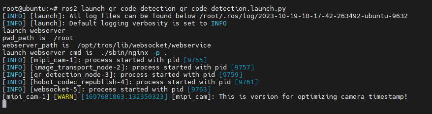
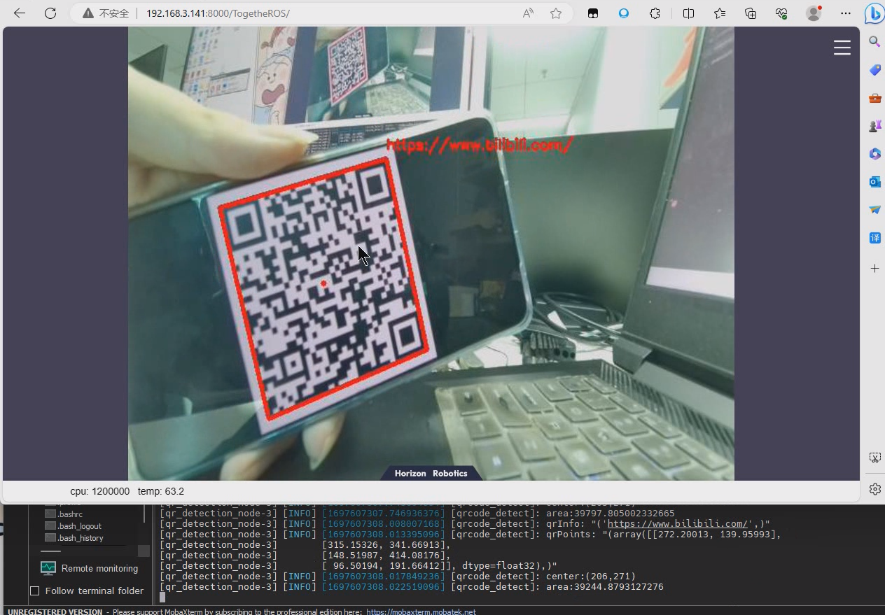
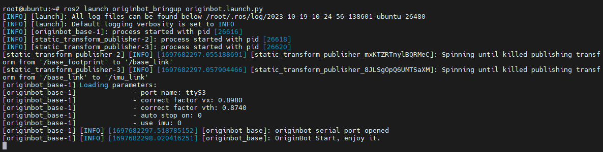
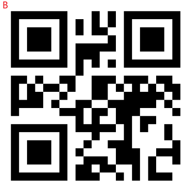
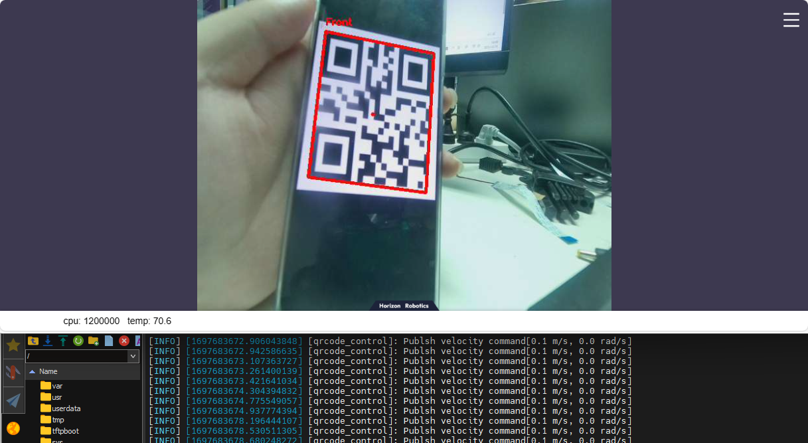
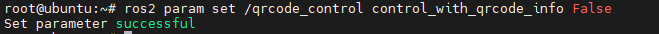
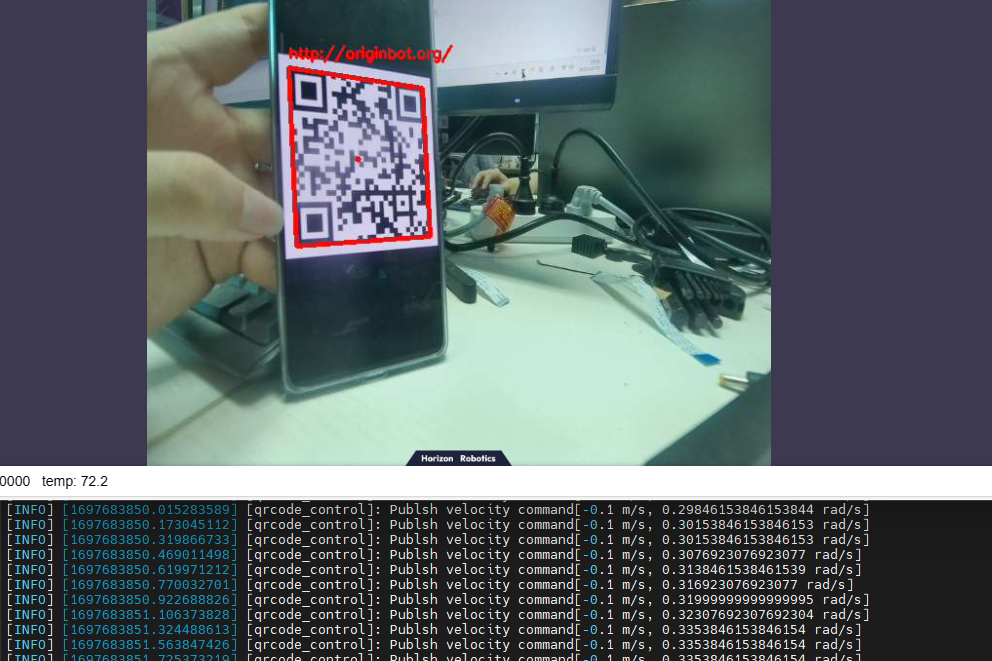
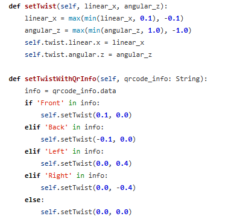

# **QR code detection and tracking**

???+ hint
    The operating environment and software and hardware configurations are as follows:

     - OriginBot Pro
    
     - PC：Ubuntu (≥22.04) + ROS2 (≥humble)


In our daily lives, what are the most common image recognition scenarios we encounter every day? Scanning a QR code must be one of them.

You need to scan a QR code to log in to WeChat, to pay with your mobile phone, and to ride a shared bicycle. In addition to these scanning scenarios that are already very popular in daily life, QR codes have also been widely used in industrial production. For example, QR codes are used to mark material models, or to save product production information in QR codes. Just scan them with a camera and you can quickly see the corresponding content.

There are many ways to encode a QR code, the most common one is QR Code, which is mainly used on mobile devices.

Since QR codes can store a lot of information, can they be combined with robots? For example, when the robot recognizes different QR codes, it can perform different actions accordingly?

Next, we will try to let the robot recognize the QR code and follow the movement of the QR code.

## **QR code recognition**

After successfully connecting to OriginBot through SSH, enter the following command in the terminal to start the QR code recognition function:

```bash
ros2 launch qr_code_detection qr_code_detection.launch.py
```


### **View the routine effect on the WEB side**

After the operation is successful, on the PC side of the same network, open the browser, enter http://IP:8000 ，and select "web display side" to view the image and algorithm effect, and the IP is the IP address of OriginBot.



## **QR code tracking**

### **Start the chassis**

After the SSH connection to OriginBot is successful, enter the following command in the terminal to start the robot chassis:

```bash
ros2 launch originbot_bringup originbot.launch.py
```



### **Start the QR code control node**

SSH connects to OriginBot, and after the QR code recognition node is activated, enter the following command in the terminal to start the QR code control node:

```bash
ros2 run qr_code_control qr_code_control_node
```

### **QR code control**

By default, the QR code content Front, Back, Left, Right is used to control the OriginBot, and the following QR code can be used to control OriginBot.

|  |  |
| ---------------------------------- | ---------------------------------- |
|  |  |




### **View control mode**

It can also identify the relative position of the QR code to track the QR code

Enter the following command in the terminal to view the control mode:

```bash
ros2 param get /qrcode_control control_with_qrcode_info
# False Do not understand the content of the QR code, only follow the position of the QR code
# True  Identify the contents of the two-dimensional code and execute the command according to the contents of the two-dimensional code
```


### **Modify the control mode**

Enter the following command in the terminal to modify the control mode:

```bash
ros2 param set /qrcode_control control_with_qrcode_info False
```



At this point, the relative position of the QR code will be recognized, and the sending speed will be recognized.



 You can adjust the movement speed in File qr_code_control_node.py.
 


[](https://www.guyuehome.com/){:target="_blank"}
