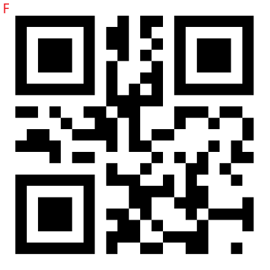

# **QR Code Detection and Tracking**

???+ hint
    The operating environment and hardware configuration are as follows:

     - OriginBot Robot (Lite/Standard/Pro versions)
    
     - PC: Ubuntu (≥22.04) + ROS2 (≥humble)

In our daily lives, one of the most common image recognition scenarios is scanning QR codes. 

Whether it's logging into WeChat, making mobile payments, or unlocking shared bikes, QR code scanning has become ubiquitous. Beyond these everyday applications, QR codes are also widely used in industrial production, such as marking material models or storing production information. By simply scanning a QR code with a camera, the corresponding information can be quickly retrieved.

QR codes can store a lot of information. Can they be combined with robots? For example, when a robot recognizes different QR codes, it can perform corresponding actions.

Next, let's try enabling the robot to recognize QR codes and follow their movement.

## **QR Code Detection**
After successfully connecting to the OriginBot via SSH, enter the following command in the terminal to start the QR code detection feature:

```bash
ros2 run originbot_qrcode_detect qr_decoder
```


To open the camera, enter the following command:

```bash
ros2 launch originbot_bringup camera.launch.py
```

To enable web display, run:

```bash
ros2 run websocket websocket --ros-args -p image_topic:=/image_jpeg -p image_type:=mjpeg -p only_show_image:=true & ros2 launch hobot_codec hobot_codec.launch.py codec_in_mode:=ros codec_in_format:=bgr8 codec_out_mode:=ros codec_out_format:=jpeg codec_sub_topic:=/qr_code_image codec_pub_topic:=/image_jpeg
```

### **Viewing the Example on the Web**

Once successfully running, open a browser on a PC connected to the same network, enter `http://IP:8000`, and select "Web Display" to view the image and algorithm results. Replace `IP` with the IP address of the OriginBot.


## **QR Code Tracking**

### **Starting the Chassis**

After successfully connecting to the OriginBot via SSH, enter the following command in the terminal to start the robot chassis:

```bash
ros2 launch originbot_bringup originbot.launch.py
```


### **Starting the QR Code Control Node**

Close the QR code detection node, then enter the following command in the terminal to start the QR code control node:

```bash
ros2 launch originbot_qrcode_detect qrcode_control.launch.py
```

To open the camera (if not already opened), run:

```bash
ros2 launch originbot_bringup camera.launch.py
```

To enable web display (if not already enabled or not needed, this step can be skipped), run:

```bash
ros2 run websocket websocket --ros-args -p image_topic:=/image_jpeg -p image_type:=mjpeg -p only_show_image:=true & ros2 launch hobot_codec hobot_codec.launch.py codec_in_mode:=ros codec_in_format:=bgr8 codec_out_mode:=ros codec_out_format:=jpeg codec_sub_topic:=/qr_code_image codec_pub_topic:=/image_jpeg
```

### **QR Code Control**

By default, the robot recognizes QR code content such as `Front`, `Back`, `Left`, and `Right` to control the robot's movement. You can use the following QR codes to control the robot:

|  |  |
| --------------------------------------------- | --------------------------------------------- |
|  |  |


### **Viewing the Control Mode**

You can also track the relative position of the QR code to follow it. 

Enter the following command in the terminal to view the control mode:

```bash
ros2 param get /qrcode_control control_with_qrcode_info
# False: Does not recognize QR code content, only follows the QR code's position
# True:  Recognizes QR code content and executes commands based on it
```


### **Modifying the Control Mode**

Enter the following command in the terminal to modify the control mode:

```bash
ros2 param set /qrcode_control control_with_qrcode_info False
```


In this mode, the robot will follow the relative position of the QR code and adjust its speed accordingly.


You can adjust the movement speed in the `qrcode_control.cpp` file:


[](https://www.guyuehome.com/){:target="_blank"}