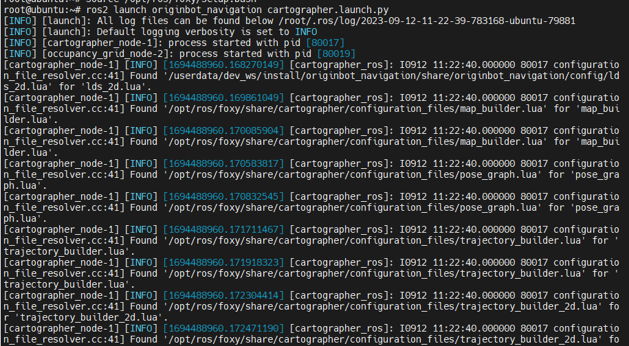
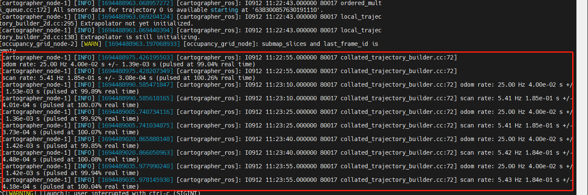

# **SLAM Map building**

???+ hint
    The operating environment and software and hardware configurations are as follows:

     - OriginBot Pro
     - PC：Ubuntu (≥22.04) + ROS2 (≥humble)


<!-- <iframe
  src="//player.bilibili.com/player.html?aid=516658213&bvid=BV1eg411a7A9&cid=866152168&page=16&autoplay=0"
  scrolling="no"
  border="0"
  width="800px"
  height="460px"
  frameborder="no"
  framespacing="0"
  allowfullscreen="true"
>
</iframe> -->

## **Start the chassis and lidar**

After successfully connecting to OriginBot through SSH, enter the following command in the terminal to start the robot chassis and lidar:

``` bash
ros2 launch originbot_bringup originbot.launch.py use_lidar:=true use_imu:=true
```

{.img-fluid tag=1 title="Start the chassis and lidar"}

???+ hint
	Since the chassis will automatically record odom data after startup, you need to restart the chassis each time before running the SLAM function, otherwise the TF tree transformation may fail.


## **Start SLAM**

Connect to OriginBot via SSH and enter the following command in the terminal to start the cartographer mapping algorithm:


``` bash
ros2 launch originbot_navigation cartographer.launch.py
```
{.img-fluid tag=1 title="Start SLAM"}


If the program is running properly, the terminal should display a screen similar to the following:

{.img-fluid tag=1 title="Correct display"}


## **Upper computer visual display**

In order to view the complete SLAM process, start the upper computer visualization software on the PC under the same network:

```bash
ros2 launch originbot_viz display_slam.launch.py
```

You can see the map that has been created at this point.

{.img-fluid tag=1 title="Visualized display of the upper computer"}

???+ hint
    Make sure that the [originbot_desktop](https://github.com/guyuehome/originbot_desktop){:target="_blank"} code repository has been downloaded and compiled on the PC. If it is inconvenient to use the originbot_desktop code repository, you can also use "ros2 run rviz2 rviz2" to start Rivz2 separately, and manually add display plug-ins such as map, tf, laserscan, etc. to achieve similar results.


## **Keyboard control mapping**

In order for the robot to establish a complete picture of its surroundings, we also need to start a keyboard control node:

```bash
ros2 run teleop_twist_keyboard teleop_twist_keyboard
```

???+ hint
    The keyboard control node can be run on the PC or OriginBot.


Now, we can click the up, down, left, and right keys on the keyboard in the keyboard-controlled terminal to control the robot to explore the unknown environment. The full picture of the map will gradually appear in Rviz.


{.img-fluid tag=1 title="Keyboard control mapping"}


## **Save the map**

After the map is built, you can use the following command to save the map:

```bash
ros2 run nav2_map_server map_saver_cli -f my_map --ros-args -p save_map_timeout:=10000
```

???+ info
    The above command will save the map to the current path of the terminal. Before using it for subsequent navigation, it needs to be copied to the originbot_navigation function package.


[](https://www.guyuehome.com/){:target="_blank"}