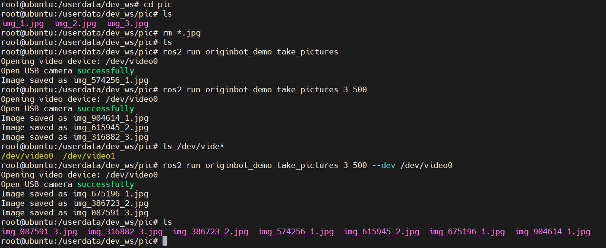

# **Image Acquisition**

???+ hint
    The operating environment and software and hardware configurations are as follows:
    
     - OriginBot Robot (Lite/Standard/Pro Edition)
     - PC: Ubuntu (≥22.04) + ROS2 (≥humble)

## **Function Introduction**

Image acquisition is an essential basic function in visual development. Users can interact with data by reading each frame of an image or use various traditional visual algorithms to process each frame of the image based on the read data. Therefore, this function package is designed to solve two problems: first, to help users obtain specified frame image data, and second, to help developers learn the use of various image data in the RDK.

## **Function Operation (Pro Edition)**

Open the video device and obtain image data. You can specify the number of images to capture and the interval time (ms). By default, it captures 1 image with an interval of 1000ms, and the default video device is `/dev/video0`.

```bash
# Capture images
ros2 run originbot_demo take_pictures
# Specify the number of images and interval time (ms)
# Example: Capture 3 images with a 500ms interval
ros2 run originbot_demo take_pictures 3 500
# Specify the camera device
ros2 run originbot_demo take_pictures 3 500 --dev /dev/video0
```



## **Function Operation (Lite/Standard Edition)**

### **Compile the Function Package**

The `take_pictures_node` function package is an independent package. Users can ensure its proper operation before running it by executing the following commands:

```bash
cd /userdate/dev_ws
colcon build --packages-select take_pictures_node
cp -r /opt/tros/lib/mono2d_body_detection/config/ .
cp -r /opt/tros/lib/hand_lmk_detection/config/ .
cp -r /opt/tros/lib/hand_gesture_detection/config/ .
```

### **Obtain Image Frame Data**

This function provides two startup methods: one is to use `ros2 run` to start the node independently, allowing manual specification of the number of images to capture; the second is to use a launch file to continuously obtain image frames.

#### Method 1: ros2 run

Open two terminals. In the first terminal, execute:

```bash
cd /userdate/dev_ws
ros2 run take_pictures_node take_pictures
```

In the second terminal, start the camera node:

```bash
ros2 launch originbot_bringup camera.launch.py
```

#### Method 2: ros2 launch

Start using the launch file. Since the number of images to capture is set by default in the launch file, the program will automatically capture images after execution. You can view the corresponding camera images by opening the webpage at `ip:8000`.

```bash
ros2 launch take_pictures_node take_pictures_node.launch.py
```

### **Example Description**

Taking `ros2 run` as an example, after starting two terminals, the result is shown in the figure below.


At this point, simply enter the number of data frames you want to capture into the terminal. The program will automatically save the images to `/userdata/dev_ws/imagedata/`. If the path does not exist, it will be created automatically, as shown below.


The captured images look like this:


The images obtained by executing the following command are in RGB data format. Additionally, this function package provides images in NV12 format for selection.

```bash
# rgb8
ros2 run take_pictures_node take_pictures
```

The following command is used to obtain images in NV12 format:

```bash
# First terminal
ros2 launch originbot_bringup camera_internal.launch.py
# Second terminal
ros2 run take_pictures_node take_pictures --ros-args -p sub_img_topic:=/hbmem_img --ros-args -p take_nums:=0
```

### **Key Module Description**

In the code implementation, attention should be paid to `hbm_img_msgs::msg::HbmMsg1080P` and NV12, NV12 to RGB conversion, as well as RGB and OpenCV format processing.

```cpp
void TakePicturesNode::saveHbmImage(
    hbm_img_msgs::msg::HbmMsg1080P::SharedPtr image_msg) {
    RCLCPP_INFO(rclcpp::get_logger("take_pictures"), "saveHbmImage start");

    auto image_nv12 = Hbmem2Sensor(image_msg);

    char *buf_src = new char[image_msg->data_size];
    cv::Mat mat_src = cv::Mat(image_nv12.height * 1.5, image_nv12.width, CV_8UC1, buf_src);
    cv::Mat mat_dst = cv::Mat(image_nv12.height, image_nv12.width, CV_8UC3);
    cv::cvtColor(mat_src, mat_dst, cv::COLOR_YUV2BGR_NV12);

    auto image_rgb = NV122RGB(image_nv12, mat_dst);

    cv_bridge::CvImagePtr cv_ptr = nullptr;
    cv_ptr = cv_bridge::toCvCopy(image_rgb, sensor_msgs::image_encodings::RGB8);
    // cv::Mat frame_gray;
    // cvtColor(cv_ptr->image, frame_gray, cv::COLOR_BGR2GRAY);
    cv::Mat frame_rgb = cv_ptr->image;
    std::string fName = save_dir_ + "/raw_img_" +
        std::to_string(image_rgb.header.stamp.sec) +
        std::to_string(image_rgb.header.stamp.nanosec) + ".jpg";
    cv::imwrite(fName, frame_rgb);
}
```

[](https://www.guyuehome.com/){:target="_blank"}