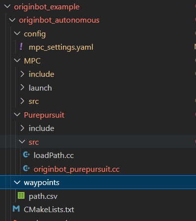
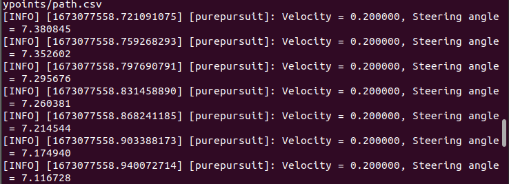
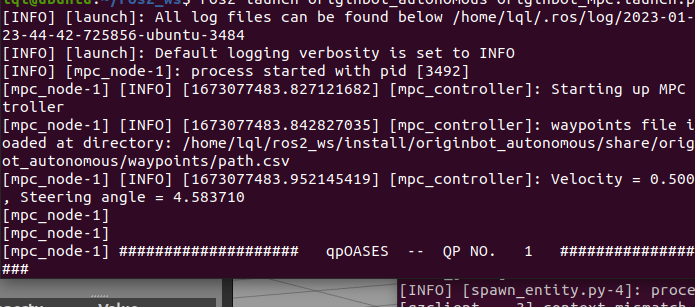
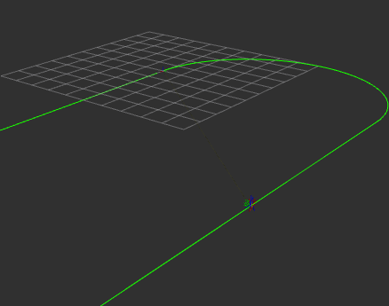
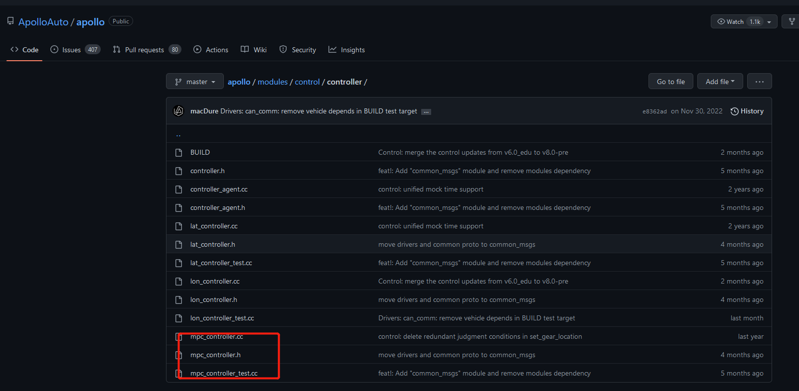
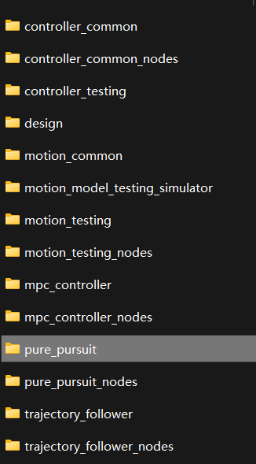
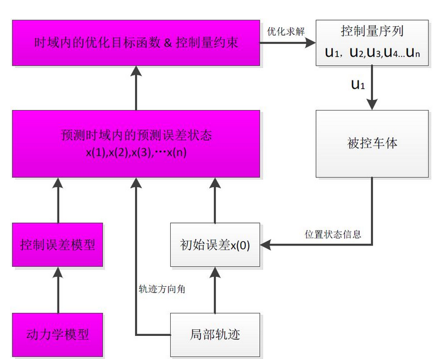

# **Trajectory tracking**

???+ hint
    The operating environment and software and hardware configurations are as follows:
    

     - OriginBot Pro
     - PC：Ubuntu (≥22.04) + ROS2 (≥humble)

This example aims to simulate the autonomous driving control module using OriginBot trajectory tracking as an example. The function development refers to Baidu Apollo. At the same time, in order to make it easier for everyone to transplant, only the lateral movement of the single-vehicle model is used, so that different kinematic models can be less affected.

The code directory is as follows:



##  **Run the case**

### **Start the chassis and lidar**
After successfully connecting to OriginBot through SSH, enter the following command in the terminal to start the robot chassis and lidar:

```
ros2 launch originbot_bringup originbot.launch.py
```


### **Start trajectory tracking**

Choose Pure Pursuit：

```
ros2 run originbot_autonomous purepursuit_node
```



Select MPC ：

```
ros2 launch originbot_autonomous originbot_mpc.launch.py
```



At the same time, after opening rviz, click the topic in the interface and select Path, you can see the following track display in the interface.



## **Brief analysis of the principle**

The PurePuesuit and MPC algorithms are commonly used control algorithms in autonomous driving, in order to make the trajectory points at the planning area smoother and meet the kinematic trajectory of the vehicle itself. In both Autoware and Apollo, both algorithms have their own implementations. See:

Apollo：



Autoware：



### **Overview**

Before talking about the implementation of the two algorithms, it is necessary to understand that the two mainstream trajectory tracking algorithms are divided into geometry-based tracking and model-based tracking methods.

In this implementation, it can basically be regarded as known coordinate information, including (x, y, yaw) and curvature Kappa, and calculates the steering angle of the control quantity, that is, the amount of lateral movement, so that the OriginBot can run smoothly in the trajectory.

Taking MPC as an example, the diagram is as follows:



### **PurePursuit**

The pure tracking algorithm proposes the concept of "preview distance", which finds the target path point that meets the requirements in the target trajectory according to the preview distance.The judgment logic is to find which point on the target trajectory and the relative distance between the current vehicle position is equal to the pre-sight distance, then the point is the target point at the current moment. The control objective is to calculate the size of the front wheel deflection angle, which can make the current OriginBot position move to the target position. On this basis, you might as well take a brief look at the core point, what is the preview distance.

To put it simply, the preview distance is like finding a tracking reference point after driving a car, for example, when driving on a straight road, we will choose a higher speed, and we are used to considering the point farther ahead as the tracking reference point; When driving in a curve, they will choose to slow down, and it is customary to choose a closer point as a tracking reference point. So this value is a value that we can set ourselves. The setting of this value will also greatly affect the movement of the OriginBot. For example, in the code of this example, in the findCloestindex function, we find the nearest point based on the preview distance.

```c++
//ld=l+kvld=l+kv (Too dependent on the selection of forward looking distance, can be used dynamic forward looking distance ld=l+kvld=l+kv, where l, kl, k are the coefficients, adjust the forward looking distance according to the speed)
double ld = kv*linear_x+ld0;
double ld_now = 0;
while(ld_now<ld && index<=(int)xr.size()) {
    double dx_ref = xr[index+1] - xr[index];
    double dy_ref = yr[index+1] - yr[index];
    ld_now += sqrt(pow(dx_ref,2)+pow(dy_ref,2));
    index++;
}
```

After obtaining this point, the rotation angle is calculated according to the model limitations of the car itself:

```c++
double PurePursuit::calSteeringAngle(double alpha,double ld) 
{
	double steer = atan2(2*track*sin(alpha),ld);
	if (steer > M_PI) {
        steer -= M_PI*2;
        } else if (steer < (-M_PI)) {
        steer += M_PI*2;
        }
    return steer;
}
```

### **MPC**

MPC is comparatively more complex to solve. Directly expose the code framework:

1.Obtain the parameters of the car body.

2.Select the state quantity and control quantity.

3.The AB matrix is discretized, and the perturbation matrix is added to Apollo.

4.Set the QR matrix.

5.Set the predicted number of steps and augment the ABQR.

6.Set the constraints of relevant parameters and obtain the values of each sensor.

7.Solve the control quantity u, and finally get u[0].

For more specific logic, please refer to [this link](https://blog.csdn.net/u013914471/article/details/83824490){:target="_blank"}


[](https://www.guyuehome.com/){:target="_blank"}

