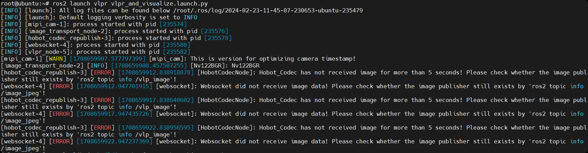
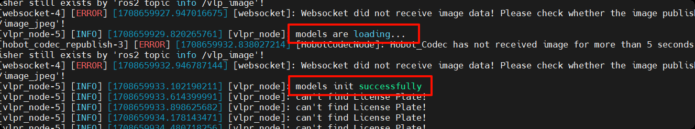
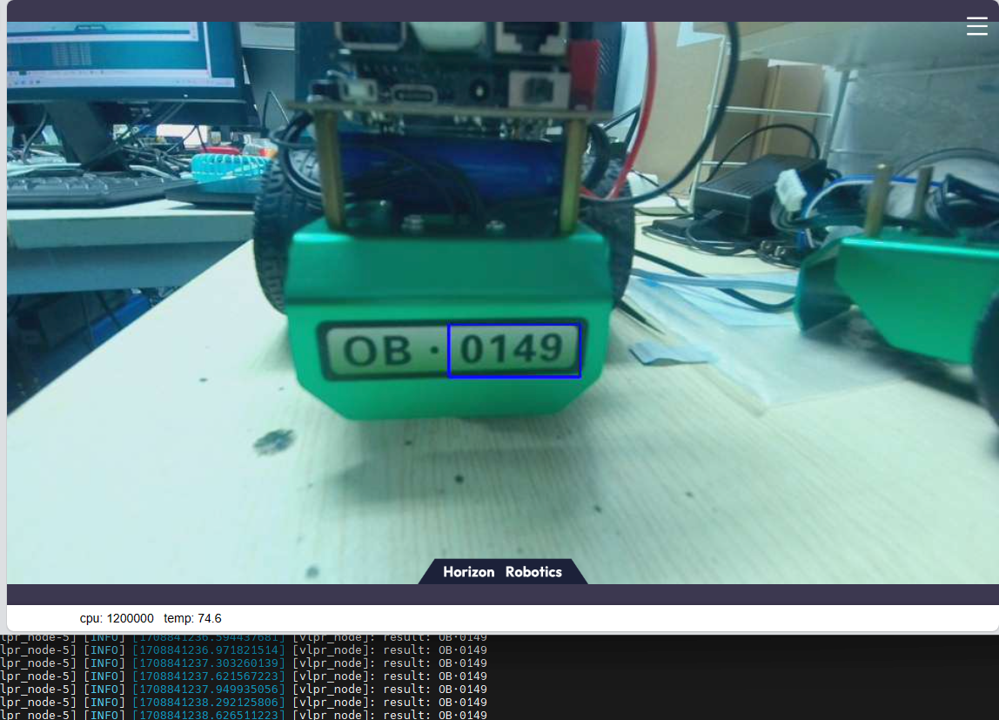
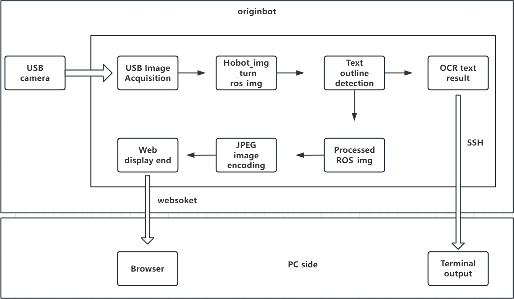

# **License plate recognition**

???+ hint
    The operating environment and software and hardware configurations are as follows:

     - OriginBot Pro
     - PC：Ubuntu (≥22.04) + ROS2 (≥humble)


## **License plate recognition**

After connecting to OriginBot via SSH, enter the following command in the terminal to enable the license plate recognition function:

```
ros2 launch vlpr vlpr_and_visualize.launch.py
```






After starting, the web side will warn that there is no image data, and you need to wait for the license plate recognition function to be fully activated, and the startup will be completed when [vlpr_node]shows successfully.


## **Check the effect of the routine on the WEB side**

After successful running, open the browser on the PC in the same network, enter http://IP:8000, select "web display terminal", and you can view the image and recognition effect. IP is the IP address of OriginBot.



## **Introduction to the principle**

The license plate recognition function is realized by detecting the contour of the license plate and identifying the numbers in the contour, which is composed of MIPI image acquisition, glyph detection, OCR, image encoding and decoding, and WEB display, and the process is as follows:



[](https://www.guyuehome.com/){:target="_blank"}