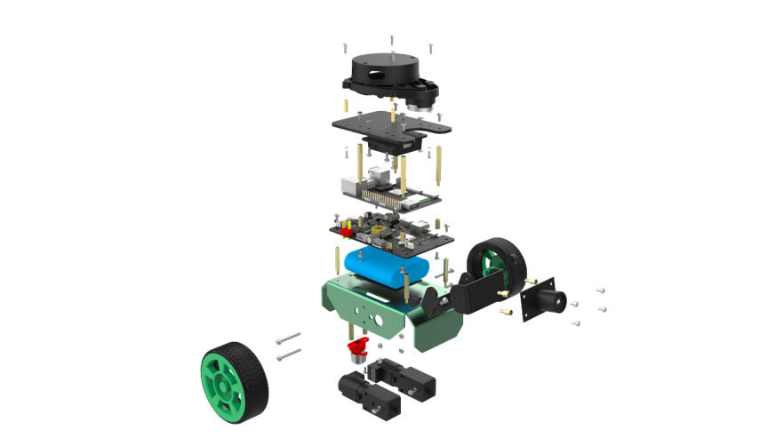
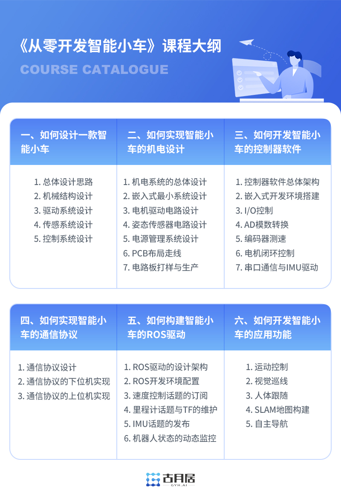

# **Courses**

Every robot developer has a dream of "developing a robot from scratch", the only difference is whether you take action or not.

**Strongly recommended**

{.img-fluid tag=1 title="从零开发智能小车"}

    <a href="https://class.guyuehome.com/detail/p_6332a82ee4b0eca59c36826b/6" target="_blank" class="md-button md-button--primary">Start Learning</a>

???+ hint
    This course is the standard content of the OriginBot kit, and you can exchange for learning by using the exclusive course exchange card included in the kit; other users can also purchase and learn separately.

## **Course video**

| Course Name                                | Course Link                                                     | Description                                                      |
| --------------------------------------- | ------------------------------------------------------------ | --------------------------------------------------------- |
| 《Developing an intelligent car from scratch》                    | [Click to learn](https://class.guyuehome.com/detail/p_6332a82ee4b0eca59c36826b/6){:target="_blank"} | Detailed explanation of the birth process of OriginBot and hand-by-hand design and development of a smart car |
| 《OriginBot intelligent robot open source kit user manual》 | [Click to learn](https://www.bilibili.com/video/BV1eg411a7A9/?spm_id_from=333.999.0.0&vd_source=c67aa749a53261eb7bdd22ba5b916d5f){:target="_blank"} | OriginBot usage operation explanation                                     |
| 《ROS2 Entry-level 21 Lectures》                        | [Click to learn](https://class.guyuehome.com/detail/p_628f4288e4b01c509ab5bc7a/6){:target="_blank"} | From zero to ROS2 basic concepts and common tools                            |
| 《TogetheROS™.Bot Core Principles and Applications》           | [Click to learn](https://class.guyuehome.com/search/TogetheROS){:target="_blank"} | Lead you to understand and master the TogetheROS system                         |
| 《Play with the RDK》            | [Click to learn](https://developer.d-robotics.cc/coursecenter/){:target="_blank"} | Implementation methods of TogetheROS gesture control, human following, and voice control applications |

More ROS robot courses, please see [guyuehome](https://class.guyuehome.com/){:target="_blank"}.

## **Text tutorial**

| Tutorial Name                     | Tutorial Link                                                  | Description                              |
| ---------------------------- | --------------------------------------------------------- | --------------------------------- |
| 《ROS2 Entry-level Tutorial》             | [Click to learn](https://book.guyuehome.com/){:target="_blank"} | From zero to ROS2 basic concepts and common tools    |
| 《RDK Tutorial》 | [Click to learn](https://hhp.guyuehome.com/){:target="_blank"}  | Lead you to understand and master the TogetheROS system |

More text content, please see [guyuehome](https://www.guyuehome.com/){:target="_blank"}.

{:target="_blank"}

