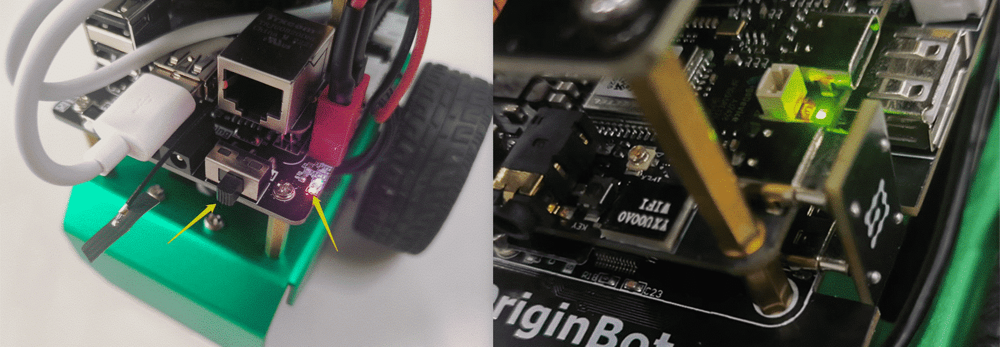

# **Get started quickly**

After completing the kit assembly and system flashing, you can prepare to start OriginBot.

<!-- <iframe
  src="//player.bilibili.com/player.html?aid=516658213&bvid=BV1eg411a7A9&cid=866084308&page=8&autoplay=0"
  scrolling="no"
  border="0"
  width="800px"
  height="460px"
  frameborder="no"
  framespacing="0"
  allowfullscreen="true"
>
</iframe> -->


## **Power on and start**

（1） Turn on the main power switch, the expansion board power indicator lights up, and the RDK X5 power indicator lights up.

{.img-fluid tag=1}

 After connecting the power adapter to the development board, the green power indicator light is on, indicating that the development board is powered normally, and the orange status indicator light is flashing after version 3.1.0, indicating that the system is running normally.

（2） Turn on the power switch of the robot controller, and the buzzer of the robot controller will sound for 0.5s.

（2）The lidar starts to rotate (if connected)

（3）Wait for 5~10s for the start to be successful


## **Remote connection**

1. Start the SSH software and log in to OriginBot remotely

???+ info
    If you are in an Ubuntu environment on the PC side, you can also use the following command in the terminal to implement ssh remote login (note to change the IP address to the actual address; if you are using a virtual machine, you need to set the network to **bridge mode**)：
    ssh root@192.168.31.246

  

{.img-fluid tag=1}


2. Enter the username and password: root（username），root（password）

3. Remote login is successful

{.img-fluid tag=1}

???+ warning
    OriginBot are running under the **root** user by default. Please use the root user for operation during subsequent development.You can switch to the root user by entering the command `su root` during subsequent development.

## **Example run**

Let's start with the example of running a robot remote control to familiarize ourselves with the basic operation of the robot.


After the SSH connection is successful, enter the following command to start the robot chassis drive:

```bash
ros2 launch originbot_bringup originbot.launch.py
```

???+ hint
    After successful startup, the buzzer of the robot controller can be heard for 0.5 seconds.

{.img-fluid tag=1}


Start another SSH remote terminal and run the following command to start the keyboard control node:

```bash
ros2 run teleop_twist_keyboard teleop_twist_keyboard
```

{.img-fluid tag=1}


According to the prompts in the terminal, you can control the movement of the robot forward, backward, left and right, or you can refer to the prompts to dynamically adjust the movement speed of the robot.

{.img-fluid tag=1}

???+ hint
    If the robot starts the automatic parking function, the robot will automatically stop after releasing the button for 0.5 seconds, and if the automatic parking function is turned off (default), the robot will not automatically stop after releasing the button, and must click "k" to control the parking.


## **Power off and shut down**

If you need to shut down the robot, you can enter the following command in the terminal to close the software system:

```bash
halt
```


After waiting for about 5 seconds, you can turn off the power switch on the robot controller, and the robot shutdown is completed.


???+ Attention
    Turning off the power switch directly can also turn off the power and shut down, but it is possible to damage the files that the software system is reading and writing, causing unexpected problems with the system.


At this point, we have preliminarily started OriginBot, and we can refer to “**Basic Use**” and “**Application Functions**” to continue in-depth development.


[](https://www.guyuehome.com/){:target="_blank"}

