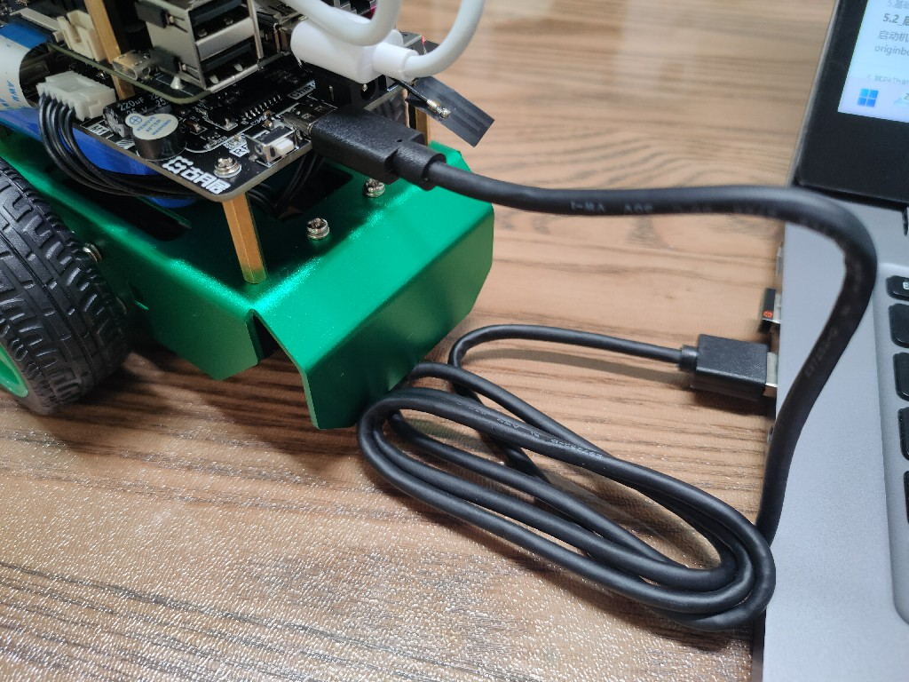
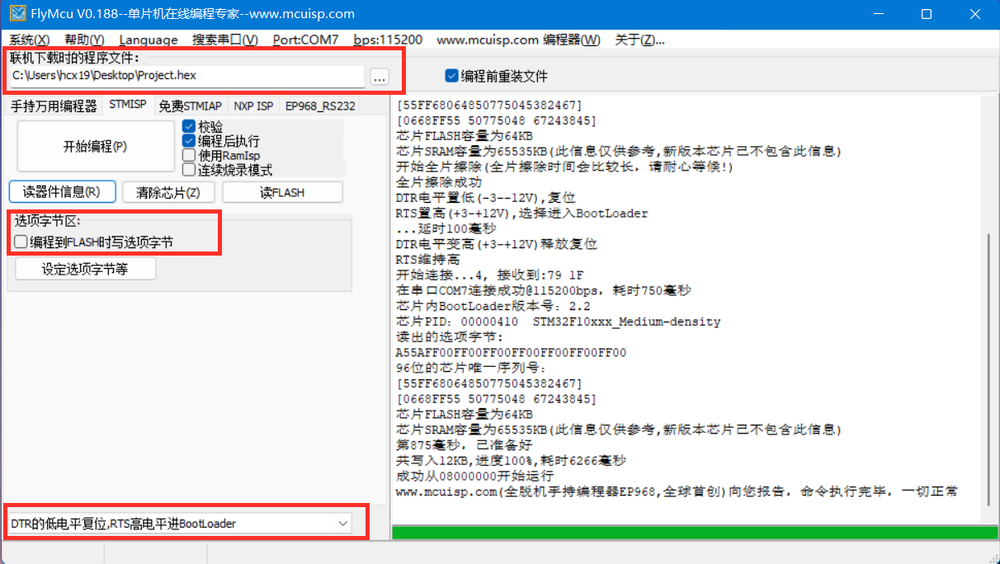
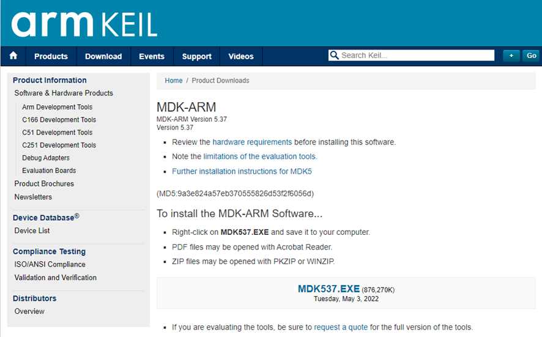
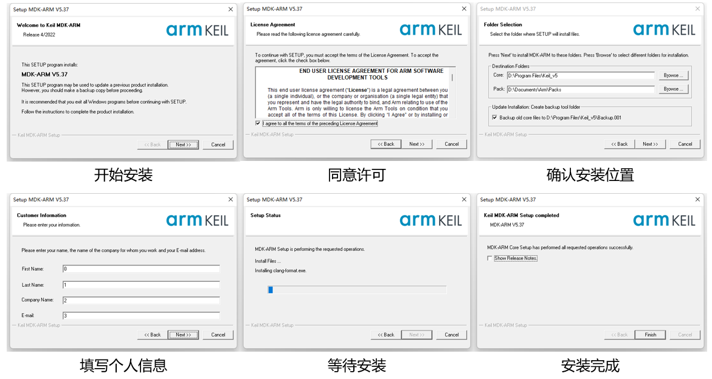
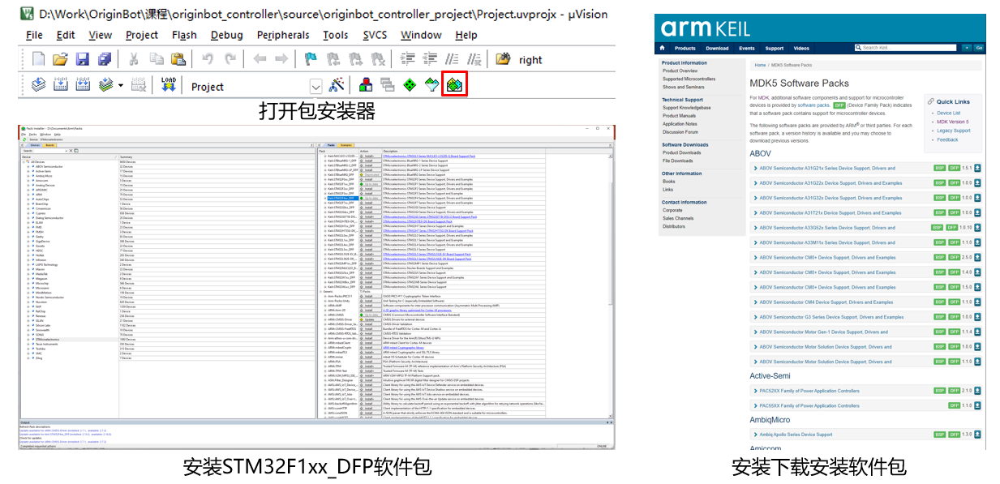
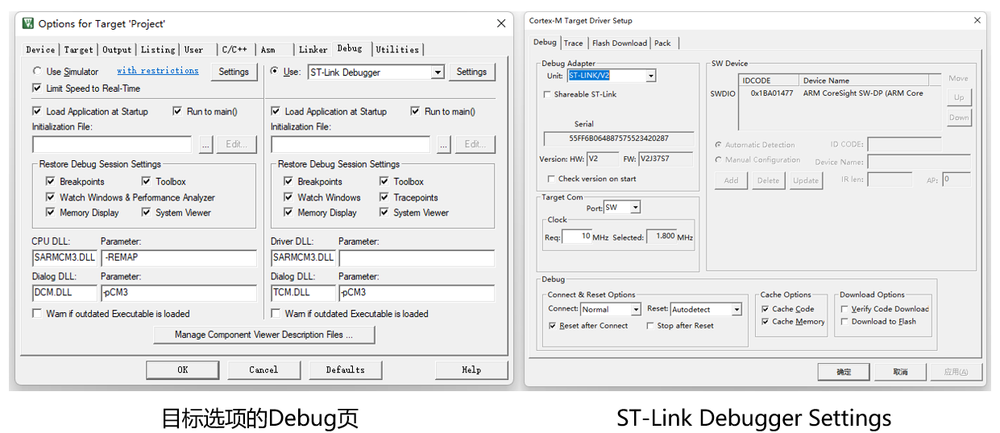
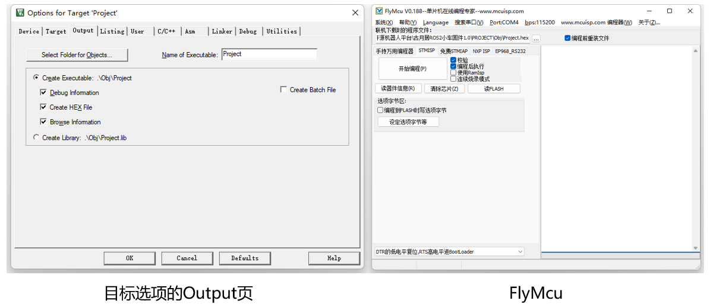

# **Controller firmware installation**

The OriginBot controller does not have firmware burned in the factory. You can install the firmware in one of the following two ways.

1. [**Directly burn the official pre-compiled firmware**](#download_controller_firmware)【Recommended】
2. [**Download the firmware through source code debugging**](#debug_controller_code)


## **<span id="download_controller_firmware">Burn the controller firmware</span >**

<!-- <iframe
  src="//player.bilibili.com/player.html?aid=516658213&bvid=BV1eg411a7A9&cid=865911983&page=7&autoplay=0"
  scrolling="no"
  border="0"
  width="800px"
  height="460px"
  frameborder="no"
  framespacing="0"
  allowfullscreen="true"
>
</iframe> -->

### **Download the official firmware**

Please select the following table to download the controller firmware suitable for your robot.


#### The latest version

| project                | version   | Release date  | Download link                                                     |
| ------------------- | ------ | --------- | ------------------------------------------------------------ |
| OriginBot controller firmware | v1.0.6 | 2024.9.23 | [originbot_controller_firmware_v1.0.6_5V.hex](https://drive.google.com/drive/folders/1gljgcJTUWTWHnm4A5TQ1s3KrYGyiLwfx?usp=drive_link){:target="_blank"} |

> If you need to download the image of the previous version, [ you can click here to jump to download](../material/open_source_link.md#sd){:target="_blank"}

### **Connect the burning cable**

（1）Disconnect the serial port communication connection between the controller and RDK X5


（2）The firmware is burned by the Type C cable connected later. To ensure normal burning, do not turn on the robot's main power switch.

（3） Use a Type-C cable to connect the "Burning" port of the expansion board to the computer (you can use the Type-C cable that comes with the radar)



???+ hint
    The Burning port will power the controller via USB. 


### **Download official firmware**

（1）Start the FlyMCU software on your computer（[click here to download](../material/common_software.md){:target="_blank"}）；

（2）Click Port and select the serial port for burning the firmware (select the serial port with the "CH340" number);

（3） In the FlyMCU software, select the firmware file to be burned, configure it according to the figure below, and click "Start Programming";
{.img-fluid tag=1 title="Download the official firmware"}

（4）Wait for the log on the right to prompt that programming is complete and the firmware download/update is complete;

（5）After the download is complete, restore the serial port communication connection between the controller and RDK X5.


## **<span id="debug_controller_code">Debugging and downloading the source code</span >**

The source code of the OriginBot controller firmware is completely open source, you can also download it from [the originbot_controller](https://github.com/guyuehome/originbot_controller){:target="_blank"},and then configure the development environment for online debugging or secondary development.

### **Install the Keil software**

Visit [the download page](https://www.keil.com/demo/eval/arm.htm){:target="_blank"} of Keil software and click to download the software:

{.img-fluid tag=2 title="Download the Keil software"}


After the download is complete, you can follow the steps below to complete the installation of the software:

{.img-fluid tag=2 title="Install the Keil software"}

### **Download the firmware source code**

Run the following command to download the source code of the OriginBot controller firmware:

```bash
git clone https://github.com/guyuehome/originbot_controller
```


### **Open the project and install the dependencies**

After starting the Keil software, choose to open the project, select the project file in the source code downloaded in the previous step, and then continue to install the necessary software packages:

{.img-fluid tag=2 title="Install the dependencies"}


### **Compiler configuration**

The OriginBot controller firmware needs to be compiled using the Keil V5 compiler. Some users who directly download Keil may need to download the v5 version compiler separately. Here is a reference link for users' reference:
[Stm32 configs the compiled version of keil5](https://j7h4nezmu0.feishu.cn/docx/UsbUdQdShoxhpLxFPTvceJsmnQb?from=from_copylink){:target="_blank"}


### **Debug the download**

If you use the debugger to debug online, you need to configure the following parameters:

{.img-fluid tag=2 title="Configure debugging options"}


If you want to compile and generate the HEX binary file and download it via USB, you need to configure the following configurations, and then compile it to appear the HEX file, which can be downloaded through the FlyMCU software:

{.img-fluid tag=2 title="Configuration output options"}

[](https://www.guyuehome.com/){:target="_blank"}

