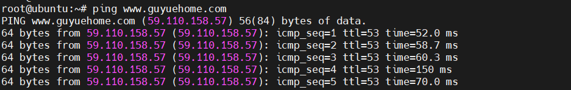
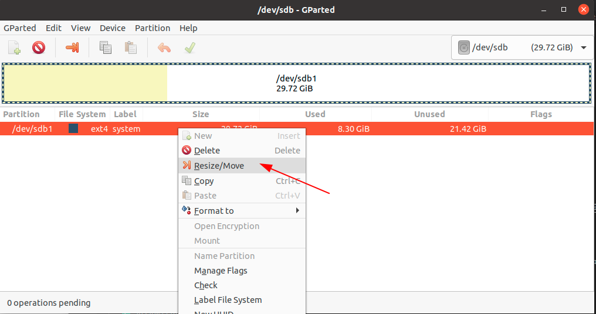
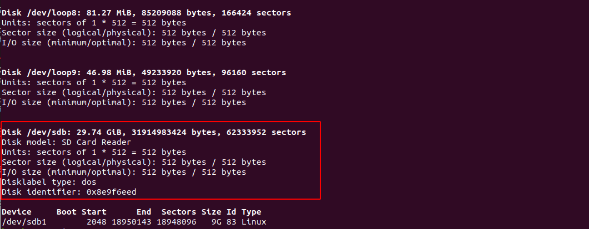
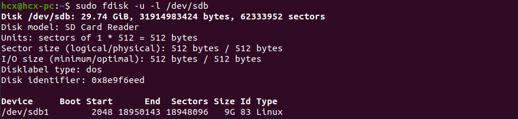
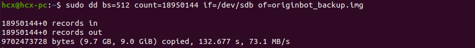

# **System image installation and backup**

OriginBot does not have a system installed when it leaves the factory. You can install it in the following ways:

- [**Burn OriginBot SD card image**](#download_sd_image)【Recommended】


If you want to back up the current system image during use, you can refer to the following instructions to back it up yourself. The image after backup can still be used for the above burning method.

- [**Back up the OriginBot SD card image**](#backup_sd_image)


------


## **<span id="download_sd_image">Burn the OriginBot SD card image</span >**


### **Download the OriginBot SD card image**

Please download the SD card image of the robot from the table below and extract the downloaded **file**.

| Version | Release date  | Download link | Software version included |
| ----------------------------------- | --------------------- | ------------------------------------------------------------ | ------------------------------------------------------------ |
| <br /><center>v3.0.1</center> | <br />2025.3.1| [<br />originbot_sd_image_v3.0.1](https://drive.google.com/drive/folders/1RaEA9IfGLUg54k5W0NqdY5vwYPDGEHww){:target="_blank"} | The new version of the system, all application functions and the source code<br />ros：humble<br />TogetheROS：2.3.2|

> If you need to download the image of the previous version, [you can click here to jump to download](../material/open_source_link.md#sd){:target="_blank"}


<!-- ### **Burn the SD card image**

<iframe
  src="//player.bilibili.com/player.html?aid=516658213&bvid=BV1eg411a7A9&cid=865880997&page=2&autoplay=0"
  scrolling="no"
  border="0"
  width="800px"
  height="460px"
  frameborder="no"
  framespacing="0"
  allowfullscreen="true"
>
</iframe> -->


（1） Use a card reader to insert the SD card into the computer. The recommended SD card capacity is ≥ 16GB.

（2）Start the image burning software please refer to [the common software](../material/common_software.md){:target="_blank"} download;

（3）Confirm the SD card device number and select the system image to be burned;


（4）After clicking "START", continue to click "OK" to start burning the image;


（5）The progress bar will display the current burning progress, and after the burning is completed, you can exit the software.

### **Start OriginBot**

(1) Confirm that the robot kit has been installed correctly and the corresponding version system has been successfully installed, then insert the SD card and start the power;


(2) Use the network cable in the kit to connect the robot to the network port of RDK X5;

???+ info
    The RDK X5 wired network uses a static IP configuration by default, and the initial IP address is 192.168.127.10.


(3) Connect the other end of the network cable to the network port on the PC. First, configure your computer properties. Take RDK X5 as an example:
{.img-fluid tag=1}
{.img-fluid tag=1}


(4)Start the MoboXterm software, click Session in the upper left corner, and then click SSH connection:
{.img-fluid tag=1}

(5) In the MoboXterm software, you can see a login prompt. Enter the username and password. Both the username and password are root:


### **Expand SD card space**

<!-- <iframe
  src="//player.bilibili.com/player.html?aid=516658213&bvid=BV1eg411a7A9&cid=865882863&page=4&autoplay=0"
  scrolling="no"
  border="0"
  width="800px"
  height="460px"
  frameborder="no"
  framespacing="0"
  allowfullscreen="true"
>
</iframe> -->


In order to reduce the size of the system image and facilitate downloading and burning, the free space in the system image has been compressed. If you need to use the full space of the SD card, you need to expand it manually.

After starting OriginBot and logging in via wireless connection, you can use the following command to expand:

```bash
sudo growpart /dev/mmcblk1 2
sudo resize2fs /dev/mmcblk1p2
```

{.img-fluid tag=1}

After the operation is successful, restart the system to take effect. Use the following command to confirm that the system space expansion is successful. The SD card used here is 32GB:

{.img-fluid tag=1}


### **CWireless WIFI connection introduction**

<!-- <iframe
  src="//player.bilibili.com/player.html?aid=516658213&bvid=BV1eg411a7A9&cid=865881701&page=5&autoplay=0"
  scrolling="no"
  border="0"
  width="800px"
  height="460px"
  frameborder="no"
  framespacing="0"
  allowfullscreen="true"
>
</iframe> -->

After completing the Ubuntu installation, start the system and refer to the following link to complete the wireless network configuration:

```bash
sudo nmcli device wifi rescan        # Scan wifi networks
sudo nmcli device wifi list          # List the Wi-Fi networks found
sudo wifi_connect "SSID" "PASSWD"    # Connect to a specified wifi network
```

{.img-fluid tag=1}

When the terminal returns the message "successfully activated", it means that the WIFI connection is successful. We can ping a website to check the connection. If it can be pinged, it means that the network has been successfully connected. Now you can successfully connect to the Internet, which is convenient for subsequent software downloads and updates.

{.img-fluid tag=1}


### **SSH telnet**

<!-- <iframe
  src="//player.bilibili.com/player.html?aid=516658213&bvid=BV1eg411a7A9&cid=865881692&page=6&autoplay=0"
  scrolling="no"
  border="0"
  width="800px"
  height="460px"
  frameborder="no"
  framespacing="0"
  allowfullscreen="true"
>
</iframe> -->

After the network configuration is completed, you will no longer be restricted by cables, and you can remotely log in to the robot through the wireless network to carry out development.

{.img-fluid tag=1}

???+ info
    Here, fill in the corresponding IP address according to whether you are using a wired network or a wireless network. The IP address can be queried using the ifconfig command. eth0 corresponds to the wired network card, and wlan0 corresponds to the wireless network card.


Enter the username and password: root/root, and you can log in successfully:

{.img-fluid tag=1}


???+ info
    - If you are in the Ubuntu environment on the PC side, you can also use the following command to implement ssh remote login in the terminal (note to change the IP address to the actual address):
        ssh root@192.168.31.246
    
    - If you're using a virtual machine, set the network to **bridging mode**
    
    

## **<span id="backup_sd_image">Back up the OriginBot SD card image</span >**

The following backup process is done on the Ubuntu system on the computer.


### **Compress disk space**

In order to reduce the image size, we first use gparted software to compress the disk space of the SD card. Insert the SD card into the running computer, install and launch the gparted software:

```bash
sudo apt-get install gparted
sudo gparted
```


In the open gparted software, select the SD card in the upper right corner:
{.img-fluid tag=1}


Then right-click and select Mount Unmount SD Card:
{.img-fluid tag=1}


Go ahead and right-click, select the "Resize/Moves" option to reset the space on your SD card:
{.img-fluid tag=1}


Drag the right side of the space partition bar, compress the space, where yellow is the occupied partition, white is the free partition, pay attention to keep a little white free partition to avoid the image cannot be started.
{.img-fluid tag=1}


After confirmation, click the execute button in the software to start the compression operation.
{.img-fluid tag=1}


Once the compression is complete, you can close the gparted software.


### **View disk information**

Open the terminal and run the fdisk command to view the current disk status.

```bash
sudo fdisk -u -l
```
{.img-fluid tag=1}


In the figure, /dev/sdb is the disk number of the SD card, run the following command to view the partition information of the SD card:

```bash
sudo fdisk -u -l /dev/sdb
```
{.img-fluid tag=1}


### **Start the backup-to-disk**

Now you can use the dd command to back up your SD card to an img file.

```bash
sudo dd bs=512 count=[fdisk command maximum end number + 1] if=/dev/sdb of=originbot_backup.img
```
{.img-fluid tag=1}


At this time, there is no message in the terminal, but the backup has started and it will take a long time, so please wait patiently.


After the backup is completed, the terminal command will automatically pop up, and the img image backup file will be obtained in the current path.
{.img-fluid tag=1}


The generated IMG image file is large, and if necessary, you can continue to use zip and other tools for compression and decompression.


At this point, the SD card image has been backed up, and when you need to use it, you can refer to [**Burn the OriginBot SD card image**](#download_sd_image).


[](https://www.guyuehome.com/){:target="_blank"}