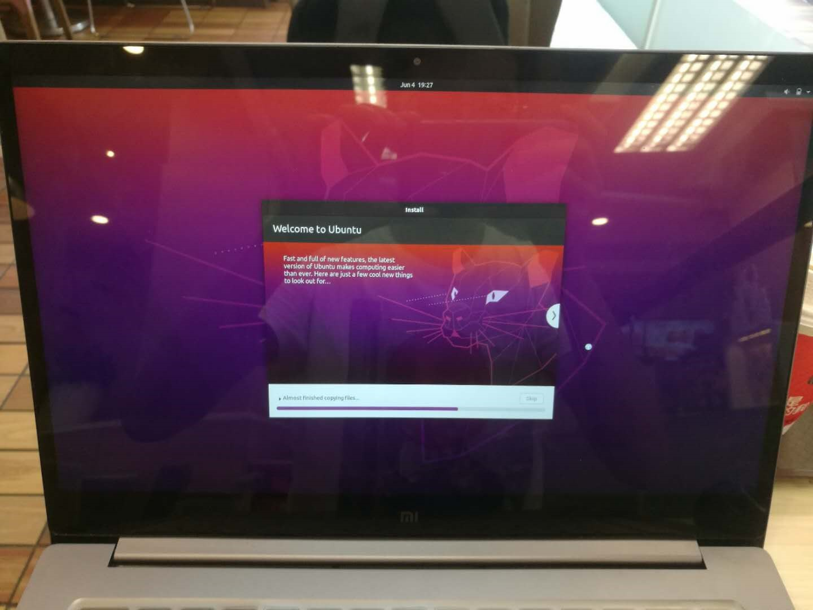

# **PC Environment Configuration**


## **<span id="ubuntu_install">Ubuntu system installation</span>**

### **Method 1: Install Ubuntu on a virtual machine**

A virtual machine is a piece of software that can build a virtual system on top of an existing system, allowing multiple operating environments to run at the same time.


The virtual machine software we use here is called VMware, the download address is as follows, the installation steps are the same as other software, please download and install by yourself:

[Click to download the vmware virtual machine](https://www.vmware.com/products/workstation-pro/workstation-pro-evaluation.html ){:target="_blank"} 


After the preparation is completed, you can start the system installation, and the installation steps are as follows:

#### (1)  Download the system image

[Click to download the Ubutnu system image](https://ubuntu.com/download/desktop ){:target="_blank"} 


???+ attention
    Ubuntu22.04 is recommended to be selected here, the different version choices determine the next ROS2 version installation,  Ubuntu 22.04 is recommended to install ROS2 Humble.


#### (2) Create the system in a virtual machine


#### (3) Set the size of the virtual machine's hard disk


???+ attention
    The size of the hard disk here can be slightly larger, and it is recommended that it should not be less than 60G to avoid insufficient disk space in the future.


#### (4) Set the Ubuntu image path


#### (5) Start the virtual machine


#### (6) Set a username and password


#### (7) Wait for the system to be installed


#### (8) Complete the installation


After the Ubuntu system in the virtual machine is installed, you can feel free to use it to familiarize yourself with it.


### **Method 2: Ubuntu dual system installation**

???+ attention
    Dual-system installation has certain risks, which may cause the computer to fail to boot, so it is recommended for experienced developers. The following installation steps use the following computer configuration, you can also refer to the information on the Internet to operate:
    

     - Notebook model: Xiaomi 15.6 Pro
    
     - Computer configuration: two hard disks, one with Windows, the other with two Ubuntu systems, startup items set on Ubuntu hard disks, which will be more stable, and will not cause windows to crash because of tinkering with Ubuntu.


#### (1) Download the system image
[Click to download the Ubutnu system image](https://ubuntu.com/download/desktop ){:target="_blank"}


#### (2) Create a USB installation image
Next, make a USB flash drive into a boot disk, as long as it is larger than 4G.

You can use the tools that come with Ubuntu, or the boot disk maker such as UltraISO, after starting the software, select the ISO image path and the location of the USB flash drive, click start, and the production will be completed in about 10 minutes.


#### (3) Hard disk installation
Hard disk installation is a key step, be sure to choose the location of partitions and startup items, otherwise the computer may become bricked after installation.

After inserting the made startup U disk, the boot starts from the U disk, press F12 on this computer, and it will soon enter the boot disk, and follow the instructions in the first few steps.


The key setting is in the partition step, because the computer has multiple systems, it cannot be installed automatically, and it may overwrite the startup items of the original system, select "something else" to set up the partition yourself.


Here we only divide it into two partitions, "/" and "swap", so that all files share the same space size, which is very flexible.


After the partition is set, you also need to pay attention to the location of the bootlodaer, here you choose the hard disk where Ubuntu is located, to avoid conflicts with Windows.


After the setup is completed, it can be installed, and all the installation will be completed in 10 minutes.




#### (4) Start the new system
Restart the computer and see the grub interface smoothly.


Choosing Ubuntu, the first boot was a little slow.


At this point, the installation of Ubuntu dual system is complete.


## **<span id="ros2_install">ROS2 system installation</span>**

Next, we can install ROS2 on Ubuntu. The installation steps are as follows:


### (1) Set the code

```bash
sudo apt update && sudo apt install locales
sudo locale-gen en_US en_US.UTF-8
sudo update-locale LC_ALL=en_US.UTF-8 LANG=en_US.UTF-8 
export LANG=en_US.UTF-8
```


### (2) Add a source

```bash
sudo apt update && sudo apt install curl gnupg lsb-release 
sudo curl -sSL https://raw.githubusercontent.com/ros/rosdistro/master/ros.key -o /usr/share/keyrings/ros-archive-keyring.gpg 
echo "deb [arch=$(dpkg --print-architecture) signed-by=/usr/share/keyrings/ros-archive-keyring.gpg] http://packages.ros.org/ros2/ubuntu $(source /etc/os-release && echo $UBUNTU_CODENAME) main" | sudo tee /etc/apt/sources.list.d/ros2.list > /dev/null
```


### (3)  Install ROS2

```bash
sudo apt update
sudo apt upgrade
sudo apt install ros-humble-desktop
```

### (4) Set environment variables

```bash
source /opt/ros/humble/setup.bash
echo " source /opt/ros/humble/setup.bash" >> ~/.bashrc 
```

   

### (5) ROS2 sample test

In order to verify that the ROS2 installation is successful, we can test it with the following example.


#### **Command-line operations**

First, let's try whether DDS, the most important underlying communication system of ROS2, is normal.


Start the first terminal ,and start a publisher node of data with the following command:

```bash
ros2 run demo_nodes_cpp talker
```


Start the second terminal ,and start a subscriber node with the following command:

```bash
ros2 run demo_nodes_py listener
```


If the "Hello World" string is transmitted normally between the two terminals, there is no problem with the communication system.


#### **Baby turtle simulation**

Let's try another classic example in ROS - the Little Turtle Emulator.


Start the two terminals and run the following commands:

```bash
ros2 run turtlesim turtlesim_node
ros2 run turtlesim turtle_teleop_key
```


The first command will start a turtle simulator with a blue background, and the second command will start a keyboard control node, and you can control the movement of the baby turtle by clicking the "up, down, left, right" buttons on the keyboard in the terminal.


We will continue to explore the mystery of ROS in baby turtles in the following tutorials.


So far, the ROS2 installation has been successful.


## **<span id="package_install">Download/compile the PC feature pack</span>**

OriginBot is mainly used and developed on PC. After completing the above Ubuntu and ROS2 environment configurations, you also need to download the PC function package of OriginBot to the computer and complete the compilation for subsequent operations.


###  **(1) Create a PC workspace**

Run the following command to create a workspace on your computer:

```bash
mkdir -p ~/dev_ws/src
```


### **(2) Download originbot_desktop and dependency packages**

The feature packages of OriginBot on the PC are placed in the originbot_desktop code repository:

```bash
cd ~/dev_ws/src
git clone https://github.com/yzhcat/originbot_desktop.git 
```


### **(3) Install feature packages and dependencies**

In order to meet the needs of subsequent robot development, a series of function packages and dependency libraries need to be installed:

```bash
sudo apt install python3-colcon-ros
sudo apt install python3-colcon-common-extensions              # The ROS2 compiler
sudo apt install git                                           # Install git tool
sudo apt install ros-${ROS_DISTRO}-nav2*                       # Install the navigation package
sudo apt install ros-${ROS_DISTRO}-xacro                       # Install the model parsing function
sudo apt install ros-${ROS_DISTRO}-teleop-twist-keyboard       # Install a keyboard controller node
sudo apt install ros-${ROS_DISTRO}-rmw-cyclonedds-cpp          # Install Cyclone DDS
sudo apt install ros-${ROS_DISTRO}-cv-bridge                   # Install the image processing package
sudo apt install ros-${ROS_DISTRO}-robot-state-publisher       # Install the robot status Publisher package
sudo apt install ros-${ROS_DISTRO}-joint-state-publisher       # Install the joint status publisher package
sudo apt install ros-${ROS_DISTRO}-joint-state-publisher-gui   # Install the joint status publisher package
sudo apt install ros-${ROS_DISTRO}-image-transport             # Install the image compression package
sudo apt install ros-${ROS_DISTRO}-image-transport-plugins     # Install the image compression package
```

???+ attention
    In addition to sequential downloads, you can also download all dependent libraries with a single command:
    ```bash
    cd ~/dev_ws
    rosdep install --from-paths src --ignore-src -r -y
    ```
    or
    ```bash
    cd ~/dev_ws/src/originbot_desktop/
    ./install_prereq.sh
    ```


### **(4) Compile the workspace**

Go back to the root directory of the workspace and compile the entire workspace:

```bash
cd ~/dev_ws
colcon build
```


### **(5) Set environment variables**

For subsequent use, we need to configure environment variables to let the system know where the workspace is located:

```bash
gedit ~/.bashrc
```


At the end of the script, add:

```bash
source ~/dev_ws/install/setup.sh
```


At this point, the function package of OriginBot on the computer has been configured.

[](https://www.guyuehome.com/){:target="_blank"}

