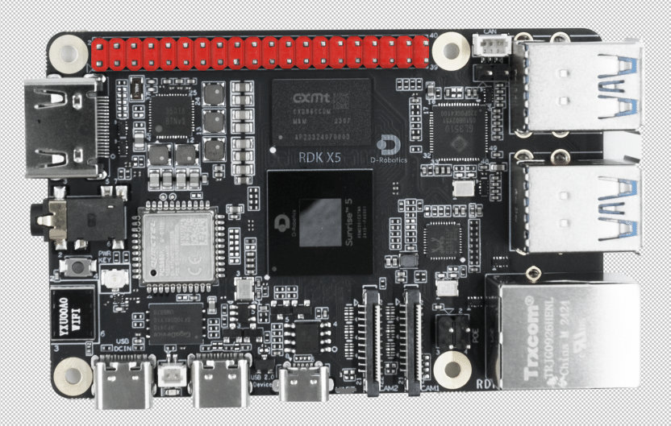

# **OriginBot Intelligent Robot Open-Source Kit**

> **Notice to Users**: This English document is intended for users outside of China. Overseas users can refer to this document to use OriginBot. If you have any questions, please join the [Discord](https://discord.gg/nd5aqYNp) community group (see the product QR code).

  <a href="#originbot_1" class="md-button">Learn About OriginBot</a>
  <a href="./guide/quick_guide/" class="md-button md-button--primary">Explore OriginBot Now!</a>

## **OriginBot**

OriginBot is an open-source kit for intelligent robots and a community-driven project designed to let every participant enjoy the process of robot development.

### **Open-Source Collaboration**

"Open source is power"—this is the core spirit of OriginBot, and we welcome every developer to participate.

**▶ Open-Source Ecosystem**

What you gain is more than what you see, and what you see is open source. From structure to electronics, from drivers to applications, OriginBot's compact design houses a vast open-source ecosystem. Every developer is welcome to learn from it and contribute to its growth.

**
Continuous Iteration ◀
**

Why stop? Progress is infinite. Each step forward brings joy. With strong community support, OriginBot and its developers continuously advance. Both software and hardware are iteratively improved, ensuring growth with every version update.

### **Full-Stack Development**

The journey of intelligent robot development is challenging, and OriginBot is here to support every developer along the way.

**▶ Comprehensive Tech Stack**

The OriginBot project spans multiple fields, including structural design, electronics, embedded systems, ROS, and artificial intelligence. Whatever your research focus, you can find your niche here, quickly grasp the complete robot design process, and master core development techniques.

### **Smart Applications**

OriginBot features a simple structure but supports complex applications, enabling limitless possibilities.

**▶ High-Performance Computing**

OriginBot comes equipped with the Sweet Potato Robot Development Board - RDK X5, offering robust computational power. It supports various use cases such as CV acceleration, human tracking, gesture recognition, and visual line following, allowing you to experience the fun of AI and create truly "intelligent" robots.

**
Rich Applications ◀
**

OriginBot uses ROS2 and TogetheROS™.Bot (a deeply optimized ROS open-source robot operating system by D-Robotics) as its software foundation. It is compatible with many ROS ecosystem applications and is ready to use out of the box. It supports original applications and enables quick development of features like SLAM, navigation, visual processing, and machine learning.

### **Born from Passion**

Every robot developer dreams of "building a robot from scratch," and OriginBot was created to fulfill this passion.

**▶ Unique Identity**

Each OriginBot is unique. The kit includes a license plate with a unique serial number, starting from "0000." When you attach the license plate to your robot, you become its owner. Endless possibilities await exploration.

**
Start Development ◀
**

OriginBot aims to awaken every developer's original dream and help them find a development path that suits them. The journey ahead is long, but together, we will set sail now!
 
 
 
<a href="guide/quick_guide/" class="md-button">Start Developing with Qihang Robot</a>

## **Configuration Parameters**

| Main Configuration Items | OriginBot                                      |                                                                                                                                      |
| ------------------------- | ----------------------------------------------------------------------------------------------------------------------------------------- |:----------------------------------------------------------------------------------------------------------------------------------------- |
| Renderings               | {.img-fluid tag=1 title="OriginBot Navigation Version"}                                        |                                        |
| Application Processor    | **RDK X5** CPU: Octa-core ARM Cortex-A55@1.5GHz BPU: 32Gflops, equivalent computing power 10TOPS Memory: 8GB LPDDR4 RAM Storage: 32GB (TF Card) | 
| Motion Controller        | MCU: STM32F103 Flash Capacity: 64K RAM Capacity: 20KB                                                                                                                                   |
| Differential Chassis     | TT motor with encoder 2 * 2 Camera bracket Universal wheel and bracket                                                                                                       | 
| Camera                   | 720P USB Camera                                                                                                                             | 
| LiDAR (TOF)              | 6Hz scanning frequency, 360° scanning angle 3000Hz ranging frequency                                                                         | 
| Gesture Sensor           | Acceleration, gyroscope, and angular output Built-in Kalman filter                                                                                   |
| Size                     | Length: 180 mm Width: 132 mm Height: 154 mm (±2)                                                                       | 
| Weight                   | 0.78 kg (±0.05)                                                                                                 | 
| Max Speed                | 0.8 m/s (±0.05)                                                                                                                            | 
| Operating Software       | Ubuntu 22.04 (Server) ROS2 Humble TogetheROS 3.0.0                                                                                | 
| Other Accessories        | Uniquely numbered license plate stickers LiDAR stickers Screws, copper pillars, cables, card reader installation tools, etc.                                                                    |
| Power Supply              | 5V/3A USB Type-A  [**power bank**](../material/open_source_link.md#power-bank)                                                                                                                            |

## **Contribute**

We warmly invite all developers to participate in the OriginBot project. There are many ways to contribute:

### **Provide Feedback**

- If you have any questions or suggestions while using the OriginBot kit, please ask and discuss in the [Guyuehome Community Forum](https://www.guyuehome.com/interlocution?id=1826932316801544194){:target="_blank"}.

- If you encounter any bugs while using OriginBot, please submit an issue in the [code repository](https://github.com/yzhcat/originbot){:target="_blank"}.

### **Contribute Code**

- If you have any optimizations, additions, or other modifications to the native code while using the OriginBot kit, feel free to submit a pull request in the [code repository](https://github.com/yzhcat/originbot){:target="_blank"}.

### **Open-Source Sharing**

- If you are interested in OriginBot, please star the project's source code repository or share it with developers who might benefit from it.

- If you develop interesting features or robots based on the OriginBot open-source project, please share them with us in the [Community Section](https://www.guyuehome.com/interlocution?id=1826932316801544194){:target="_blank"}. We will promote outstanding projects within the community.

## **Link Summary**

- Community Main Site: [https://www.originbot.org](https://www.originbot.org/){:target="_blank"}

- Open-Source Repositories:
  
  | Name                   | Link                                                                                                                     | Description                |
  | ---------------------- | ---------------------------------------------------------------------------------------------------------------------- | -------------------------- |
  | originbot             | [https://github.com/yzhcat/originbot](https://github.com/yzhcat/originbot){:target="_blank"}                       | Repository for OriginBot's functional package |
  | originbot_desktop     | [https://github.com/yzhcat/originbot_desktop](https://github.com/yzhcat/originbot_desktop){:target="_blank"}       | Repository for OriginBot's desktop application |
  | originbot_controller  | [https://github.com/yzhcat/originbot_controller](https://github.com/yzhcat/originbot_controller){:target="_blank"} | Repository for OriginBot's controller source code |

- Forum Exchange: [https://www.guyuehome.com/interlocution?id=1826932316801544194](https://www.guyuehome.com/interlocution?id=1826932316801544194){:target="_blank"}

- D-Robotics Developer Community: [https://developer.d-robotics.cc/en](https://developer.d-robotics.cc/en){:target="_blank"}

{:target="_blank"}
