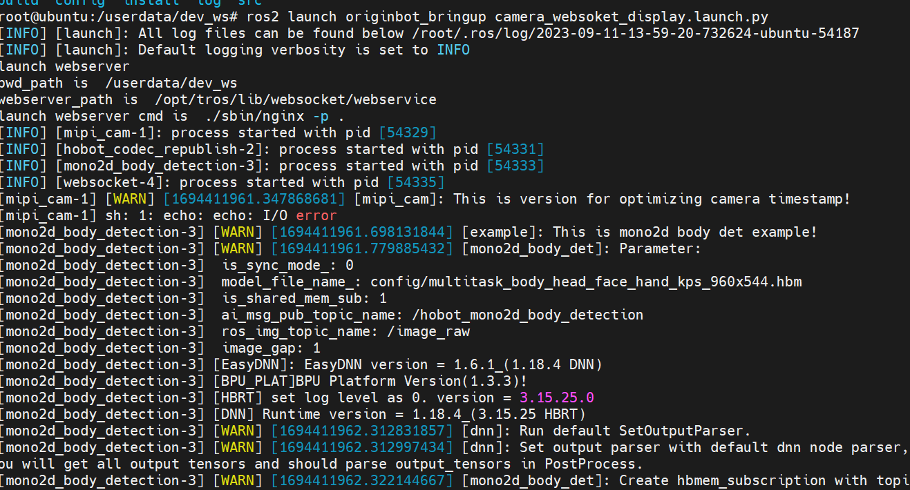
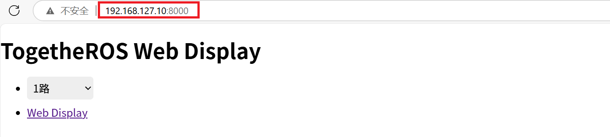
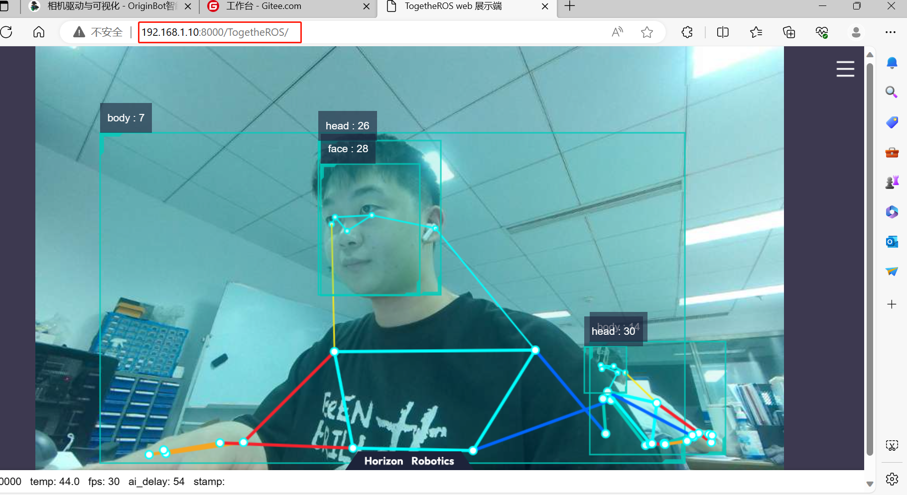
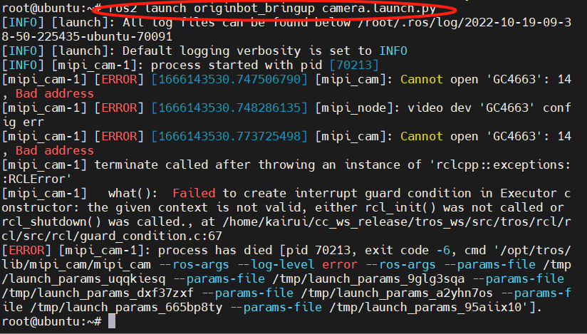
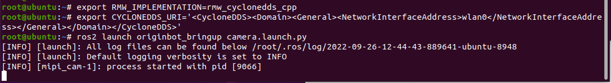
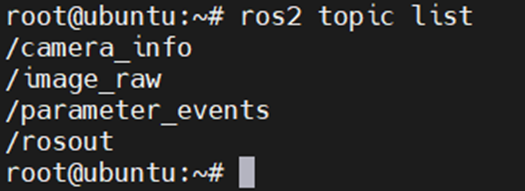
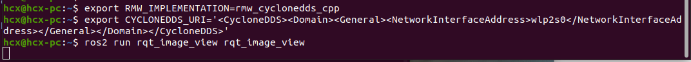
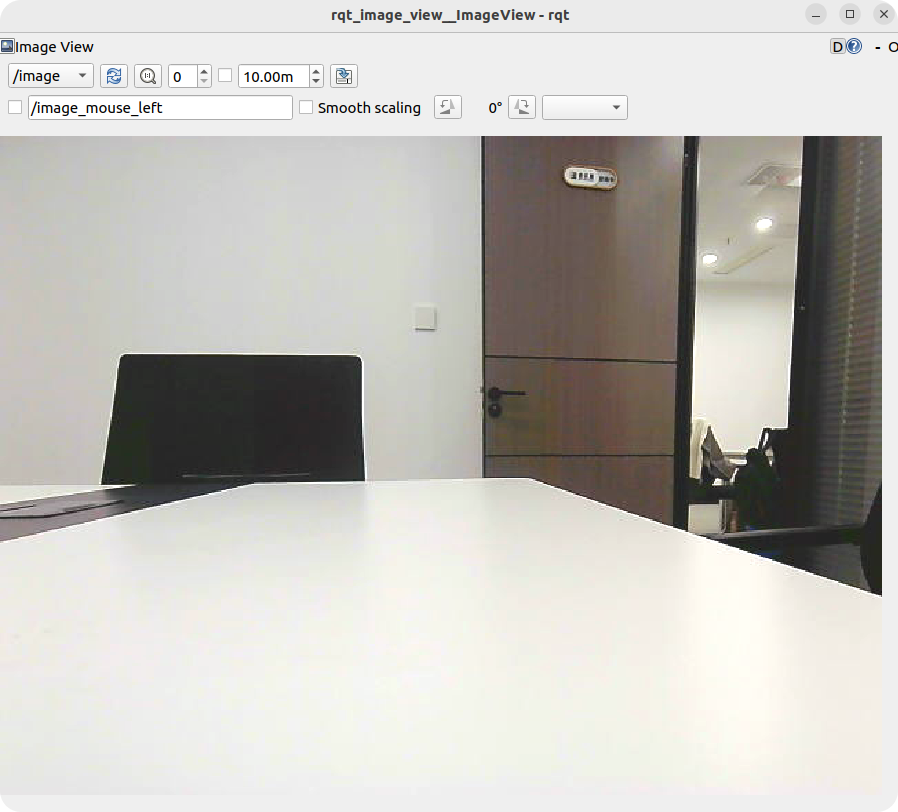
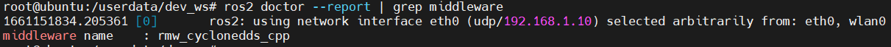
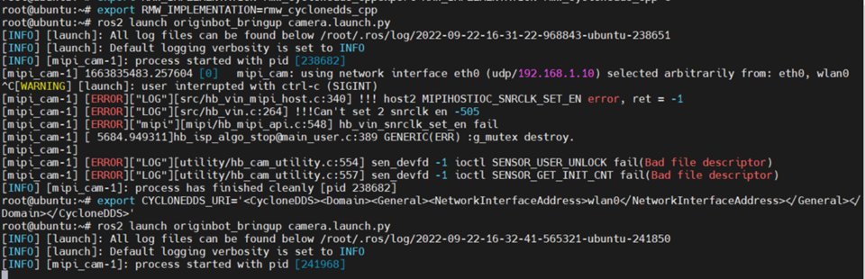

# **Camera driver and image visualization**

???+ hint
    Operating environment and software/hardware configuration are as follows:
    

     - OriginBot Pro
     - PC：Ubuntu (≥22.04) + ROS2 (≥humble)


<!-- <iframe
  src="//player.bilibili.com/player.html?aid=516658213&bvid=BV1eg411a7A9&cid=866105646&page=12&autoplay=0"
  scrolling="no"
  border="0"
  width="800px"
  height="460px"
  frameborder="no"
  framespacing="0"
  allowfullscreen="true"
>
</iframe> -->


## **Camera Driver Routine**

The camera driver is already built into the OriginBot system image. To make sure the camera is connected correctly and recognized by the system, let's first run the system's built-in camera routine.


### **Launching the Camera Routine**

After successfully connecting to OriginBot through SSH, enter the following command in the terminal:

``` bash
cd /userdata/dev_ws
ros2 launch originbot_bringup camera_websoket_display.launch.py
```
{.img-fluid tag=1 title="Launching the Camera Routine"}
    


### **Check the effect of the routine on the host computer**

After successful operation, open the browser on the PC in the same network, enter http://IP:8000, select "web display terminal", and you can view the image and algorithm effects. IP is the IP address of OriginBot.

{.img-fluid tag=1 title="Check the effect of the routine on the host computer"}

If the camera is driven smoothly, we can not only see the real-time image, but also an example of human skeleton point recognition, which shows that the camera is operating normally.

{.img-fluid tag=1 title="Visualization Effect of Camera Routine"}


### **Closing routines**

After the routine is finished running, please use Ctrl+C to close the launch file running in the terminal to release the camera hardware resources for subsequent routines. Otherwise, the camera device may not be found:

{.img-fluid tag=1 title="Previous routine did not release camera hardware resources"}
## **ROS Image Transfer**

After confirming that the previous camera routine has been closed, you can then test the image subscription and publishing in the ROS2 environment.


### **Start the ROS camera driver**

After successfully connecting to OriginBot through SSH, enter the following command in the terminal:

```bash
export RMW_IMPLEMENTATION=rmw_cyclonedds_cpp
export CYCLONEDDS_URI='<CycloneDDS><Domain><General><NetworkInterfaceAddress>wlan0</NetworkInterfaceAddress></General></Domain></CycloneDDS>'
ros2 launch originbot_bringup camera.launch.py
```

{.img-fluid tag=2 title="Configuring cyclonedds"}


???+ info
     In order to ensure the real-time quality of the image, we will switch the DDS to cyclonedds to avoid image delays caused by DDS slicing. By default, cyclonedds will bind a certain network card for data transmission. Here, we use the second command to specify the wireless network card wlan0 as the binding network card. You can switch according to the actual situation. For more information, you can also refer to [DDS Configuration](#DDS Configuration).


### **View Camera Topics**

After successful running, you can use the following command on the robot or PC in the same network to confirm that the image topic has been published normally.

```bash
ros2 topic list
```



### **View Visualization**

On the PC side in the same network, also configure the DDS to be used, and then use the rqt_image_view tool to see the real-time camera image of the robot.
```bash
export RMW_IMPLEMENTATION=rmw_cyclonedds_cpp
export CYCLONEDDS_URI='<CycloneDDS><Domain><General><NetworkInterfaceAddress>wlp2s0</NetworkInterfaceAddress></General></Domain></CycloneDDS>'
ros2 run rqt_image_view rqt_image_view
```

{.img-fluid tag=3 title="Configuring cyclonedds"}

???+ info
    Here, we use the second command to specify the wireless network interface wlp2s0 as the binding interface.The name is related to the computer system, and you can use ifconfig to check it. You can switch it according to your actual situation. For more information, please refer to [DDS Configuration](#DDS Configuration). 

{.img-fluid tag=3 title="Visualized Images"}


## <span id="DDS Configuration">**Appendix: DDS Configuration**</span >

ROS2 Foxy uses fastdds by default, which can be limiting in image transmission scenarios. In such cases, we can switch to cyclonedds.


### **Installing DDS**

cyclonedds is already configured in the OriginBot image. If you want to configure it on your computer, you can use the following command to install it:

```bash
sudo apt install ros-${ROS_DISTRO}-rmw-cyclonedds-cpp
```


### **Switching DDS**

In the terminal where you are running the commands, use the following command to set the DDS:

```bash
export RMW_IMPLEMENTATION=rmw_cyclonedds_cpp
```


By default, CycloneDDS will bind to a specific network interface for data transmission. If you need to switch the bound network interface, you can enter the following command in the same terminal:

```bash
export CYCLONEDDS_URI='<CycloneDDS><Domain><General><NetworkInterfaceAddress>wlan0</NetworkInterfaceAddress></General></Domain></CycloneDDS>'
```

???+ hint
    The middle parameter is the name of the bound network card. Modify it as needed to eth0、wlan0，or the actual network card device number. Reference link: http://www.robotandchisel.com/2020/08/12/cyclonedds/


Use the following command to check whether the DDS used by the current terminal has been successfully switched:

```bash
ros2 doctor --report | grep middleware
```

{.img-fluid tag=4 title="Checking dds"}


After confirming that the switch is successful, you can run the node that publishes data in the current terminal, such as the camera publisher node:

```bash
ros2 launch originbot_bringup camera.launch.py
```


In the running terminal, you can see the network card that fastdds is currently bound to and publishes data to.

{.img-fluid tag=4 title="Running Data Communication Node"}


[](https://www.guyuehome.com/){:target="_blank"}