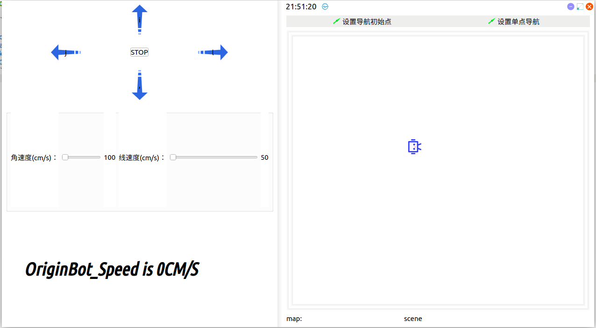
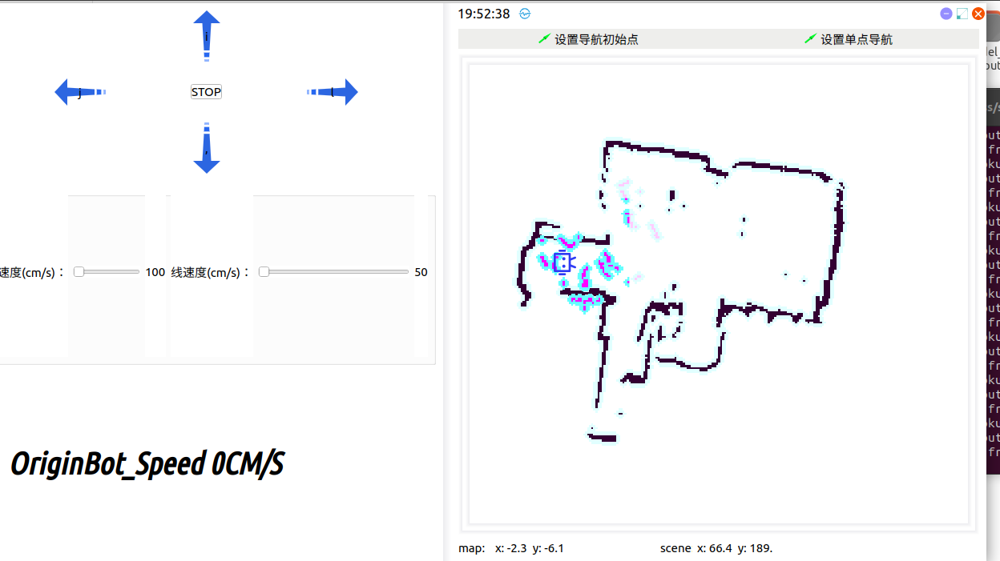
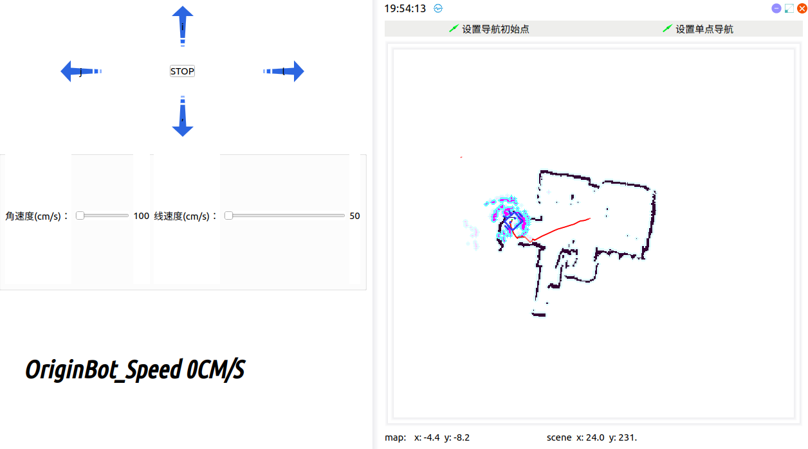

# **Upper computer control instructions**

???+ hint


	The operating environment and software and hardware configurations are as follows:
	
	 - OriginBot Pro
	 - PC：Ubuntu (≥22.04) + ROS2 (≥humble)


## **Application Description**

 In the development of robot interfaces, QT design is also a non-negligible part. How to connect QT interface development with ROS2 and OriginBot? In this example, I hope to give you an example through a brief development. I hope that you will gradually improve it in the subsequent development and deploy it in your own projects.


## **Run method**

  This time the function package, we put it in the originbot_desktop/originbot_app, so how to use it, in the originbot_desktop directory on the PC side, run the following command:

```
ros2 run originbot_app originbot_app
```

After the operation is run, you can see that the following interface appears:

{.img-fluid tag=2}


## **Implement functionality**

What does this QT do? On the left, there are the front, back, left and right button control keys, when the chassis is started, you can control the movement of the OriginBot through the buttons and the angular velocity and linear speed controls below. On the right is a simplified Rviz interface.In this interface, you can realize the function of mapping and navigation.

You can directly run the navigation and mapping programs, and the interface in RVIZ will be displayed in this QT.

### **Navigation examples**

Start the chassis:

```
source /opt/ros/foxy/setup.bash
ros2 launch originbot_bringup originbot.launch.py use_lidar:=true
```

Launch the QT interface:

```
ros2 run originbot_app originbot_app
```

Startup Navigation:

```
 source /opt/ros/foxy/setup.bash
ros2 launch originbot_navigation nav_bringup.launch.py
```

After running, you can see the following interface:



Click Set up single navigation.



The machine also plans the path and moves.

[](https://www.guyuehome.com/){:target="_blank"}