# **Set up a development environment**

OriginBot supports ssh remote login for development, if you are not used to remote command line development, you can also build a visual development environment on the PC side, here we introduce how to use VSCode for remote development.

???+ hint
    The operating environment and software and hardware configurations are as follows:
    

     - OriginBot Bot
     - PC：Ubuntu(≥22.04) + ROS2(≥humble) + VSCode

<!-- <iframe
  src="//player.bilibili.com/player.html?aid=516658213&bvid=BV1eg411a7A9&cid=866084309&page=9&autoplay=0"
  scrolling="no"
  border="0"
  width="800px"
  height="460px"
  frameborder="no"
  framespacing="0"
  allowfullscreen="true"
>
</iframe> -->

## **Install VSCode**

VSCode officially provides installation packages under a variety of operating systems, you can choose to download according to the operating system you use.

[Download link for VSCode](https://code.visualstudio.com/Download){:target="_blank"}

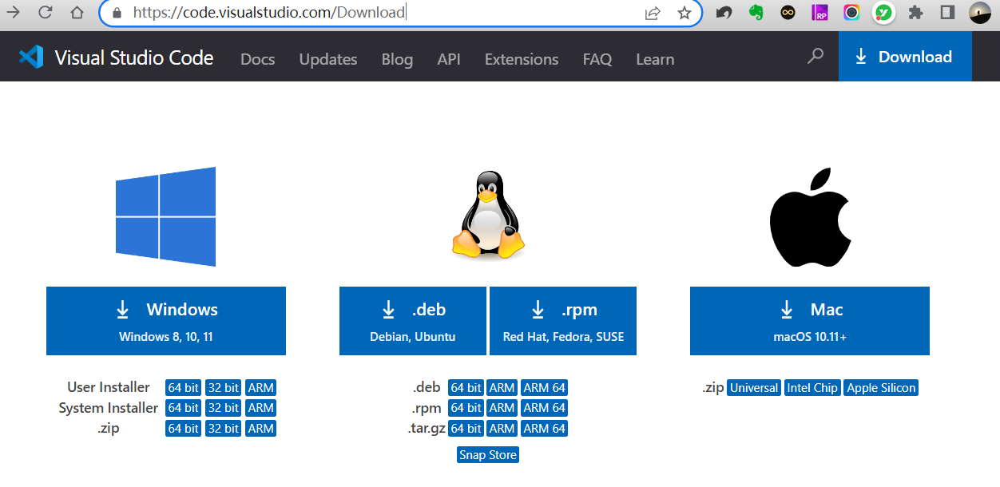{.img-fluid tag=1 title="Download page for VSCode"}

After the download is complete, double-click the installation package and follow the steps prompted to complete the installation.

???+ hint
    If you are running in Ubuntu, download the .deb installation package, and run the following command to install it:

    sudo dpkg -i filename .deb

## **Install the SSH plugin**

Open the installed VSCode, select the "Extensions" extension on the right, type "ssh" in the search bar to search, find the "Remote - SSH" plugin, and click Install.

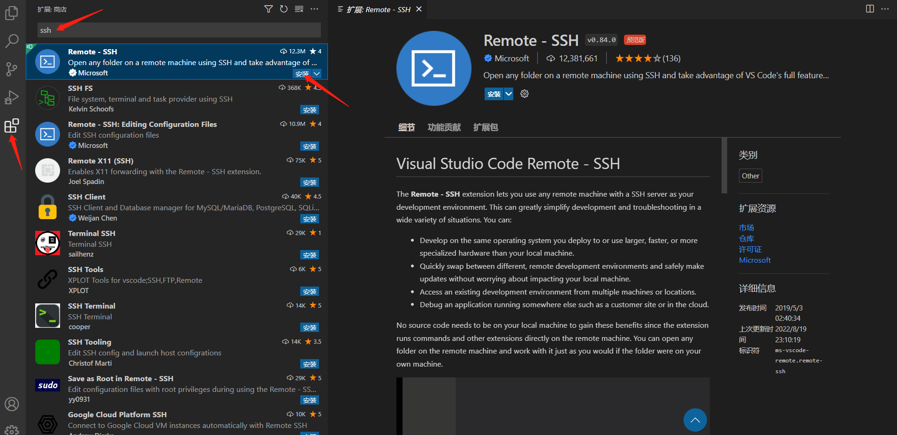{.img-fluid tag=2 title="Install the SSH plugin"}

Once installed, a "Remote Explorer" will appear on the left side of VSCode.

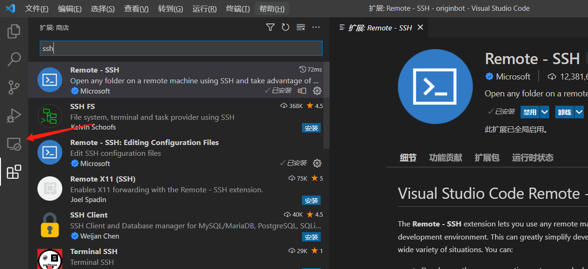{.img-fluid tag=2 title="Install the SSH plugin"}

## **Configure a remote connection**

Click on the new "Remote Explorer" on the left side of VSCode and click on the "+" Add button.

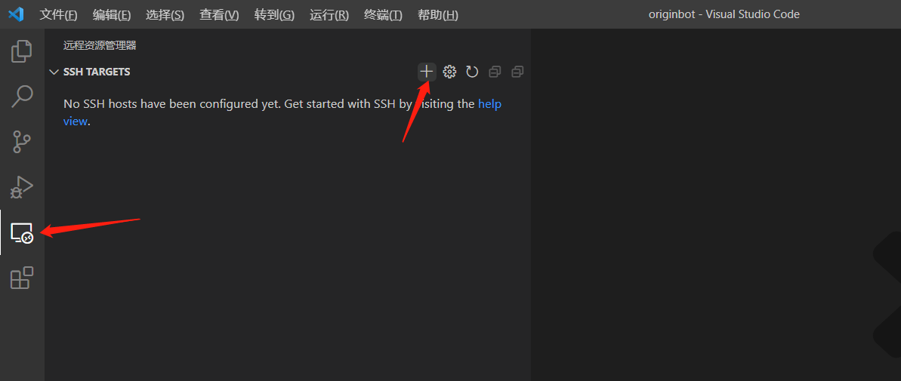{.img-fluid tag=3 title="Configure a remote connection"}

In the pop-up prompt, output the full command of ssh and press enter.

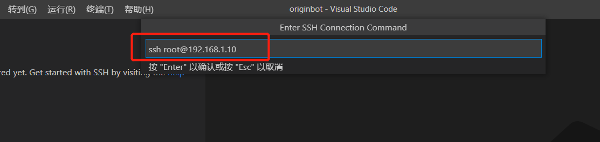{.img-fluid tag=3 title="Configure a remote connection"}

Then select the default configuration file of the first item and save the ssh command information you just entered.

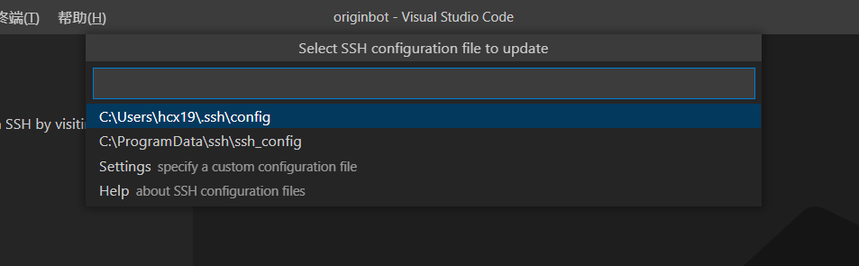{.img-fluid tag=3 title="Configure a remote connection"}

After the saving is successful, you can also follow the prompts to open the configuration file, so that you don't need to fill in the information next time you log in remotely. And in the list on the left, the IP address of the remote target has also been added.

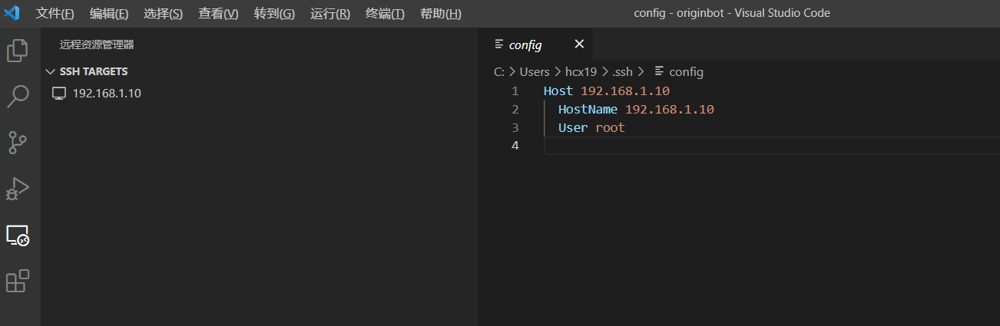{.img-fluid tag=3 title="Configure a remote connection"}

## **Connect to a remote server**

Right-click on the IP address of the remote server and select Open in Current Window.

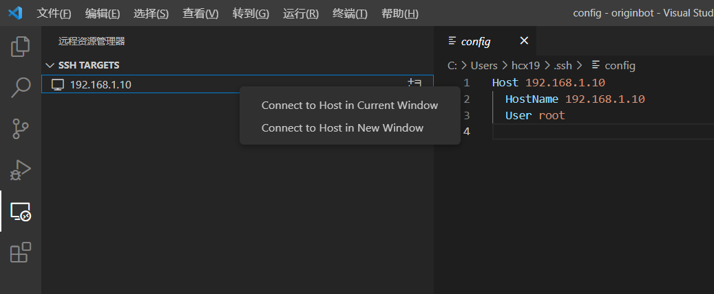{.img-fluid tag=4 title="Connect to a remote server"}

Soon a new window will open and let's select the target server system, we will select "Linux".

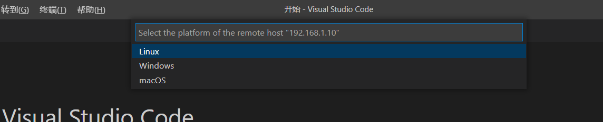{.img-fluid tag=4 title="Connect to a remote server"}

Next, enter the user password of the target server: root.

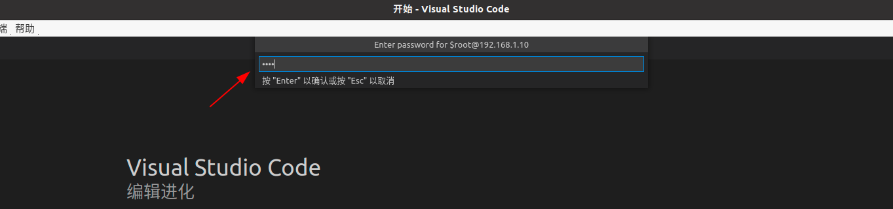{.img-fluid tag=4 title="Connect to a remote server"}

Wait a while and the login will be successful.

{.img-fluid tag=4 title="Connect to a remote server"}

Select Open Folder.

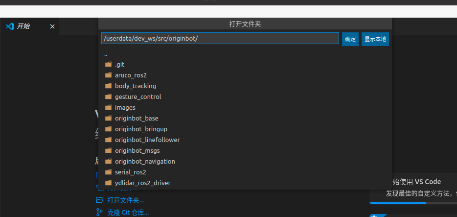{.img-fluid tag=4 title="Connect to a remote server"}

Then we select the workspace of OriginBot, and the userdata is slightly lower, which can be seen by scrolling the mouse wheel.

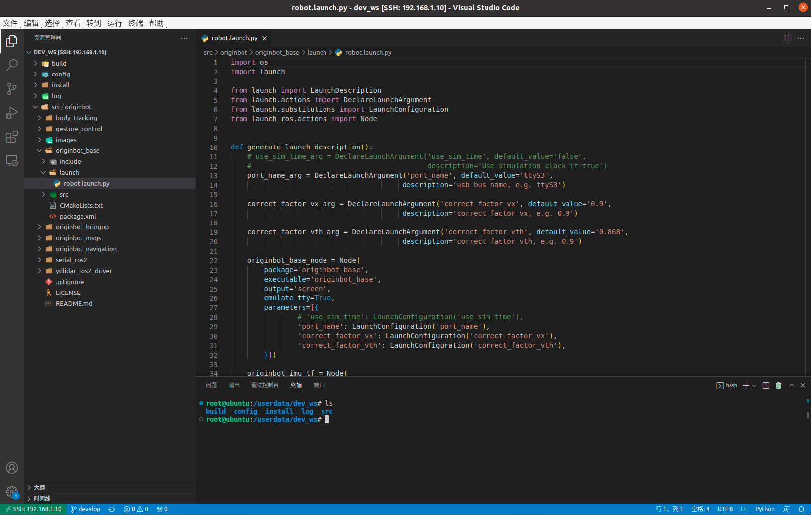{.img-fluid tag=4 title="Connect to a remote server"}

In this way, we can remotely access the code on OriginBot, and we can modify it at any time, and it will be synchronized to the bot side in real time. In addition, we can also launch multiple terminals in VSCode after a successful connection, so that we can enter various commands to run on OriginBot.

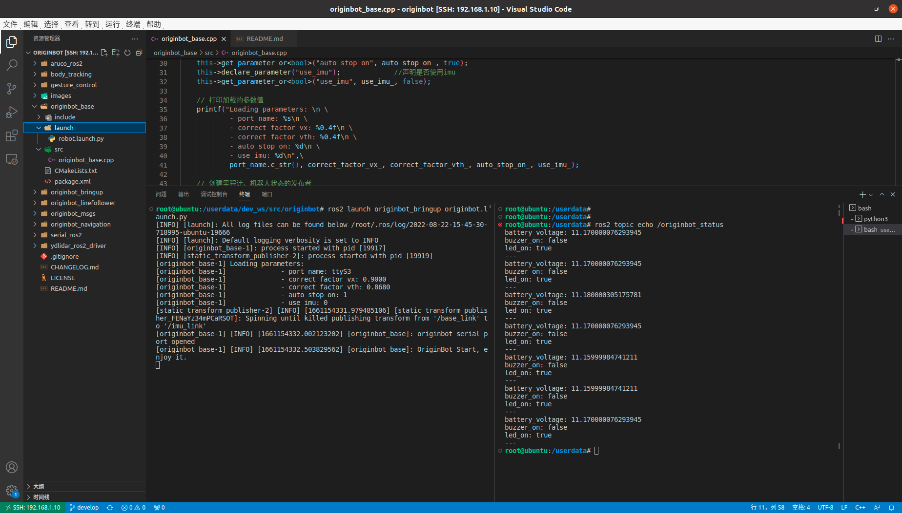{.img-fluid tag=4 title="Connect to a remote server"}

{:target="_blank"}

