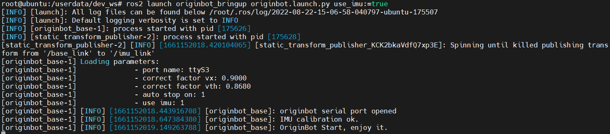
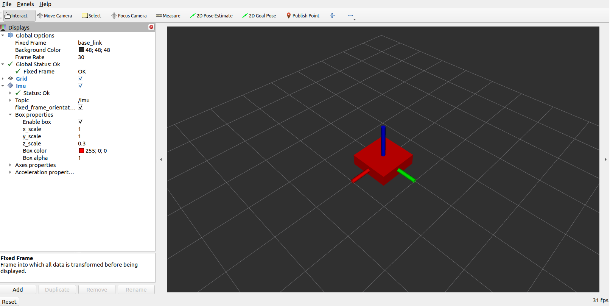

# **IMU Driver and Visualization**

???+ hint
    The operating environment and software and hardware configurations are as follows:
    

     - OriginBot Pro
     - PC：Ubuntu (≥22.04) + ROS2 (≥humble)


<!-- <iframe
  src="//player.bilibili.com/player.html?aid=516658213&bvid=BV1eg411a7A9&cid=866114680&page=14&autoplay=0"
  scrolling="no"
  border="0"
  width="800px"
  height="460px"
  frameborder="no"
  framespacing="0"
  allowfullscreen="true"
>
</iframe> -->


## **IMU driver**

After successfully connecting to OriginBot through SSH, enter the following command in the terminal to start the robot chassis and IMU:

```bash
ros2 launch originbot_bringup originbot.launch.py use_imu:=true
```

{.img-fluid tag=1 title="start the robot chassis and IMU"}


## **Data visualization**

On the PC side of the same network, install the IMU plug-in in Rivz:

```bash
sudo apt install ros-${ROS_DISTRO}-rviz-imu-plugin
```


Then start the host computer visualization software:

```bash
ros2 launch originbot_viz display_imu.launch.py
```


You can see the visualized IMU information. If you shake the robot, the coordinate system in Rviz will also move accordingly.
{.img-fluid tag=1 title="Real-time data visualization for IMU"}

???+ hint
    Make sure that Ubuntu+ROS2 system has been installed on the PC, and the [originbot_desktop](https://github.com/guyuehome/originbot_desktop){:target="_blank"} code repository has been downloaded and compiled. In addition, you can also use "ros2 run rviz2 rviz2" to start Rivz2 separately, manually configure Fixed Frame to select base_link, add imu display items, and subscribe to imu topics to achieve similar effects.


[](https://www.guyuehome.com/){:target="_blank"}

