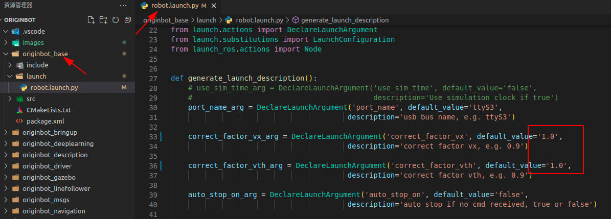
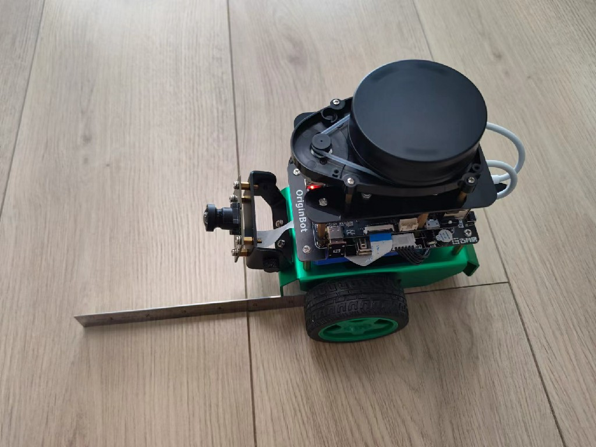
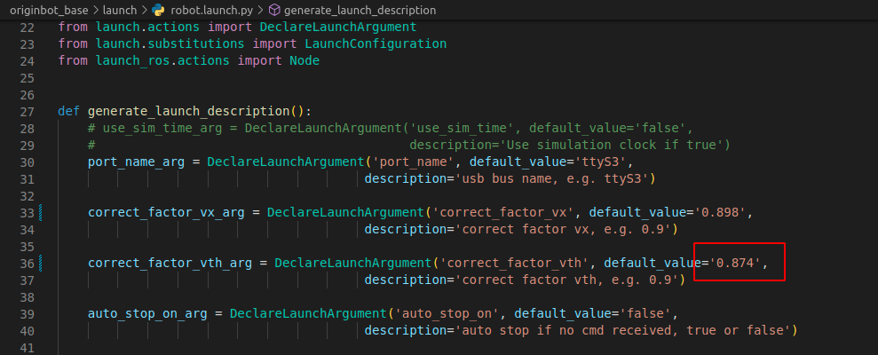

# **Robot odometer calibration**

???+ hint
    The operating environment and software and hardware configurations are as follows:
    

     - OriginBot Pro
     - PC：Ubuntu (≥22.04) + ROS2 (≥humble)
     - tape measure
     - Mobile phone compass/protractor


Since the physical properties of the motors and encoders of each robot are slightly different, a preliminary calibration has been performed in the code. In order to achieve a better positioning effect, it is still recommended to perform the following calibration operations for each actual robot.


## **Preparation**
In the robot workspace, open the launch folder under the originbot_base package and change the factory calibration coefficient in robot.launch.py ​​to "1.0":
{.img-fluid tag=1 title="odometer calibration"}


???+ hint
    Note that the modification uses the floating-point format, and the modification needs to be recompiled to take effect.


## **Linear velocity calibration**

The principle of linear speed calibration is to find the linear proportional relationship between the actual speed and the calculated speed, and to make the calculated speed as close to the actual speed as possible through the linear coefficient.

The steps are as follows:
- Spread the tape measure out on the ground as a reference for the actual straight-line mileage:
  {.img-fluid tag=1 title="odometer calibration"}

  

- Place the robot at the zero position of the tape measure, using the front edge of the robot chassis as a reference line:
  {.img-fluid tag=1 title="odometer calibration"}

  

- Start the robot chassis:
```bash
ros2 launch originbot_bringup originbot.launch.py
```


- Dynamic display of robot odometer data

```bash
ros2 topic echo /odom
```


{.img-fluid tag=1 title="odometer calibration"}


- Start the keyboard control node, slow down a bit, and control the forward movement of the robot:

```bash
ros2 run teleop_twist_keyboard teleop_twist_keyboard
```


- After moving for a certain distance, such as about 1m, stop running, and check the actual distance of the robot at this time, as well as the cumulative distance of ODOM feedback.

  For example, the actual distance traveled at this time is 1.023m:
  
  
  
  {.img-fluid tag=1 title="odometer calibration"}


The odometer feedback is 1.139m:


{.img-fluid tag=1 title="odometer calibration"}


- Calibration factor for calculating line velocity = actual running distance/odometer feedback distance
  For example: 1.023/1.139 = 0.898

  

- Fill in the calibration parameters into the robot.launch.py, and the linear speed calibration is completed
  {.img-fluid tag=1 title="odometer calibration"}


???+ hint
    In order to improve the calibration accuracy, the above steps can be repeated 3~5 times, and the calculated coefficients are averaged.


## **Angular velocity calibration**

The principle of angular velocity calibration is to find the linear proportional relationship between the actual angular velocity and the calculated angular velocity, and make the calculated angular velocity as close to the actual angular velocity as possible through the linear coefficient.


- Place the robot on a level ground and look for a reference line on the ground, or artificially draw a reference line as the zero point for the robot to rotate:
{.img-fluid tag=1 title="odometer calibration"}


- Start the robot chassis:

```bash
ros2 launch originbot_bringup originbot.launch.py
```


- Dynamic display of robot odometer data:

```bash
ros2 topic echo /odom
```

{.img-fluid tag=1 title="odometer calibration"}


- Start the keyboard control node, slow down a little, and control the robot to rotate in place:

```bash
ros2 run teleop_twist_keyboard teleop_twist_keyboard
```


- After rotating at a certain angle, such as about 300 degrees, stop the operation and mark the attitude reference line of the robot at this time
  {.img-fluid tag=1 title="odometer calibration"}


- Calculate the actual angle of rotation of the robot: it can be measured with a protractor or with the compass of your phone.

  For example, when the robot is at zero point, the angle displayed by the mobile phone compass is 21 degrees
  {.img-fluid tag=1 title="odometer calibration"}


When the robot stops moving, the angle displayed by the mobile phone compass is 341 degrees
{.img-fluid tag=1 title="odometer calibration"}


The actual angle of rotation of the robot is: 341 - 21 = 320 degrees


The rotation angle of the odometer feedback at this point is:


{.img-fluid tag=1 title="odometer calibration"}


The pose in ROS shows the quaternion by default, and we need to convert the quaternion to Euler angles, which can be done online using [quaternions website](https://quaternions.online/)：


{.img-fluid tag=1 title="odometer calibration"}


From the calculation results, it can be found that the robot odometer should be rotated by 6.193 after the integral exceeds 360 degrees, that is, the total integral rotates by 360+6.193 = 366.193 degrees


- Calibrations for calculating angular velocity = angle of actual rotation / odometer feedback angle
  For example: 320/366.193 = 0.874

  

- Fill in the calibration parameters into the robot.launch.py, and the angular velocity calibration is completed
{.img-fluid tag=1 title="odometer calibration"}


???+ hint
    In order to improve the calibration accuracy, the above steps can be repeated 3~5 times, and the calculated coefficients are averaged.


## **Calibration complete**

After the above calibration operations are completed, you need to recompile the workspace for this to take effect.

After restarting the robot chassis, you can continue to control the robot movement, compare the distance and angle of the actual operation of the robot, and whether the value of the feedback in the ODOM is close, if the error is not large, the calibration is completed, if there is still a large error, please repeat the above calibration operation.


[](https://www.guyuehome.com/){:target="_blank"}

