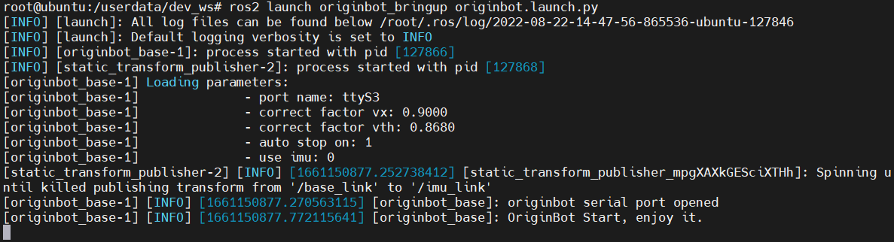
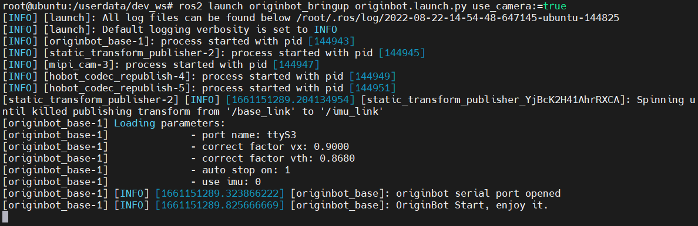

# **Robot startup and parameter configuration**

Based on the originbot.launch.py ​​startup file, we can not only start the OriginBot robot chassis, but also use the configuration and matching of different parameters to start different sensors in combination.

???+ hint
    The operating environment and software and hardware configurations are as follows:
    
     - OriginBot Pro
     - PC：Ubuntu (≥22.04) + ROS2 (≥humble)


<iframe
  src="//player.bilibili.com/player.html?aid=516658213&bvid=BV1eg411a7A9&cid=866084401&page=10&autoplay=0"
  scrolling="no"
  border="0"
  width="800px"
  height="460px"
  frameborder="no"
  framespacing="0"
  allowfullscreen="true"
>
</iframe>


## **How to start the robot**

Connect to OriginBot via SSH on the PC side.

{.img-fluid tag=1 title="Bot-launch"}

After the connection is successful, the command to start the OriginBot robot is:

```bash
ros2 launch originbot_bringup originbot.launch.py use_camera:=true use_lidar:=true use_imu:=true
```


After the chassis is successfully started, you will hear the buzzer on the controller sound for about **0.5 seconds**.


### **Sensor start-up parameters**

Depending on the sensor actually connected, we can configure whether to drive or not by parameter:

| The name of the parameter         | description                   | Parameter value                        | Default value |
| -------------- | ---------------------- | ----------------------------- | ------ |
| <font color='green'>**use_camera**</font> | Whether or not to connect and use the camera   | true：use<br />false：do not use | false  |
| <font color='green'>**use_lidar**</font>  | Whether or not to connect and use lidar | true：use<br />false：do not use | false  |
| <font color='green'>**use_imu**</font>    | Whether to connect and use the IMU      | true：use<br />false：do not use | false  |

???+ Info
    The above parameters can be configured individually or multiple times together, and if the default values are used, they can be defaulted at startup.  


### **Chassis configuration parameters**

originbot.launch.py will start the corresponding sensor according to the above parameters, and will also call the robot.launch.py to start the robot chassis, in the robot.launch.py, we can also configure some chassis related parameters:

{.img-fluid tag=2 title="Chassis configuration parameters"}

| The name of the parameter                                            | description                                                         | Parameter value                    | Default value |
| ------------------------------------------------- | ------------------------------------------------------------ | ------------------------- | ------ |
| <font color='green'>**port_name**</font>          | The serial slogan of the RDK X5 connection with the controller                                | string                    | ttyS3  |
| <font color='green'>**correct_factor_vx**</font>  | Linearity correction parameters for linear velocity                                         | float                     | 0.898  |
| <font color='green'>**correct_factor_vth**</font> | Linearity correction parameter for angular velocity                                         | float                     | 0.874  |
| <font color='green'>**auto_stop_on**</font>       | If the Twist speed command is not received within 0.5 seconds after starting, the robot will automatically stop | true：use，false：not use | false  |
| <font color='green'>**use_imu**</font>            | Whether to connect and use the IMU（will be overridden by the configuration in the originbot.launch.py）     | true：use，false：not use | false  |
| <font color='green'>**pub_odom**</font>           | Whether or not to publish an odometer-based ODOM to base_footprint TF transformation             | true：publish，false：do not publish | true   |

???+ Info
    The above parameter values ​​can be modified in the robot.launch.py ​​file based on the actual usage of the robot. 


## **Robot and sensor activation**

### **Start the chassis**

Use the following command to start the robot chassis alone. The camera, radar, and IMU will not be started at this time. It can be used for motion control related applications.

```bash
ros2 launch originbot_bringup originbot.launch.py
```

{.img-fluid tag=3 title="Start the chassis"}


### **Start chassis + camera**

Use the following command to start the robot chassis and camera. The radar and IMU will not be started at this time. They can be used for motion control and vision processing related applications.

```bash
ros2 launch originbot_bringup originbot.launch.py use_camera:=true
```

{.img-fluid tag=3 title="Start the chassis + camera"}


### **Start chassis + camera + lidar**

Use the following command to start the robot chassis, camera, and lidar. The IMU will not be started at this time. It can be used for motion control, visual processing, and mapping and navigation related applications.

```bash
ros2 launch originbot_bringup originbot.launch.py use_camera:=true use_lidar:=true
```

{.img-fluid tag=3 title="Start chassis + camera + lidar"}


### **Start chassis + camera + lidar + IMU**

Use the following commands to start the robot chassis, camera, lidar, and IMU, which can be used for motion control, visual processing, and positioning and navigation related applications.

```bash
ros2 launch originbot_bringup originbot.launch.py use_camera:=true use_lidar:=true use_imu:=true
```

{.img-fluid tag=3 title="Start chassis + camera + lidar + IMU"}


[](https://www.guyuehome.com/){:target="_blank"}

