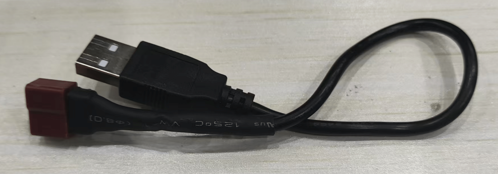

# **Robot charging method**

???+ hint
    The operating environment and software and hardware configurations are as follows:
    

     - OriginBot Pro
     - Power supply method: Supports direct power supply via mobile phone charger or power bank

## **Power Supply**
You need a 5V constant voltage power supply， such as a power bank or a mobile phone charger.

[**xiaomi power bank**](../material/open_source_link.md#power-bank) 

By USB-A to T-type interface, connect the power supply to the robot.

 

## **Usage Instructions**
Please ensure the use of compliant power supply equipment to guarantee normal robot operation.
Connect the T-type power interface to the robot's power input;
Connect the other end toA mobile phone charger (plugged into mains socket), or power bank's USB output port.

## **Precautions**
It is recommended to use reliable power supply equipment. 
Disconnect the power supply when not in use for extended periods.

{:target="_blank"}

