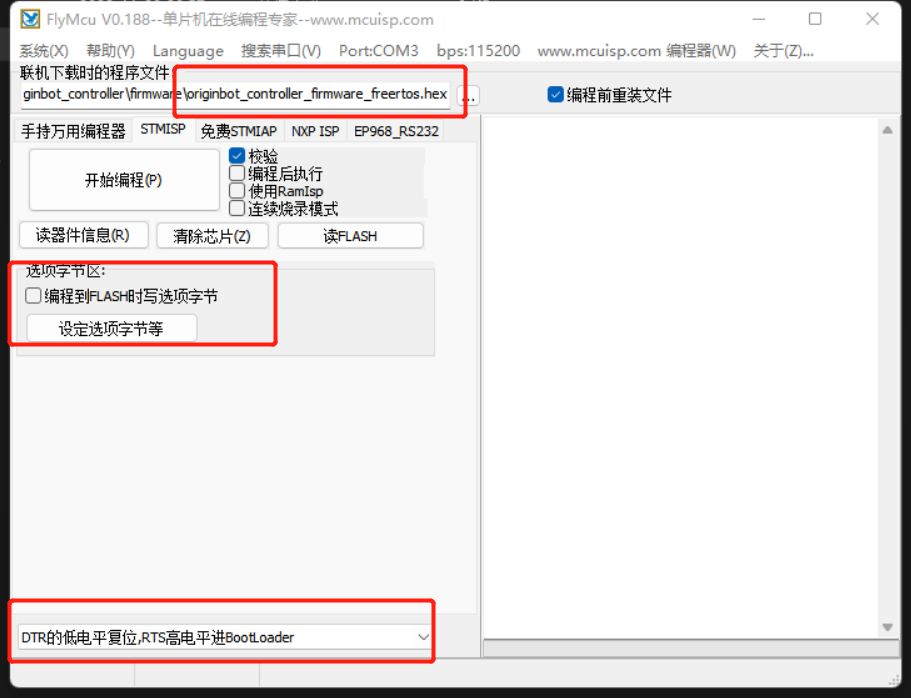
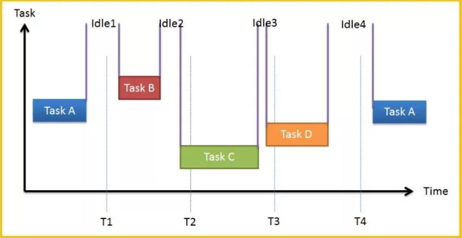
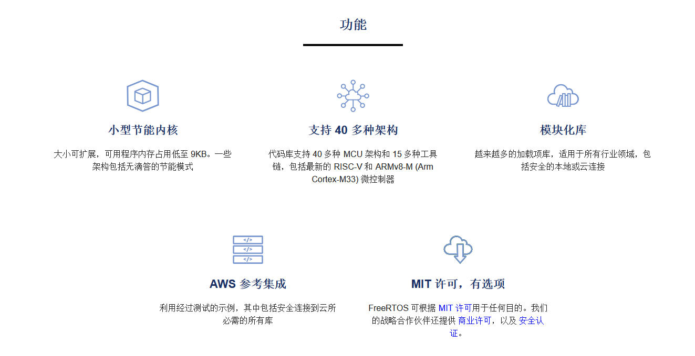
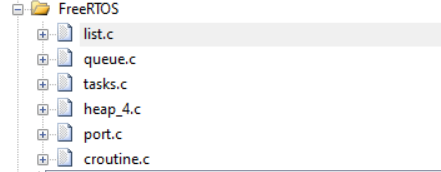

# **Real-Time Operating System RTOS Configuration**

???+ hint
    The operating environment and software and hardware configurations are as follows:
    

     - OriginBot Pro
     - PC：Ubuntu (≥22.04) + ROS2 (≥humble)


## **FreeRTOS onboard**

In the controller firmware installation column, you have already equipped the general microcontroller processing firmware, but in addition to the general processing firmware, here will provide you with the processing firmware of the FreeRTOS in the microcontroller real-time operating system.

FreeRTOS is written in the same way as general firmware, and we provide a FreeRTOS sample firmware that can achieve the same function as the general processing firmware for you to burn.

**Here's how it works:**：

（1）Start the flymcu software on the computer（[click here to download](../material/common_software.md)）；

（2）Click Port and select the serial port to burn the firmware (select the serial port with the "CH340" number);

（3）In the flymcu software, select the firmware file to be burned, configure it according to the figure below, and click "Start Programming";




## **Introduction to FreeRTOS**

#### RTOS（Real Time Operation System）

RTOS stands for Real Time Operation System. RTOS emphasizes real-time, which is divided into hard real-time and soft real-time. Hard real-time requires that the operation must be completed within the specified time, and timeouts are not allowed; In soft real-time, however, the requirements for processing timeouts are not very strict. At the heart of an RTOS is task scheduling.

#### FreeRTOS

FreeRTOS is a type of RTOS that is very small and can be run on a microcontroller. A microcontroller is a small, resource-constrained processor that contains the processor itself, read-only memory (ROM or Flash) to hold the program to be executed, and random access memory (RAM) required for the program to be executed, which is generally executed directly from the read-only memory. On the official website of FreeRTOS, we can see the features it supports.



## **Configure FreeRTOS**

Configuring FreeRTOS requires refactoring the original code, refactoring part of the code according to the FreeRTOS code template to make it follow the rules of FreeRTOS, and then introducing the most basic FreeRTOS configuration and some APIs.

### Basic configuration

The first thing you need to do is choose a distribution, each version of the API will have some slight differences, in this project you choose V10.2.1, all of which is hosted on the [code hosting platform](https://sourceforge.net/projects/freertos/files/FreeRTOS/) 

After the code is downloaded, some files need to be configured into the originbot_controller, mainly including the kernel and hardware interface layers that match the MCU, refer to [code repository](https://github.com/yzhcat/originbot_controller/tree/support_Freertos/source/originbot_controller_project/FreeRTOS)



During the configuration process, we need to modify some file contents, such as FreeRTOSConfig.h, in which FreeRTOS task priority and stack size are defined, and we need to add the definition of interrupt mechanism on this basis.

```
#define vPortSVCHandler SVC_Handler
#define xPortPendSVHandler PendSV_Handler
```

The reason for this definition is that the following three interrupt mechanisms are defined in port.c to ensure that FreeRTOS tasks are polled.

```
void xPortPendSVHandler( void );
void xPortSysTickHandler( void );
void vPortSVCHandler( void );
```

Since xPortSysTickHandler is already in use in the original project, there is no need to redefine it, just refactor the original implementation.

```
extern void xPortSysTickHandler(void);
void SysTick_Handler(void) 
{
    if(xTaskGetSchedulerState()!=taskSCHEDULER_NOT_STARTED)//The system is running
    {
        xPortSysTickHandler();	
    }
}
```

### Task implementation

After the basic configuration is complete, you can start the creation and implementation of the task.

#### Task creation

For task creation, FreeRTOS provides an API for us to use. The format is as follows:

	   /* Create DemoTaskCreate task */
	DemoTaskCreate_Handle = xTaskCreateStatic((TaskFunction_t	)DemoTaskCreate,		//Task function
														(const char* 	)"DemoTaskCreate",		//Task name
														(uint32_t 		)128,	//Task stack size
														(void* 		  	)NULL,				//Parameters passed to the task function
														(UBaseType_t 	)3, 	//Task priority
														(StackType_t*   )DemoTaskCreate_Stack,	//Task stack
														(StaticTask_t*  )&DemoTaskCreate_TCB);	//Task control block   
															
	if(NULL != DemoTaskCreate_Handle)/* Created successfully */
	vTaskStartScheduler();   /* Start a task and enable scheduling */
So we can refer to the above implementation to define the multiple tasks we need.

```
void start_task(void *pvParameters);
void start_task(void *pvParameters)
{
    taskENTER_CRITICAL(); //Enter the critical area
    //Create the task
		xTaskCreate(led_task, "led_task", 1000, NULL, LED_TASK_PRIO, NULL);
		xTaskCreate(buzzer_task, "buzzer_task", 1000, NULL, BUZZER_TASK_PRIO1, NULL);
		xTaskCreate(uart_task, "uart_task2", 1000, NULL, RECEIVE_HANDLE_TASK_PRIO, NULL);
    vTaskDelete(StartTask_Handler); //Delete the start task
    taskEXIT_CRITICAL();            //Exit the critical section
}
```

#### Task delay

In addition to the task creation API, task latency is also an extremely important implementation in FreeRTOS, as you can see in the introduction to FreeRTOS, in essence, each task has four states, ready, suspended, running, and blocking. A brief introduction to the process is described as follows:

(1)：Create a task → ready state (Ready): After the task is created, it enters the ready state, indicating that the task is ready to run at any time, and only waits for the scheduler to schedule.

(2)：Ready state → Running state: When a task switch occurs, the highest priority task in the ready list is executed, thus entering the running state.

(3)：Running state → ready state: After a higher priority task is created or restored, task scheduling will occur, and the highest priority task in the ready list becomes running state, then the original running task changes from running state to ready state, and is still in the ready list, waiting for the highest priority task to finish running and continue to run the original task (this can be regarded as the CPU usage is preempted by a higher priority task).

(4)：Running state → blocking state (Blocked): When the running task is blocked (suspended, delayed, read semaphore waiting), the task will be deleted from the ready list, and the task status will change from the running state to the blocking state, and then the task switch will occur, and the current highest priority task in the ready list will be run.

(5)： Blocking state → ready state: After the blocked task is resumed (task recovery, delay time timeout, read semaphore timeout or read semaphore, etc.), the resumed task will be added to the ready list, so as to change from the blocking state to the ready state; If the priority of the restored task is higher than the priority of the running task, a task switchover will occur, and the task will be transitioned from the ready state to the running state again.

(6) ：Ready, Blocking, Running→ Suspended: The task can be suspended in any state by calling the vTaskSuspend() API function, and the suspended task does not get the right to use the CPU, nor will it participate in the scheduling unless it is lifted from the suspended state.

(7)：Suspended state → ready state: The only way to resume a task in a suspended state is to call the vTaskResume() or vTaskResumeFromISR() API function, if the priority of the resumed task is higher than the priority of the running task, a task switch will occur, and the task will be converted to the task state again, from the ready state to the running state.

Task latency is the transformation of a task into a blocking state, and there are two task delay APIs in FreeRTOS.

##### vTaskDelay()

vTaskDelay() is used a lot in our tasks, and each task must be in an endless loop, and there must be a block, otherwise the lower priority tasks will not be able to run. To use the vTaskDelay() function in FreeRTOS, you must define INCLUDE_vTaskDelay as 1 in FreeRTOSConfig.h to enable it.

##### vTaskDelayUntil()

This absolute delay is often used to run tasks at a more precise cycle, for example, I have a task and want it to be executed at a fixed frequency at regular intervals, regardless of external influences, and the time interval between the start of the last run and the start of the next run is absolute, not relative.


[](https://www.guyuehome.com/){:target="_blank"}

