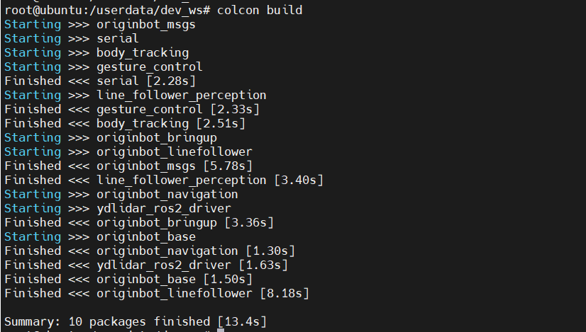

# **Code development and compilation methods**

OriginBot fully complies with the development methods of ROS2. Here we briefly introduce the common operations of the function package. For the detailed development principles of ROS2, please refer to [the ROS2 Getting Started Tutorial](https://book.guyuehome.com/){:target="_blank"}。


???+ hint
    The operating environment and software and hardware configurations are as follows:
    

     - OriginBot Pro
     - PC：Ubuntu (≥22.04) + ROS2 (≥humble)


## **Workspaces**

In ROS robot development, when we develop code for certain functions of the robot, various written codes, parameters, scripts and other files need to be placed in a certain folder for management. This folder is called a **workspace** in the ROS system.

In the official image of OriginBot, a workspace has been created. It is located in the /userdata folder and is named dev_ws. It is called the root directory of the workspace and contains four subfolders:


- **src，code space**，code and scripts written in the future, all need to be artificially placed here;
- **build，the compilation space**，which saves the intermediate files generated during the compilation process;
- **install，installation space**，where compiled executables and scripts are placed;
- **log，log space**，during compilation and operation, various warnings, errors, information and other logs are stored;
- **config，configuration file**，which stores the model configuration file of the human body tracking and gesture recognition application (not a folder required for the ROS2 workspace).

For the folders of these four spaces, most of our operations are performed in src. After successful compilation, execute the compilation results in install.


## **Feature packs**

The function packages of the OriginBot robot are placed in the src folder in the /userdata/dev_ws workspace, and the structure of the function packages is as follows:

- originbot_base： Robot chassis drive
- originbot_driver：Robot equipment driven
    - serial_ros2：Serial port driver package
    - ydlidar_ros2_driver：EAI X3 lidar Driver Package
    - kruisee_lidar：Krypton KRJ10 lidar Driver Package
- originbot_msgs： OriginBot custom communication interface
- originbot_bringup：Scripts and files related to the bot launch
- originbot_linefollower：Robot visual line inspection function package
- originbot_navigation：Scripts and configuration files related to robot mapping and navigation
- originbot_example：The robot implements the official classic case function package of ROS
- originbot_audio：Robot voice-related function packages
- originbot_deeplearning：Robot deep learning function
    - body_tracking：Robot human body following function package
    - gesture_control：Robot gesture control function package
    - line_follower_perception：Robot AI visual line inspection function package
    - play_football：Robot AI visual kick and shoot function package
    - parking_search：Robot AI vision parking space search function package


## **Compile the code**

After modifying the code or configuration file in the feature package, you need to use the following command to compile the workspace. If there are missing dependencies or errors in the code, there will be errors during the compilation process. Otherwise, there should be no errors during the compilation process:

```bash
cd /userdata/dev_ws/
colcon build
```




## **Set environment variables**

After compilation, in order for the system to be able to find our feature pack and executable, we also need to set the environment variables:

```bash
source /userdata/dev_ws/install/local_setup.bash # Takes effect only on the current terminal
echo " source /userdata/dev_ws/install/local_setup.bash" >> ~/.bashrc # All terminals are valid and run only once
```


???+ hint
    In the official image of OriginBot, the above environment variables have been set in the .bashrc configuration file, and there is no need to configure them again.


[](https://www.guyuehome.com/){:target="_blank"}

