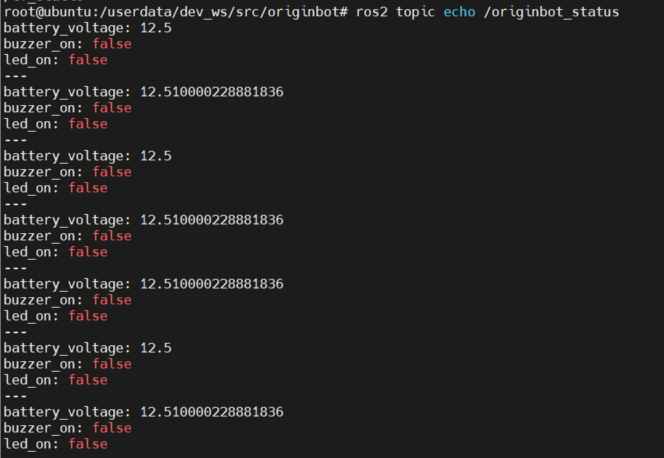
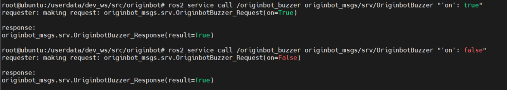
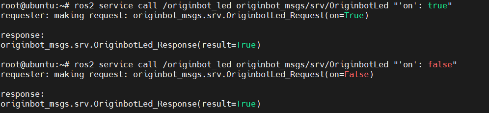
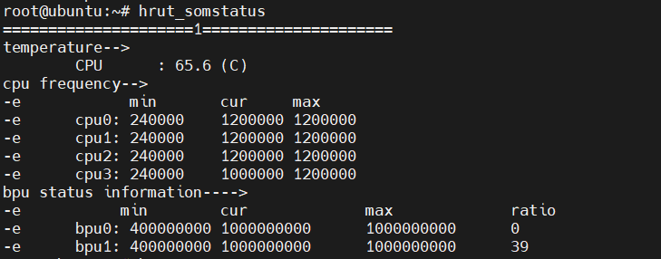
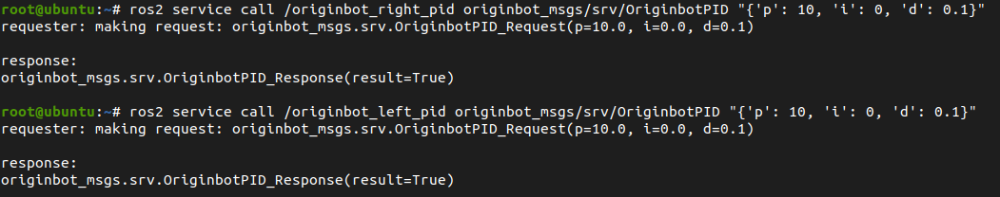
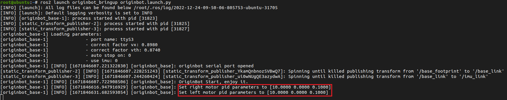

# **Dynamic monitoring of robot parameters**

After starting the bot, OriginBot provides a variety of parameters that can be dynamically detected or modified.


???+ hint
    The operating environment and software and hardware configurations are as follows:
    

     - OriginBot Pro
     - PC：Ubuntu (≥22.04) + ROS2 (≥humble)


<iframe
  src="//player.bilibili.com/player.html?aid=516658213&bvid=BV1eg411a7A9&cid=866149913&page=15&autoplay=0"
  scrolling="no"
  border="0"
  width="800px"
  height="460px"
  frameborder="no"
  framespacing="0"
  allowfullscreen="true"
>
</iframe>


## **Check the robot status**

Through the following instructions, you can see the status information of the robot. The publishing frequency of the robot is 10Hz.

```bash
ros2 topic echo /originbot_status
```

| state                  | description        | typical                   |
| ------------------- | --------- | --------------------- |
| **battery_voltage** | Battery level, unit: V | 9.0~12.8              |
| **buzzer_on**       | Control the status of the buzzer on the board | true：On<br />false：Off |
| **led_on**          | Control the status of the LEDs on the board | true：On<br />false：Off |

{.img-fluid tag=1 title="View the status of your bot"}


## **Control on-board buzzer**

The following instructions can be used to turn on or off the buzzer on the controller by calling the service:

```bash
ros2 service call /originbot_buzzer originbot_msgs/srv/OriginbotBuzzer "'on': true"     ## Turn on the buzzer
ros2 service call /originbot_buzzer originbot_msgs/srv/OriginbotBuzzer "'on': false"    ## Turn off the buzzer
```

{.img-fluid tag=1 title="Control on-board buzzer"}


## **Control on-board LED lights**

The following commands can be used to turn on or off the LED light on the controller by calling the service:

```bash
ros2 service call /originbot_led originbot_msgs/srv/OriginbotLed "'on': true"      ## Turn on the LED
ros2 service call /originbot_led originbot_msgs/srv/OriginbotLed "'on': false"     ## Turn off the LED
```

{.img-fluid tag=1 title="Control on-board LED lights"}


## **View the information about the CPU and BPU**

You can view the information of OriginBot's core processor, such as the frequency and temperature of each core, by using the following command:


```bash
hrut_somstatus
```

{.img-fluid tag=1 title="View the information about the CPU and BPU"}


## **Set the PID parameters of the motor**

Through the following instructions, you can set the PID parameters of the left and right motors in the OriginBot controller respectively through service calls, and the settings will take effect immediately:

```bash
ros2 service call /originbot_left_pid originbot_msgs/srv/OriginbotPID "{'p': 10, 'i': 0, 'd': 0.1}"
ros2 service call /originbot_right_pid originbot_msgs/srv/OriginbotPID "{'p': 10, 'i': 0, 'd': 0.1}"
```

{.img-fluid tag=1 title="Set the PID parameters of the motor"}

In the terminal where the robot is started, you can also see the log prompt that the PID parameters have been successfully set:

{.img-fluid tag=1 title="Set the PID parameters of the motor"}


[](https://www.guyuehome.com/){:target="_blank"}

