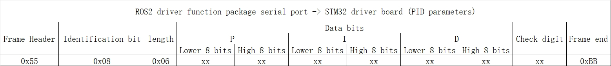

# **Communication Protocol Description**

???+ hint
    The operating environment and software and hardware configurations are as follows: 

     - OriginBot Pro

     - PC：Ubuntu (≥22.04) + ROS2 (≥humble)


## **Speed control**


### **Key features**

The drive function node of the host computer sends motor speed control data to the controller, and the controller drives the motor to execute.


### **Protocol format**

{.img-fluid tag=1 title="speed control"}


- **Frame header**：0x55, as the identifier of the start of the data, custom 0x55.

- **Identification bit**：Identifies what the current group data is, 0x01 represents the speed control command.

- **Length**：0x06, the data bit has a total of 6 bytes of data, so it is 0x06.

- **Data bit**：Responsible for left motor speed control and right motor speed control. There are two modes of direction: 0x00 and 0xFF, 0x00 the velocity value is negative, the 0xFF velocity value is positive, and when the velocity is 0.00, the direction value is 0xFF. The speed unit is mm/s (8 bits).

- **Check bit**：Used to check whether there is a data error in the process of data transmission. The check digit data is calculated as follows:
  
  ```
  Check bit value = Data bit Sum all data & 0xFF
  ```

- **Frame end**：0xBB, the end of the frame is used as an identifier for data termination, and the 0xBB is customized.

### **Examples of communication**

For example, the upper computer sends speed commands, the speed of the left motor is 5mm/s, and the speed of the right motor is -3mm/s

The content of the agreement is: **0x55 0x01 0x06 0xFF 0x05 0x00 0x00 0x03 0x00 0x07 0xBB**

Among them: 0xFF 0x05 0x00 corresponds to 5mm/s，0x00 0x03 0x00 corresponds to -3mm/s。

The check digit is: **（0xFF + 0x05 + 0x00 + 0x00 + 0x03 + 0x00） & 0xFF = 0x07**


## **Speed feedback**

### **Key features**

The controller sends motor speed data to the upper computer cycle, and the upper computer can calculate the odometer data according to the speed.


### **Protocol format**

{.img-fluid tag=1 title="Speed feedback"}

- **Identification bit**：0x02 indicates the speed feedback command.
  
  

## **Gyroscope data feedback**

### **Key features**

The controller periodically sends gyroscope data to the host computer, and the host computer can publish IMU topic messages according to the data.


### **Protocol format**

{.img-fluid tag=1 title="Gyroscope data feedback"}


There is a lot of gyroscope data, which is divided into three groups to transmit separately. Distinguish what the current data is by identifying bits. The check digits are still calculated using the data bits that add & 0xFF of each data.

For the conversion of raw data, please refer to the official agreement of Witt: [click to jump](https://wit-motion.yuque.com/books/share/29a9c291-ebf5-4f6f-83e3-4093832dce78/locehn){:target="_blank"}


**Acceleration is calculated as follows:**

```
ax=((AxH<<8)|AxL)/32768*16g (g is the acceleration of gravity, which can be 9.8m/s2) 

ay=((AyH<<8)|AyL)/32768*16g (g is the acceleration of gravity, which can be 9.8m/s2)

az=((AzH<<8)|AzL)/32768*16g (g is the acceleration of gravity, which can be 9.8m/s2)
```

**Angular velocity is calculated as follows:**

```
wx=((wxH<<8)|wxL)/32768*2000(°/s) 

wy=((wyH<<8)|wyL)/32768*2000(°/s) 

wz=((wzH<<8)|wzL)/32768*2000(°/s) 
```

**The Euler angle is calculated as follows:**

```
Roll Angle (X-axis) Roll=((RollH<<8)|RollL)/32768*180(°) 

Pitch Angle (Y-axis) Pitch=((PitchH<<8)|PitchL)/32768*180(°) 

Yaw Angle (z-axis) Yaw=((YawH<<8)|YawL)/32768*180(°)
```


Note: The data is sent in 16 base format, not ASCII code. Each data is delivered sequentially in low and high bytes, which are combined into a signed short type of data. For example, the X-axis acceleration data Ax, where AxL is a low byte and AxH is a high byte.

The conversion method is as follows: Assuming that Data is the actual data, DataH is its high-byte part, and DataL is its low-byte part, then: Data=((short)DataH<<8)|DataL. It is important to note here that DataH needs to be cast to a signed short type of data before being shifted, and the data type of Data is also a signed short type, so that negative numbers can be represented.

Euler angles or quaternions can be provided, if not, the accuracy of acceleration and angular velocity must be ensured, and the Euler angles or quaternions will be solved in the ROS2 package.


## **Sensor data feedback**

### **Key features**

The controller feeds back voltage and other data to the host computer periodically, and the host computer can perform the corresponding functions according to the information.


### **Protocol format**

{.img-fluid tag=1 title="Sensor data feedback"}

The voltage value is sent in two parts, integer and decimal, and the voltage value = integer part + decimal part / 100, the unit is V.

Reserve two sensor data bits, and the data is 0x00 when not in use, and the verification calculation is the same as above.


## **Controller resource control**

### **Key features**

The host computer sends instructions to the controller to control LED, buzzer, IMU calibration, etc.


### **Protocol format**

{.img-fluid tag=1 title="Controller resource control"}

The enable control fields and status fields of LED, buzzer, and IMU calibration commands can be set to zero and non-zero values, and the verification calculation is the same as above.

The status field takes effect only when the control field is enabled to be non-zero. The LED, buzzer, and IMU are calibrated with independent enable control and status field control.

- If the LED status field is zero, the LED is turned off. If it is not zero, the LED is turned on.

- If the Buzzer Status field is zero, the buzzer is turned off, and if it is non-zero, the buzzer is turned on.

- If the IMU calibration status field is zero, there is no action, and if it is non-zero, an IMU calibration is performed.
  
  

## **PID parameter adjustment**

### **Key features**

The host computer sends PID parameters to the controller, and the controller dynamically adjusts the motor control effect. Among them, the identification bits 0x08 and 0x09 correspond to the PID settings of the left and right motors respectively.


### **Protocol format**

{.img-fluid tag=1 title="PID parameter adjustment"}

The PID parameters are reserved externally, and the driver board has a set of factory-calibrated PID parameters.

Since the value of PID is small, the actual parameter = data field/1000, and the verification calculation is the same as above.


[](https://www.guyuehome.com/){:target="_blank"}
