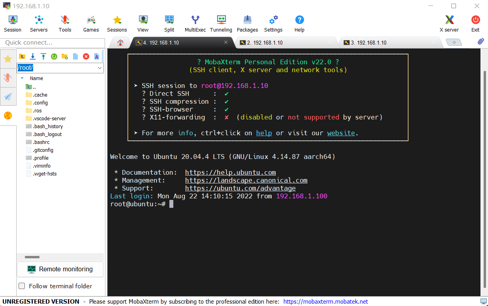
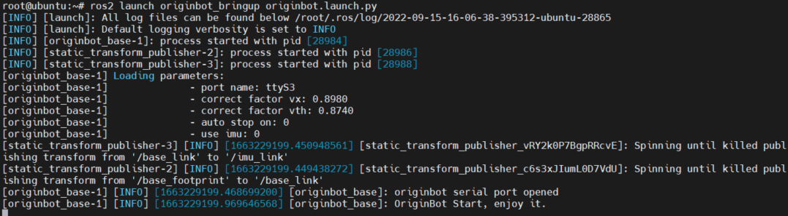
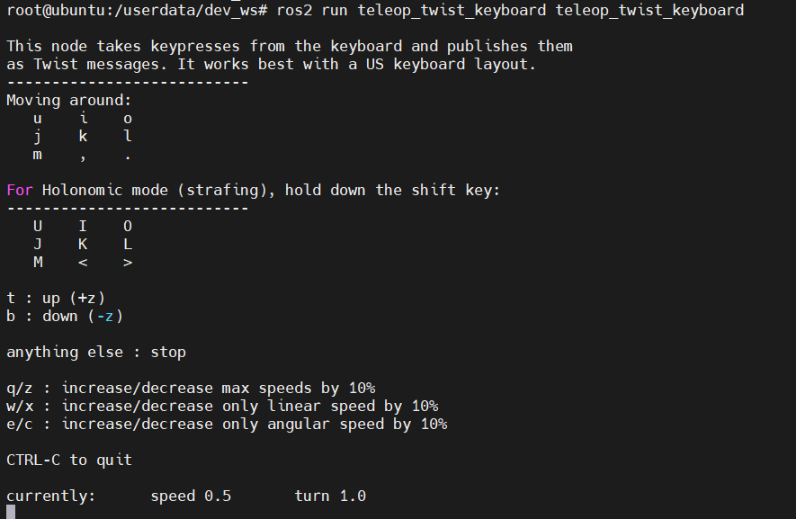
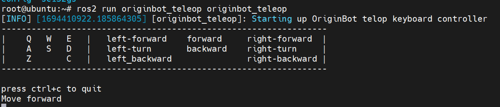
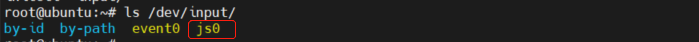
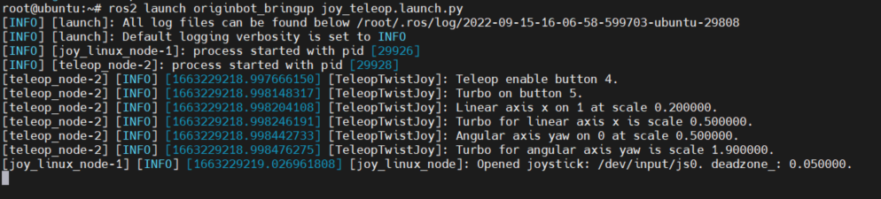
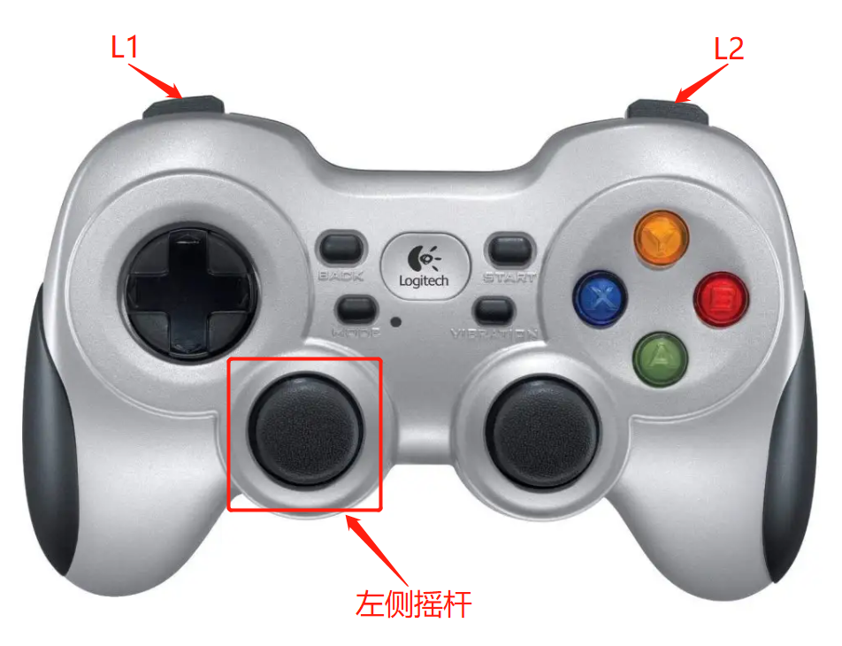
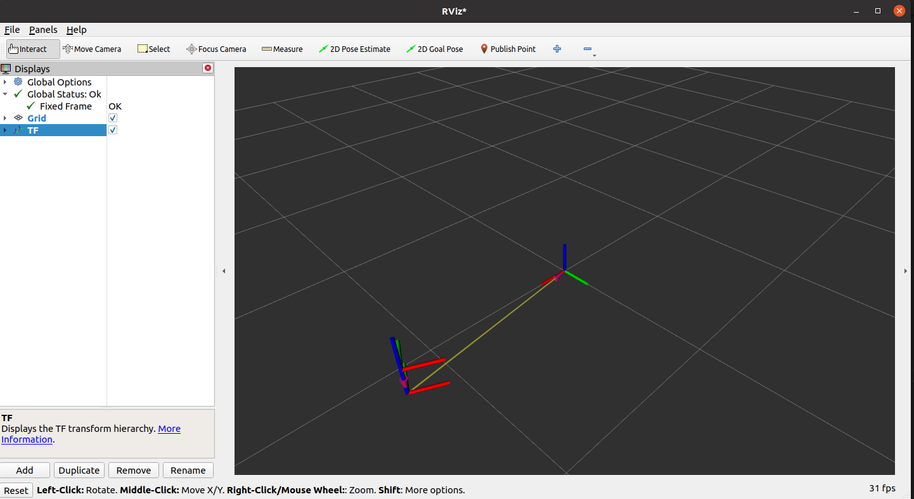
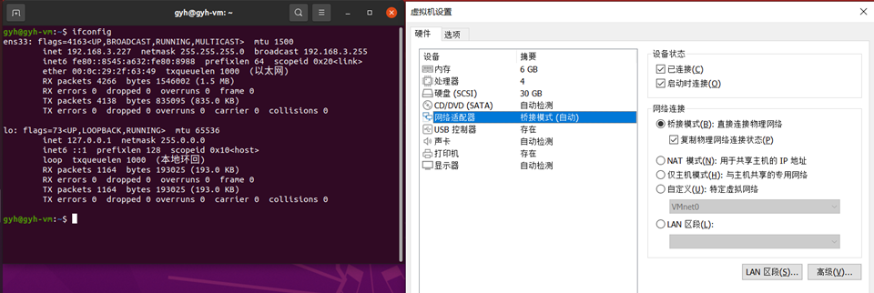

# **Robot remote control and visualization**

Based on the distributed characteristics of ROS2, OriginBot can easily achieve remote control movement.

???+ hint
    The operating environment and software and hardware configurations are as follows:

     - OriginBot Pro
     - PC：Ubuntu (≥22.04) + ROS2 (≥humble)
     - keyboard
     - Handle（optional）


<!-- <iframe
  src="//player.bilibili.com/player.html?aid=516658213&bvid=BV1eg411a7A9&cid=866092965&page=11&autoplay=0"
  scrolling="no"
  border="0"
  width="800px"
  height="460px"
  frameborder="no"
  framespacing="0"
  allowfullscreen="true"
>
</iframe> -->

## **Keyboard remote control**

Connect to OriginBot via SSH on the PC.

{.img-fluid tag=1 title="Login robot"}

After the connection is successful, start the robot chassis driver in the first terminal:

```bash
ros2 launch originbot_bringup originbot.launch.py
```

{.img-fluid tag=1 title="start the robot chassis"}


Then connect the second terminal and start the keyboard control node:

```bash
ros2 run teleop_twist_keyboard teleop_twist_keyboard
```

{.img-fluid tag=1 title="the keyboard control node"}

???+ hint
    1. The keypad control node can also be run on a PC in the same network environment.
    2. If the robot starts the automatic parking function, the robot will automatically stop after releasing the button for 0.5 seconds, and if the automatic parking function is turned off, the robot will not automatically stop after releasing the button, and must click "K" to control the parking. The parameter configuration of the automatic parking function is located in the originbot.launch.py, see [the chassis configuration parameter](http://originbot.org/manual/originbot_bringup){:target="_blank"} description for details.

In addition, OriginBot has a set of key control functions for automatic opening and automatic parking implemented in C++. The code is placed in originbot/originbot_example/originbot_teleo
The launch is as follows:

```bash
ros2 run originbot_teleop originbot_teleop
```
{.img-fluid tag=1 title="the keyboard control node"}

## **Handle remote control**

### **Handle connection**
- wired handle; Plug the USB port of the handle into the USB port of the RDK X5 on the OriginBot
- Wireless handle; Plug the wireless receiver of the handle into the RDK X5 USB port on the OriginBot

After the connection is complete, on the OriginBot side, use the following command to confirm whether the system has successfully identified it:

```bash
ls /dev/input/
```

{.img-fluid tag=2 title="Handle device number"}


If the "JS0" device is recognized, the handle is successfully recognized.


If you can't recognize the driver of the handle that has been installed in the official image of OriginBot, please reinstall the following feature packs and restart the attempt:​
​    

```bash
sudo apt install ros-foxy-teleop-twist-joy        # Install the drive pack for the handle
sudo apt install ros-foxy-joy-linux               # Install the drive pack for the handle
sudo modprobe -a joydev                           # Load driver
sudo apt install joystick                         # Install test tools
jstest /dev/input/js0                             # Test command
```


### **Remote Control Sports**

After successfully connecting to OriginBot through SSH, start the robot chassis driver in the first terminal:

```bash
ros2 launch originbot_bringup originbot.launch.py
```

{.img-fluid tag=2 title="start the robot chassis"}


Then connect the second terminal and run the handle control node:
```bash
ros2 launch originbot_bringup joy_teleop.launch.py
```

{.img-fluid tag=2 title="Start handle node"}


After the startup is successful, you can use the joystick to control the movement of OriginBot:

- Normal speed operation: Press and hold L1 and toggle the left joystick of the handle to control the robot movement
- Fast Run: Press and hold R1 and toggle the left joystick of the handle to control the robot movement





???+ hint
    The handle control node can also run on the PC side in the same network environment, at this time, you need to connect the receiver of the handle to the PC side, and install the corresponding driver function package, the above operation of the controller in RDK X5 is also applicable to the PC side.


## **Robot Visualization Display**

After starting OriginBot, open Rviz on the PC to view the real-time pose of the bot:

```bash
ros2 launch originbot_viz display_robot_tf.launch.py
```


You can see the change of the robot's position and posture in the odometer coordinate system:
{.img-fluid tag=3 title="Robot coordinate visualization"}


???+ hint
    Make sure that the Ubuntu+ROS2 system has been installed on the PC, and the download and compilation of the [originbot_desktop](https://github.com/guyuehome/originbot_desktop){:target="_blank"} code repository have been completed. In addition, you can use "ros2 run rviz2 rviz2" to start Rivz2 separately, manually configure the Fixed Frame to select **the odom**（odometer coordinate system），and add **the TF display** through the "Add" button, you can also achieve a similar effect.


If you use a virtual machine to run the Ubuntu system on the PC, you need to set the virtual machine's network to bridge mode to ensure that the robot and the Ubuntu system are in the same LAN:

{.img-fluid tag=3 title="Configure the VM network"}


[](https://www.guyuehome.com/){:target="_blank"}

