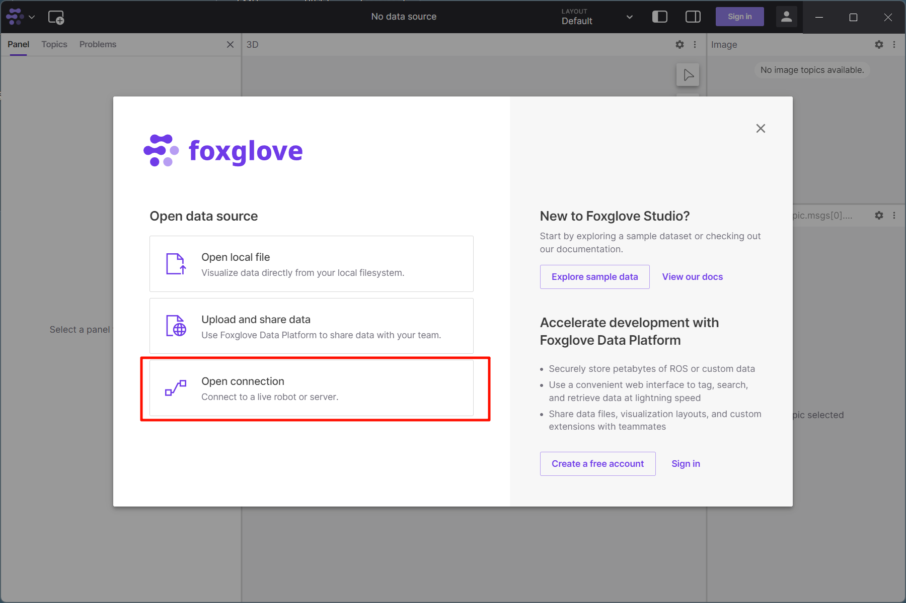

# **WebViz visualization**

Webviz is a web-based visualization tool, meaning you can access it through a browser/APP without the need to install additional software. This comes in handy for remote access and team collaboration.

Foxglove is an open-source toolkit that includes both online and offline versions. Designed to simplify the development and commissioning of robotic systems. It offers a range of features for building bot applications.

This section describes how to use Foxglove for data viewing and topic communication.

???+ hint
    The operating environment and software and hardware configurations are as follows:

     - OriginBot Pro
     - PC：Ubuntu (≥22.04) / Windows (>=10)

## **Software Installation**

It is recommended to use the APP version here, which can be used without logging in to the account, and clicking on the [download link](https://foxglove.dev/download){:target="_blank"}  can jump to the download page.

{.img-fluid tag=1 title="download foxglove"}

Follow the instructions to complete the download.

## **Environment setup**

To connect OriginBot to Foxglove, you need to build a ROS environment on OriginBot.

```bash
sudo apt install ros-${ROS_DISTRO}-rosbridge-suite
```

After the installation is complete, you can run the following command to enable the remote service of OriginBot:

```bash
source /opt/ros/${ROS_DISTRO}/setup.bash
ros2 launch rosbridge_server rosbridge_websocket_launch.xml
```

{.img-fluid tag=1 title="originbotStarting remote services"}

At the same time, open a new terminal, record the current IP address with ifconfig, and start the camera to publish image information for verification effect.

```bash
ifconfig&&ros2 launch originbot_bringup camera.launch.py
```

## **Foxglove interface visualization**

After installing Foxglove, click on the software to see the following interface.

{.img-fluid tag=1 title="Activate foxglove"}

Click here to open the connection, enter the IP address, and the connection can be completed.

{.img-fluid tag=1 title="foxglove connects to originbot1"}

After the connection is successful, you can use Foxglove in a variety of ways, and in the + in the upper left corner, you can use various plug-ins of the software to assist you in development.

{.img-fluid tag=1 title="foxglove connects to originbot2"}

Select one of the images to see the image information we opened on OriginBot at the beginning, and select different topics to display the image.

{.img-fluid tag=1 title="Image visualization"}

## **Foxglove posting the topic**

In addition to displaying topics and information, you can also use Foxglove to post topic information, such as common cmd_vel.

Click "+" and select Publish, you can see the following interface, where you can set the topic, format and content you want to publish, which are synchronized with OriginBot.

{.img-fluid tag=1 title="posting the topic"}

In addition, there are some portable components available.

{.img-fluid tag=1 title="Remote operation"}

## **Reference Links**

Official website API documentation: [https://docs.foxglove.dev/docs/introduction](https://docs.foxglove.dev/docs/introduction
){:target="_blank"}

foxglove open source repository: [https://github.com/foxglove/ros-foxglove-bridge](https://github.com/foxglove/ros-foxglove-bridge){:target="_blank"}

[](https://www.guyuehome.com/){:target="_blank"}

