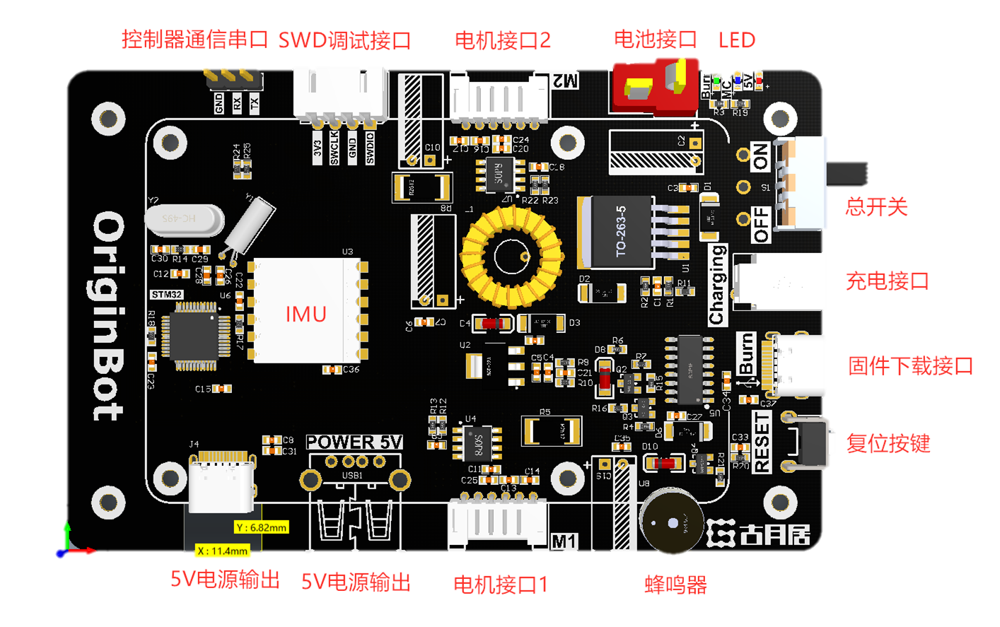
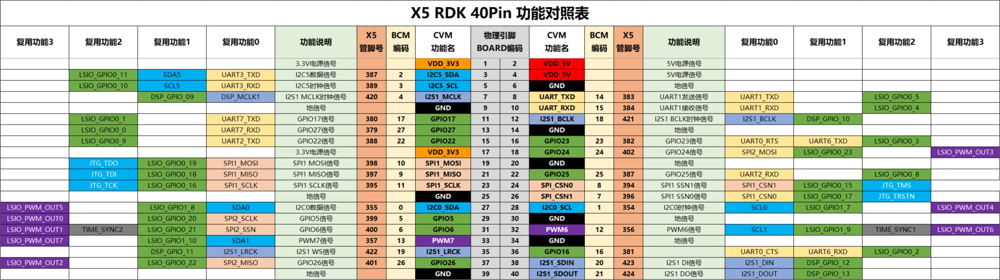
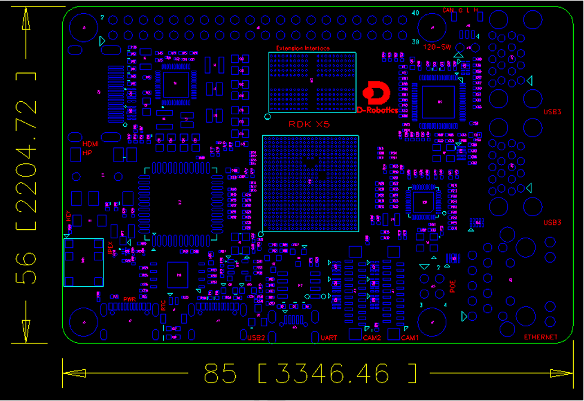

# **Interface description**

## **Robot controllers**

{.img-fluid tag=1 title="Robot controllers"}

## **RDK X5**

> [more info hardware_introduction-rdk_x5](https://developer.d-robotics.cc/rdk_doc/Quick_start/hardware_introduction/rdk_x5)

D-Robotics RDKTM X5 is equipped with Sunrise 5 intelligent computing chip, which can provide up to 10 Tops of computing power. It is an all-round development kit for intelligent computing and robotics applications. It has rich interfaces and is extremely easy to use. It supports a variety of complex models and the latest algorithms such as Transfomer, RWKV, Occupancy, Stereo Perception, etc., accelerating the rapid implementation of intelligent applications.

{.img-fluid tag=2 title="RDK X5"}

### **Board parameters**

|            | RDK X5                                                                                                                                                                                                                                                                                                                                                                                                                                |
| ---------- | ------------------------------------------------------------------------------------------------------------------------------------------------------------------------------------------------------------------------------------------------------------------------------------------------------------------------------------------------------------------------------------------------------------------------------------- |
| CPU        | Octa-core Cortex® A55 |
| BPU        | 10TOPS |
| GPU        | 	32 GFlops |
| memory	         | 8GB LPDDR4 RAM |
| storage | NA, supports external Micro SD card Peripheral |
| Sensor Interface       | 2x4-lane MIPI CSI |
| Video Encoding   | 1x4K60 (H.265/H.264) |
| Audio   | 1x3.5mm headphone jack, supports output/input |
| Display Interface | 1xHDMI Type-A, maximum support 1080p60 1x MIPI DSI 4 Lane|
| USB Host    | 4x USB 3.0 HOST (TYPE A) 1xUSB 2.0 Device (TYPE C)|
|USB Device|	1x Micro USB port|
|Network Interface	|1xRJ45 Gigabit Ethernet port, supports PoE power supply 1x dual-band Wi-Fi 6 supports 5.4|
| CAN interface       | 1x CAN FD |
| IO interface    | 28 GPIOs (maximum expandable support 5xUART, 8xPWM, 3xI2C, 2xSPI, 1xI2S) |
| Power Input     | 5V/5A |
| System Support    | RDK OS V3.X (Ubuntu 22.04) |
| Development Environment    | RDK Studio, NodeHub |
| Functional support       | LLM, 2D/3D Detection, Stereo Depth, Stereo Occupancy, Image Classification etc. SLAM, VSLAM, VIO, Navigation, Language interaction, Grasping etc.  |

#### On-board interface

{.img-fluid tag=2 title="RDK X5"}

#### Board size

{.img-fluid tag=2 title="RDK X5"}

???+ Attention
    The serial number of the pin is counted from the internal test near the HDMI board, which is pin 1, and then serpentine counting, respectively, 1, 2, 3, 4, 5, all the way to 39 and 40.

{:target="_blank"}
