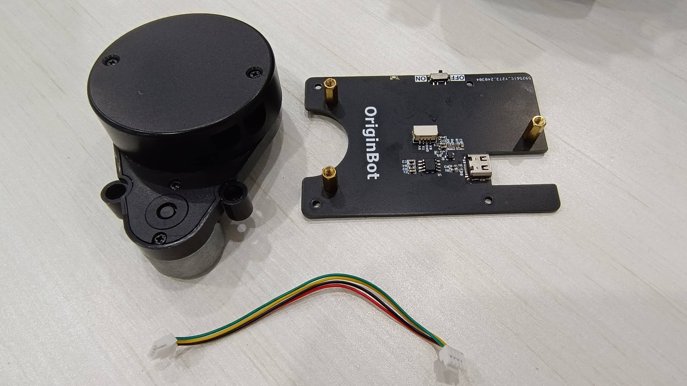

# **Kit list**

## **Chassis and  accessories**

| serial number | name           | quantity | Image                                                         | Specifications                                      |
| ---- | -------------- | ---- | ------------------------------------------------------------ | --------------------------------------------- |
| 1    | Differential OriginBot chassis   | 1 pc  | {.img-fluid tag=1 title="Differential OriginBot chassis"} | TT motor with encoder*2： 6V，350RPM metal output shaft ,Universal wheels and brackets*1|
| 2    | Camera mounting bracket | 1 set  | {.img-fluid tag=1 title="Camera mounting bracket"} |                                               |
| 3    | Rubber tires       | 2 pcs  | {.img-fluid tag=1 title="Rubber tires"} |
| 4    | Universal wheel | 1pc  | {.img-fluid tag=1 title="Universal wheel"} |                                                  |

## **Controllers and their accessories**

| serial number | name                       | quantity | Image                                                         | Specifications                     |
| ---- | -------------------------- | ---- | ------------------------------------------------------------ | ---------------------------- |
| 1    | Motion control panels                 | 1 piece  | {.img-fluid tag=2 title="Motion control panels"} | STM32F1                      |
| 2    | Type-C power supply adapter board           | 1 pc  | {.img-fluid tag=2 title="Type-C power supply adapter board"} | Type-C to Type-C 5V，4A |

## **Processors and their accessories**

| serial number | name                       | quantity | Image                                                         | Specifications                                                     |
| ---- | -------------------------- | ---- | ------------------------------------------------------------ | ------------------------------------------------------------ |
| 1    | RDK X5    | 1 set  | {.img-fluid tag=3 title="RDK X5"} | CPU：ARM Cortex-A55, 8*Core,1.5GHZ BPU： 32flops, 10Tops Memory：8GB LPDDR4 RAM |
| 2    | TF card | 1 sheet  | {.img-fluid tag=3 title="TF card"} | SanDisk 32GB (Included in plastic/carton package, same specifications)        |

## **Sensors and  accessories**

| serial number | name                                                         | quantity	 | Image                                                         | Specifications                                                     |
| ---- | ------------------------------------------------------------ | ---- | ------------------------------------------------------------ | ------------------------------------------------------------ |
| 1    |  USB Camera | 1 pc  | {.img-fluid tag=4 title="Camera"} | 720p                                |
| 2    | Lidar| 1 pc  | {.img-fluid tag=4 title="Lidar"} | VP100L  Ranging frequency: 3000HZ  Scanning frequency: 60Hz  Scanning angle: 0~360° |

## **Other accessories**

| serial number | name                                                    | quantity | Image                                                         | Specifications                                                |
| ---- | ------------------------------------------------------- | ---- | ------------------------------------------------------------ | ------------------------------------------------------- |
| 1    | License plate number sticker                                            | 2 pcs  | {.img-fluid tag=5 title="License plate number sticker"} |                                                       
| 2    | TypeC data cable	                                             | 1 pc  | {.img-fluid tag=5 title="TypeC data cable	"} | USB to Type-C 30cm                                      |
| 3   | Serial communication line                                              | 1 pc  | {.img-fluid tag=5 title="Serial communication line"} | 10cm                                                    |
| 4   | Screws, copper pillars                                              | Several | {.img-fluid tag=5 title="Screws, copper pillars"} |                                                         |
| 5    | card reader	                                                  | 1 pc  | {.img-fluid tag=5 title="card reader	"} |                                                         |
| 6    | screwdriver                                                  | 1 pc  | {.img-fluid tag=5 title="screwdriver"} |                                                         |
| 7   | wrench                                                    | 1 set  | {.img-fluid tag=5 title="wrench"} |
| 8   | USB to T power line                                              | 1 pc  | {.img-fluid tag=5 title="USB2T"} |                                                         |

{:target="_blank"}